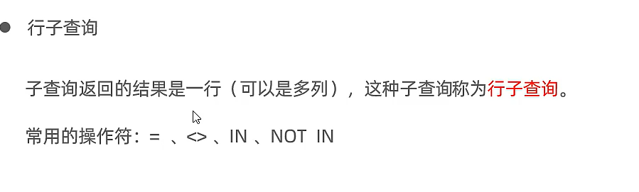

# a行子查询



-   查询与Mike年龄相同的(非Mike)同部门员工;
    1.  查询Mike的年龄和部门;

```mysql
select name, gender, age, entrydate, level
from employee
where section_ID = (select section_ID
                    from employee
                    where name = 'Mike')
          &&
      age = (select age
             from employee
             where name = 'Mike')
          &&
      name != 'Mike';
```

-   等价的简便写法

```mysql
select name, gender, age, entrydate, level
from employee
where (section_ID, age) = (select section_ID, age
                           from employee
                           where name = 'Mike')
          &&
      name != 'Mike';
```