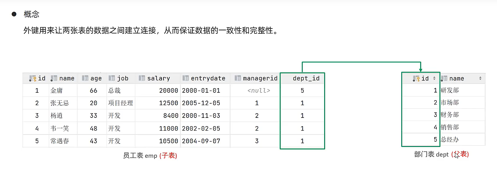
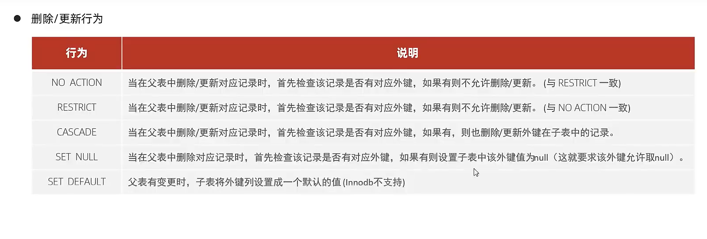

# 外键约束



## 语法

```mysql
CREATE TANBLE 表名(
	字段名 数据类型,
    
    ...
    [CONSTRAINT] [外键名称] FOREIGN KEY(外键字段名) REFERENCES(主列表名) 
);
```

### 创建/更改外键

```mysql
ALTER TABLE 起点表 ADD
	[CONSTRAINT] 外键名称 FOREIGN KEY(外键字段名) REFERENCES 被指向表(主表列名) 
;
```

-   CONSTRAINT约束

## 示例

```mysql
alter table section modify id char(3) primary key / unique ;
alter table employee
    add constraint fk_employee_section_ID foreign key (section_ID) references section (id);


-- 此时删除被指向不可行,因为有外键牵制

alter table employee drop constraint fk_employee_section_ID;
alter table section drop PRIMARY key ;
```


## 删除外键

```mysql
ALTER TABLE 表名 DROP FOREIGN KEY 外键名称;
```

外键约束的名字 fk_symbol 可通过下面语句查询：

```sql
SHOW CREATE TABLE table_name; 
```

删除外键约束，查找CREATE TABLENAME 找到系统为外键约束添加的名字


## 存在外键删除记录



-   当父表中删除/更新记录时,首先检查记录是否对应外键,如果有:

| 行为               | 说明                                                  |
| ------------------ | ----------------------------------------------------- |
| NO ACTION/RESTRICT | 不允许删除/更新                                       |
| CASCADE            | 同时删除/更新子表记录                                 |
| SET NULL           | 允许删/更新,不管三七二十一null(应要求外键允许取null)  |
| SET DEFAULT        | 父表变更时,子表将外键设置成一个默认的值(lnnodb不支持) |

```mysql
CREATE TANBLE 表名(
	字段名 数据类型,
    
    ...
    [CONSTRAINT] [外键名称] FOREIGN KEY(外键字段名) REFERENCES(主列表名) 
    	ON UPDATE 更新行为 ON DELETE 删除行为
);


ALTER TABLE ADD
	[CONSTRAINT] 外键名称 FOREIGN KEY(外键字段名) REFERENCES 主表(主表列名) 
		ON UPDATE 更新行为 ON DELETE 删除行为
;
```


​     

   