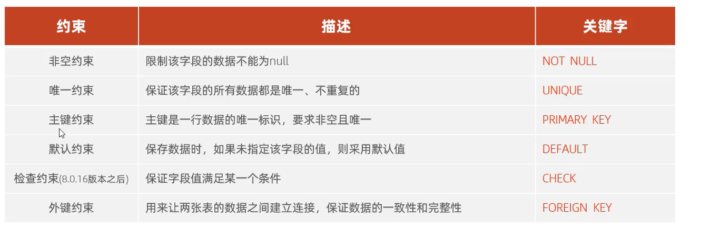
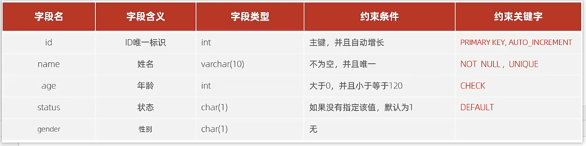

# 约束实践



允许空值null                                                                                                                                NULL

```mysql
CREATE TABLE 表名(
	字段1 类型[约束关键词][COMMENT '字段注释'] ,
    字段2 类型[约束关键词][COMMENT '字段注释'] ,
    ...
    字段N 类型[约束关键词][COMMENT '字段注释'] 
)[COMMENT '表注释'];
```



-   看得出来,可有多个约束

```mysql
create table user(
    id int comment '主键' primary key auto_increment,
    name varchar(10) not null unique comment '姓名',
    age int check ( age>0&&age<120 ) comment '年龄',
    status char(1) default '1',
    gender char(1) check (gender = '男' or gender ='女') default '男'
)comment '用户表';
```

-   如果创建了一条记录,且没有创建成功,**这条记录依旧占据一条主键**

-   auto_increment 自动增加,想要从零开始自增?:

    ```mysql
    TRUNCATE TABLE user_logs;
    TRUNCATE TABLE user;
    ```

## 为已创建的字段增加约束

```mysql
alter table 表名 change 字段名 新名字 新类型 约束 ;
alter table 表名 modify 字段名 		新类型 约束 ;
```

```mysql
alter table section change TOLL toll int not null ;
alter table section modify name char(3) not null ;
```

-   主键好像还不一样

```mysql
alter table 表名 [add constraint 约束名] primary key(字段名1,... )
```

## 删除约束

```mysql
alter table 表名 drop constraint 约束名
```

```mysql
SHOW INDEX FROM table_name\G; 
```

#### 约束查询

```mysql
SHOW INDEX FROM 表名\G; 
```

