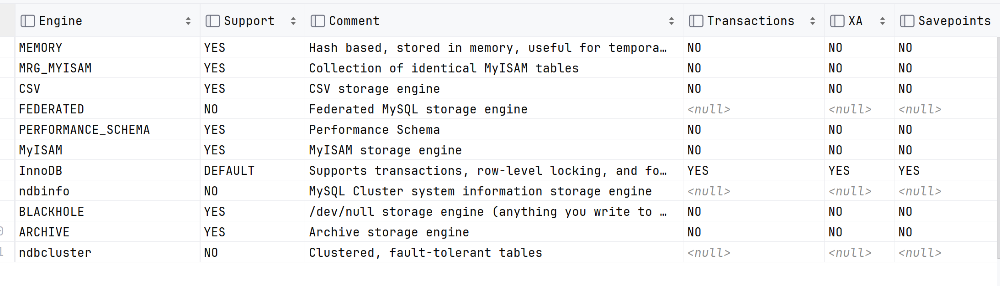
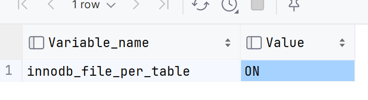
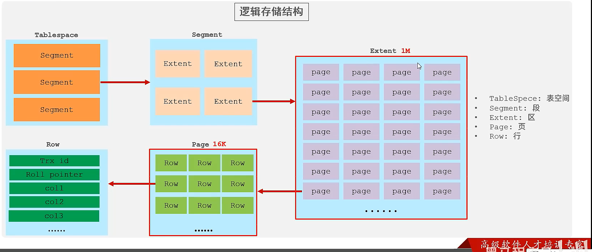
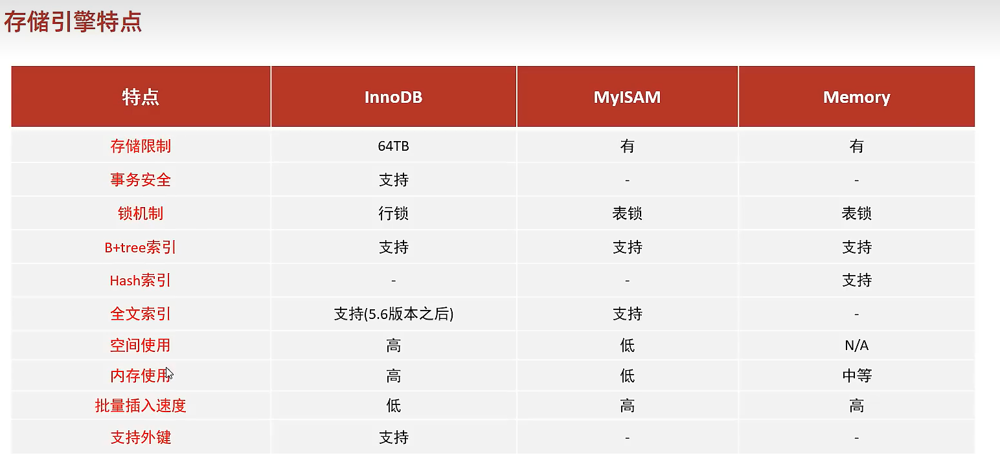

# 存储引擎

-   核心

-   合适的场景用合适的引擎

-   存储引擎是基于数据表的

    -   也被称为表的类型

    -   表不同引擎机制是不同的

    -   一个数据库下的不同表可以有不同引擎

    -   默认InnoDB

        ```mysql
        show create table employee;
        
        
        CREATE TABLE `employee` (
          .....
        ) ENGINE=InnoDB DEFAULT CHARSET=utf8mb4 COLLATE=utf8mb4_0900_ai_ci COMMENT='员工表'
        ```

## 查看当前数据库支持的存储引擎

```mysql
show Engines;
```



## 指定存储引擎

```mysql
CREATE TABLE 表名 (
  .....
) ENGINE=存储引擎;
```

## InnoDB

-   兼顾高性能和高可靠性
-   默认

### 特点

-   DML操作遵循ACID模型,支持**事务**四大特性
-   支持**行级锁**,提高并发访问性能
-   支持 **外键** FOREIGN KEY 约束,保证数据完整性和正确性

### 文件

-   `xxx.ibd`文件,xxx是表名,二进制的

    -   查看,DOS命令行哈

        ```DOS
        ibd2sdi employee.ibd
        ```

        -   从ibd文件中汲取sdi表结构数据

        -   ```json
            ["ibd2sdi"
            ,{
                    "type": 1,
                    "id": 427,
                    "object":
                            {
                "mysqld_version_id": 80034,
                "dd_version": 80023,
                "sdi_version": 80019,
                "dd_object_type": "Table",
                "dd_object": {
                    "name": "employee",
                    "mysql_version_id": 80034,
                    "created": 20231008015840,
                    "last_altered": 20231008015840,
                    "hidden": 1,
                    "options": "avg_row_length=0;encrypt_type=N;key_block_size=0;keys_disabled=0;pack_record=1;stats_auto_recalc=0;stats_sample_pages=0;",
                    "columns": [
                        {
                            "name": "employee_id",
                            "type": 29,
                            "is_nullable": true,
                            "is_zerofill": false,
                            "is_unsigned": false,
                            "is_auto_increment": false,
                            "is_virtual": false,
                            "hidden": 1,
                            "ordinal_position": 1,
                            "char_length": 20,
                            "numeric_precision": 0,
                            "numeric_scale": 0,
                            "numeric_scale_null": true,
                            "datetime_precision": 0,
                            "datetime_precision_null": 1,
                            "has_no_default": false,
                            "default_value_null": true,
                            "srs_id_null": true,
                            "srs_id": 0,
                            "default_value": "",
                            "default_value_utf8_null": true,
                            "default_value_utf8": "",
                            "default_option": "",
                            "update_option": "",
                            "comment": "",
                            "generation_expression": "",
                            "generation_expression_utf8": "",
                            "options": "interval_count=0;",
                            "se_private_data": "physical_pos=3;table_id=1101;",
                            "engine_attribute": "",
                            "secondary_engine_attribute": "",
                            "column_key": 1,
                            "column_type_utf8": "char(5)",
                            "elements": [],
                            "collation_id": 255,
                            "is_explicit_collation": false
                        },
                        {
                            "name": "name",
                            "type": 16,
                            "is_nullable": true,
                            "is_zerofill": false,
                            "is_unsigned": false,
                            "is_auto_increment": false,
                            "is_virtual": false,
                            "hidden": 1,
                            "ordinal_position": 2,
                            "char_length": 20,
                            "numeric_precision": 0,
                            "numeric_scale": 0,
                            "numeric_scale_null": true,
                            "datetime_precision": 0,
                            "datetime_precision_null": 1,
                            "has_no_default": false,
                            "default_value_null": true,
                            "srs_id_null": true,
                            "srs_id": 0,
                            "default_value": "",
                            "default_value_utf8_null": true,
                            "default_value_utf8": "",
                            "default_option": "",
                            "update_option": "",
                            "comment": "濮撳悕",
                            "generation_expression": "",
                            "generation_expression_utf8": "",
                            "options": "interval_count=0;",
                            "se_private_data": "physical_pos=4;table_id=1101;",
                            "engine_attribute": "",
                            "secondary_engine_attribute": "",
                            "column_key": 1,
                            "column_type_utf8": "varchar(5)",
                            "elements": [],
                            "collation_id": 255,
                            "is_explicit_collation": false
                        },
                        {
                            "name": "gender",
                            "type": 29,
                            "is_nullable": true,
                            "is_zerofill": false,
                            "is_unsigned": false,
                            "is_auto_increment": false,
                            "is_virtual": false,
                            "hidden": 1,
                            "ordinal_position": 3,
                            "char_length": 4,
                            "numeric_precision": 0,
                            "numeric_scale": 0,
                            "numeric_scale_null": true,
                            "datetime_precision": 0,
                            "datetime_precision_null": 1,
                            "has_no_default": false,
                            "default_value_null": true,
                            "srs_id_null": true,
                            "srs_id": 0,
                            "default_value": "",
                            "default_value_utf8_null": true,
                            "default_value_utf8": "",
                            "default_option": "",
                            "update_option": "",
                            "comment": "鎬у埆",
                            "generation_expression": "",
                            "generation_expression_utf8": "",
                            "options": "interval_count=0;",
                            "se_private_data": "physical_pos=5;table_id=1101;",
                            "engine_attribute": "",
                            "secondary_engine_attribute": "",
                            "column_key": 1,
                            "column_type_utf8": "char(1)",
                            "elements": [],
                            "collation_id": 255,
                            "is_explicit_collation": false
                        },
                        {
                            "name": "age",
                            "type": 2,
                            "is_nullable": true,
                            "is_zerofill": false,
                            "is_unsigned": true,
                            "is_auto_increment": false,
                            "is_virtual": false,
                            "hidden": 1,
                            "ordinal_position": 4,
                            "char_length": 3,
                            "numeric_precision": 3,
                            "numeric_scale": 0,
                            "numeric_scale_null": false,
                            "datetime_precision": 0,
                            "datetime_precision_null": 1,
                            "has_no_default": false,
                            "default_value_null": true,
                            "srs_id_null": true,
                            "srs_id": 0,
                            "default_value": "",
                            "default_value_utf8_null": true,
                            "default_value_utf8": "",
                            "default_option": "",
                            "update_option": "",
                            "comment": "鏃犺礋鏁?灏忎簬255",
                            "generation_expression": "",
                            "generation_expression_utf8": "",
                            "options": "interval_count=0;",
                            "se_private_data": "physical_pos=6;table_id=1101;",
                            "engine_attribute": "",
                            "secondary_engine_attribute": "",
                            "column_key": 1,
                            "column_type_utf8": "tinyint unsigned",
                            "elements": [],
                            "collation_id": 8,
                            "is_explicit_collation": false
                        },
                        {
                            "name": "idcard",
                            "type": 29,
                            "is_nullable": true,
                            "is_zerofill": false,
                            "is_unsigned": false,
                            "is_auto_increment": false,
                            "is_virtual": false,
                            "hidden": 1,
                            "ordinal_position": 5,
                            "char_length": 72,
                            "numeric_precision": 0,
                            "numeric_scale": 0,
                            "numeric_scale_null": true,
                            "datetime_precision": 0,
                            "datetime_precision_null": 1,
                            "has_no_default": false,
                            "default_value_null": true,
                            "srs_id_null": true,
                            "srs_id": 0,
                            "default_value": "",
                            "default_value_utf8_null": true,
                            "default_value_utf8": "",
                            "default_option": "",
                            "update_option": "",
                            "comment": "韬唤璇?,
                            "generation_expression": "",
                            "generation_expression_utf8": "",
                            "options": "interval_count=0;",
                            "se_private_data": "physical_pos=7;table_id=1101;",
                            "engine_attribute": "",
                            "secondary_engine_attribute": "",
                            "column_key": 1,
                            "column_type_utf8": "char(18)",
                            "elements": [],
                            "collation_id": 255,
                            "is_explicit_collation": false
                        },
                        {
                            "name": "entrydate",
                            "type": 15,
                            "is_nullable": true,
                            "is_zerofill": false,
                            "is_unsigned": false,
                            "is_auto_increment": false,
                            "is_virtual": false,
                            "hidden": 1,
            
            }
            ,
            {
                    "type": 2,
                    "id": 44,
                    "object":
                            {
                "mysqld_version_id": 80034,
                "dd_version": 80023,
                "sdi_version": 80019,
                "dd_object_type": "Tablespace",
                "dd_object": {
                    "name": "company/employee",
                    "comment": "",
                    "options": "autoextend_size=0;encryption=N;",
                    "se_private_data": "flags=16417;id=39;server_version=80034;space_version=1;state=normal;",
                    "engine": "InnoDB",
                    "engine_attribute": "",
                    "files": [
                        {
                            "ordinal_position": 1,
                            "filename": ".\\company\\employee.ibd",
                            "se_private_data": "id=39;"
                        }
                    ]
                }
            }
            }
            ```

            

-   每张表对应一个表空间文件

    -   innodb_file_per_table

    -   查看

        ```mysql
        show variables like 'innodb_file_per_table';
        ```

    -   默认打开

        

-   存储该表的结构,数据,索引

### 逻辑存储结构

-   一个区的大小1M固定
-   一个页16K大小固定



-   区的大小固定1M

## MyISAM

-   早期MySQL默认引擎

### 特点

-   不支持事务,不支持外键
-   支持表锁,不支持行锁
-   访问速度快

### 文件

`xxx.sdi`:存储表结构信息

-   这个可以直接打开看

`xxx.MYD`存放数据

`xxx.XMI`存放索引

## Memory

-   Memory(内存)
    -   ->由于硬件和断电问题,只能将这些表作为**临时表或缓存使用**

### 特点

-   由于内存,所以嘎嘎快
-   默认支持HASH索引

### 文件

`xxx.sdi`存储表结构信息

## 三个主要引擎的区别与比较



## 对存储引擎的场景选择

### InnoDB的场合

-   需要事务(**只能**用InnoDB了)的完整性

    or

-   需要外键(**只能**用InnoDB了)

    or

-   **并发**条件要求事务一致性

    or

-   对数据除了插入和查询外经常**更新或删除**

### MyISAM的场合

-   对数据**插入和查询**为主很少更新或删除
-   对事物完整性,并发性要求不高

### Memory的场合

-   临时表以及缓存
-   对表的大小**限制**尤为明显
-   无法保障数据的安全性

### PS

然而,现在MyISAM和Memory有了其他平替,甚至更好

