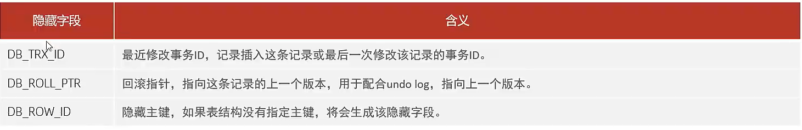
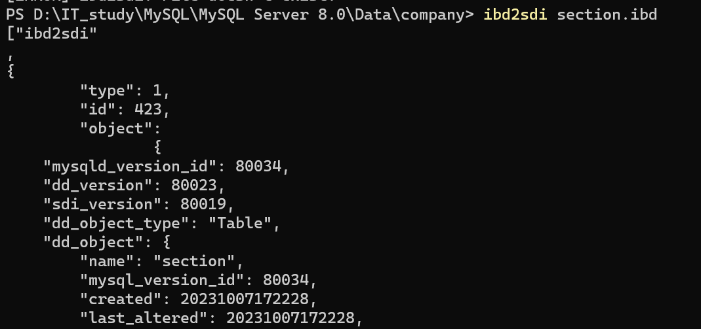
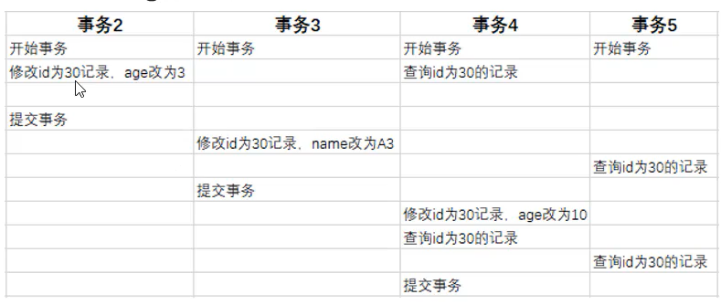
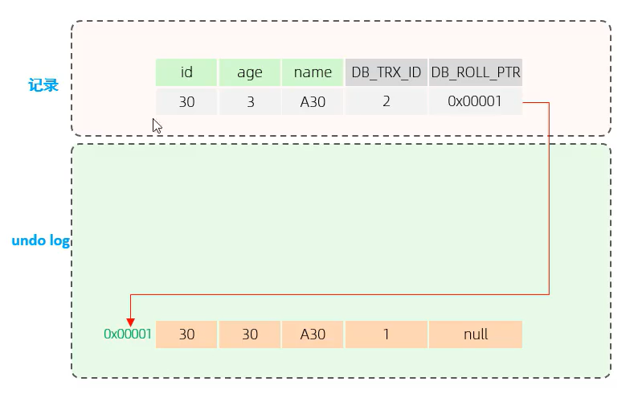
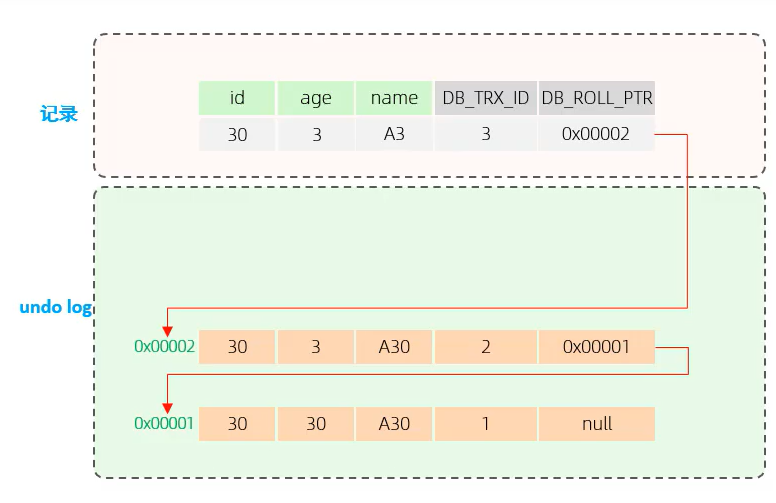
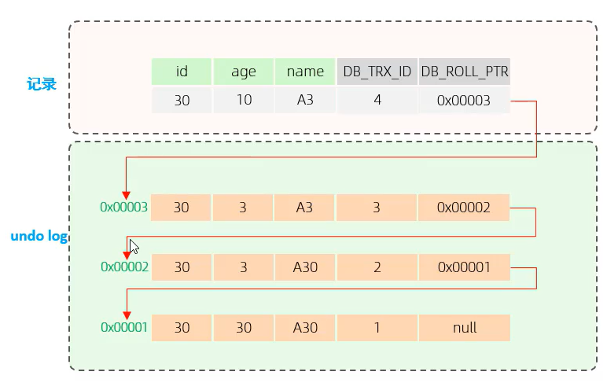
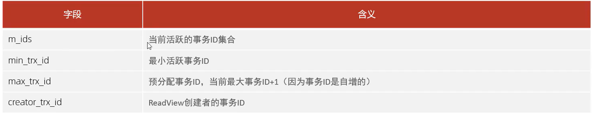

# MVCC 多版本并发控制

[并发事务问题](..\SQL基础\事务\Day06-并发事务.md)

## 当前读


读取的是记录的最新版本,读取时还要保证其他并发事务不能修改当前记录

会对读取记录进行加锁

对我们的日常操作,如:

​	`select...lock in share  mode`(共享锁)

​	`select...for update` `update` `insert` `delete`(排他锁)

都是一种当前读


## 快照读

读取的是记录数据的可见版本,有**可能是历史记录**,不加锁,是**非阻塞读**

简单的`select` (非 `select... lock in share mode` ,不加锁) 是快照读

-   Read Commit : 每次 `select` 都生成一个快照读
-   Repeatable Read : 开启事务后第一个select语句才是快照读
-   Serializable : 快照读退化为当前读


## MVCC 概述

>   Multi-Version Concurrency Control
>
>   多版本并发控制


维护一个数据的多个版本,使得**读写操作没有冲突**

**快照读为MySQL实现MVCC提供了一个非阻塞读功能**

MVCC的**具体实现**,依赖于数据库记录中的 **三个隐式字段** , **Undo Log** , **readView**

-   全是重点😓

## 三个隐式字段

InnoDB隐式地为自建表创建的字段



#### 查看

```DOS
ibd2sdi 文件名.ibd
```



-   我是在这个文件夹下打开的控制台,别的地方我不好说
-   绝对路径不好用

```Json
  "columns": [
      		{
          		......
            },
                ......
            {
                "name": "DB_ROW_ID",
                .......
            },
            {
                "name": "DB_TRX_ID",
				.......
            },
            {
                "name": "DB_ROLL_PTR",
				........
```

-   因为section表的主键是我后期加的,因此,**"DB_ROW_ID"**还存在

###


### DB_TRX_ID 事务ID

>   最近一次修改事务的ID,记录插入这条记录或最后一次修改事务的事务ID 

### DB_ROLL_RTP 回滚指针

>   指向这条记录的上个版本,用于配合Undo Log

ptr->point

### DB_ROW_ID 隐藏主键

>   如果该表没有指定主键,将会自动生成该隐式字段


## Undo Log

[Undo Log 回滚日志](Day11-InnoDB事务原理.md)

用于配合**DB_ROLL_RTP**隐式字段

### 删除时机

当**Insert**时,产生的 Undo Log 日志**只是回滚是需要**.只在事务提交后,可被立即删除

当**Update和Delete**的时候,产生的 Undo Log 日志***不只是*** **回滚是需要**,在 **快照读也需要**,不会被立即删除

### Undo Log 版本链








 

-   链表的头部是最新的记录
-   链表的尾部是最旧的记录


**那么 , 返回那一条记录是由谁来绝对的呢 ?**

​								---- ***READ VIEW***


## readView读视图

>   readView 是**快照读** SQL 执行时MVCC提取数据的依据 , **记录并维护系统当前活跃的事务** ( 并未提交时 ) id

### readView 的核心字段



-   **Max_trx_id 不是最大当前活跃事务集合里的最大ID**


### 版本链数据访问规则


**PS: trx_id : 代表Undo Log当前事务ID**

-   **将查询 符合以下规则的第一条(从链表头)版本**

1.  `trx_id == creator_trx_id? `可以访问该版本
    -   **说明事务时当前事务更改的**
2.  `trx_id<min_trx_id?` 可以访问该版本
    -   **说明数据已经提交**
3.  `trx_id>max_trx_id?` 不可以访问该版本
    -   **说明当前事务id是在ReadView生成之后才开启的**
4.  `min_trx_id<=trx_id<=max_trx_id and not ( trx_id in m_ids )`  可以访问该版本
    -   **说明数据已经提交ok,ok,ok!**
5.  其余的trx_id不可以被访问


### 隔离事务级别与生成ReadView的关系

[隔离事务级别](..\SQL基础\事务\Day06-并发事务.md)

-   Read Committed
    -   在事务中每一次执行快照读时生成ReadView
-   Repeatalbe Read
    -   仅在事务第一次体现快照读时生成ReadView,后续**复用( 这就是可重复读,每次快照读,读出来的都是相同的 )**该ReadView

