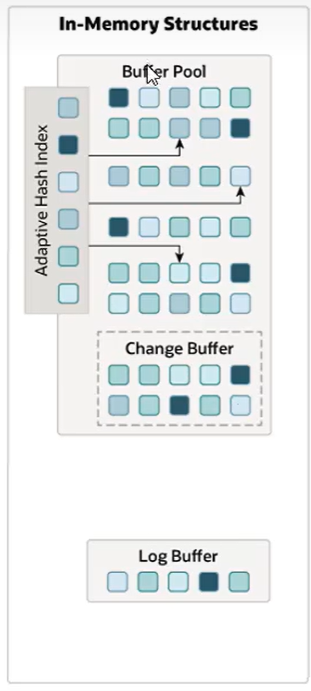
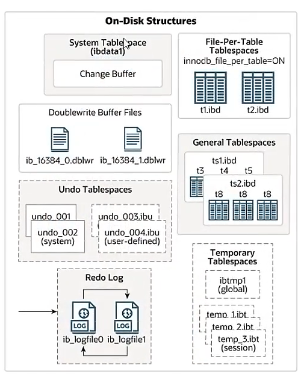
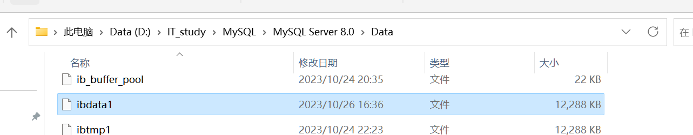
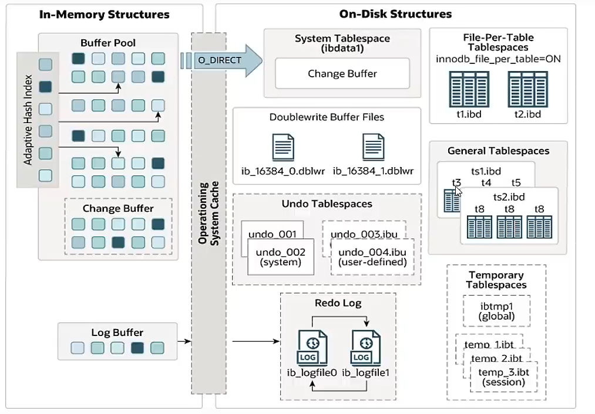
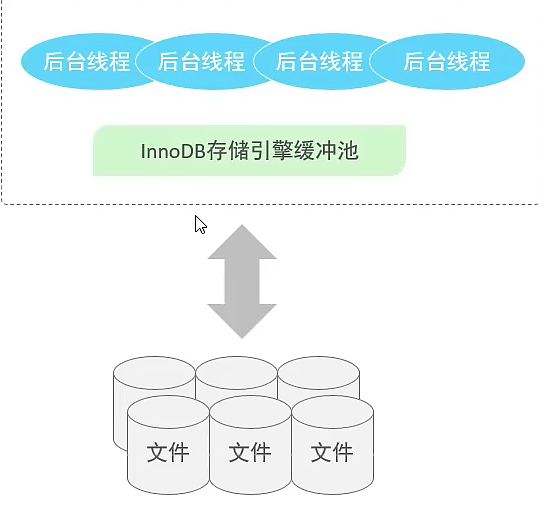

# 硬盘架构(内存结构)



## Buffer Pool 缓冲池

-   最先操作
-   若缓冲池内没有数据,就会冲磁盘中加载并缓存
-   一定频率刷少磁盘中去
-   上图的一个一个块就是页(Page)

### 页的三种状态

-   上图页的不同颜色就对应三种不同状态

#### Free Page

申请了,但没有被使用的空闲Page

#### Clean Page

被使用Page,数据没有被修改

#### Dirty Page

脏页

页被使用,数据被修改,其中的数据源未提交到磁盘,与磁盘中的数据产生了不一致

## Change Buffer更改缓冲区

-   在5.0之前叫做Insert Buffer 插入缓存区

-   **针对非唯一二级索引页**

-   执行**DML**语句时,如果数据Page**没有在Buffer Pool中,不会直接操作磁盘**,而会将数据变更**存在更改缓存区Change BUffer中**,在未来数据被读取时,再将数据合并恢复到 Buffer Pool 中,再将合并后的数据刷新到磁盘中

### Change Buffer的用处

-   因为:**针对非唯一二级索引页**
-   删除插入时不规律,每一次操作磁盘IO,效率低
-   以一定频率从 Change Buffer 提交到磁盘

## Adaptive Hash Index 自适应Hash

-   索引
-   查询速度快,等值查询
-   用于优化对Buffer Pool的查询
-   **系统根据情况创建Hash索引,提高效率**~离谱啊离谱~

-   查看是否开启**Adaptive Hash Index**

    ```mysql
    show variables like '%innodb_adaptive_hash_index%'
    ```

## Log Buffer 日志缓冲区

-   默认大小时16M

-   定期刷新到磁盘中

-   如果要更新插入删除,可以手动增加日志缓冲区的大小,节省磁盘IO

```mysql
show variables like '%log_buffer_size%';
-- 查看日志缓冲区大小(字节)

show variables like '%flush_log%';
-- 日志缓冲区的数据刷新到磁盘中的时机(默认1)

-- 0 ?: 每秒将日志写入并属性到磁盘一次
-- 1 ?: 日志再每次事务提交时写入并刷新到磁盘中去
-- 2 ?: 日志再每次事务提交后写入,并每秒刷新到磁盘一次?????????????
```

### Redo log

[事务原理](./Day11-InnoDB引擎事务原理)

### Undo log

[事务原理](./Day11-InnoDB引擎事务原理)

# 磁盘架构



## System TableSpace系统表空间

-   Change Buffer 的存放区域
-   如果InnoDB的每一张独立表空间关闭,那么每一张表也是在系统表空间存储
-   表空间文件 -> 每一张表的数据和索引

### 查看

```mysql
show variables like '%Innodb_Data_file_path%';
-- ibdata1:12M:autoextend这个文件存放系统表空间
```



## File Per Table TableSpace

-   每一个表都会有一个表空间文件(如果打开)
-   每一个文件包含每一张表的数据和索引
-   表存储的文件系统的单格数据文件

```mysql
show variables like '%innodb_file_per_table%';
-- ON 每一个表都会有一个表空间文件
```

## General Tablespace通用表空间

-   创建对应通用表空间

    ```mysql
    Create Tablespace 表空间名 Add datafile '通用表空间文件名.ibd' Engine=引擎名;

    Create Tablespace user Add datafile 'my_user.ibd' Engine=innodb;
    cerate table 表名(...) Engine = innodb tablespace=表空间名;
    ```

## Undo Tablespace撤销表空间

-   MySQL实例在初始化会自动创建**两个**默认的Undo表空间

    -   undo_001

    -   undo_002

        

-   默认大小16M

-   用于存储Undo log

-   

## Temporary Tablespace临时表空间

-   存储临时表

## Doubleweite Buffer File 双写缓冲区

-   InnoDB先将数据也写入双鞋缓存区
-   将数据也从Buffer Pool刷新到磁盘,
-   便于系统异常时恢复

## Redo Log重做日志

-   用来实现日志的持久性
-   该日志文件由两部分组成:
    -   内存
    -   磁盘
-   当事务提交之后都会把所有修改的信息村早该日志文件
-   用于出刷新脏话脏页到磁盘时,发生错误时候,进行数据恢复使用使用


-   以循环的方式从左日志文件

# 后台线程

-   连接新盘和磁盘



## 作用

将InnoDB引擎的缓冲池里的数据**在合适的时机**刷新到硬盘



## 四类后台线程

### Master Thread 核心后台线程

-   负责调度其他线程
-   负责将缓冲池里的数据异步刷新到磁盘中
-   保持数据的一致性
    -   包括脏页的刷新
    -   合并插入缓存
    -   Undo页的回收

### IO Thread

>   InnoDB大量使用AIO来处理IO请求,极大提高了数据库的性能

-   IO Thread 主要负责IO请求的回调

    

-   查看InnoDB引擎的状态,借此看看IO Thread

    ```mysql
    show engine innodb status ;
    ```

    ```Json
    =====================================
    2023-10-27 15:01:34 0x4454 INNODB MONITOR OUTPUT
    =====================================
    太长了略
    ```

    重点看这里:

    ```Json
    --------
    FILE I/O
    --------
    I/O thread 0 state: wait Windows aio ((null))
    I/O thread 1 state: wait Windows aio (insert buffer thread)
    I/O thread 2 state: wait Windows aio (read thread)
    I/O thread 3 state: wait Windows aio (read thread)
    I/O thread 4 state: wait Windows aio (read thread)
    I/O thread 5 state: wait Windows aio (read thread)
    I/O thread 6 state: wait Windows aio (write thread)
    I/O thread 7 state: wait Windows aio (write thread)
    I/O thread 8 state: wait Windows aio (write thread)
    Pending normal aio reads: [0, 0, 0, 0] , aio writes: [0, 0, 0, 0] ,
     ibuf aio reads:
    Pending flushes (fsync) log: 0; buffer pool: 0
    29784 OS file reads, 15215 OS file writes, 3990 OS fsyncs
    0.00 reads/s, 0 avg bytes/read, 0.00 writes/s, 0.00 fsyncs/s
    ```

### Purge Thread

-   回收事务已经提交的Undo log
-   在事务提交之后,undo log 可能不用了.就用它来回收

### Page Cleaner Thread

-   协助Master Thread 刷新脏页到磁盘文件的线程
-   可以减轻Master Thread的工作压力
-   减少阻塞

