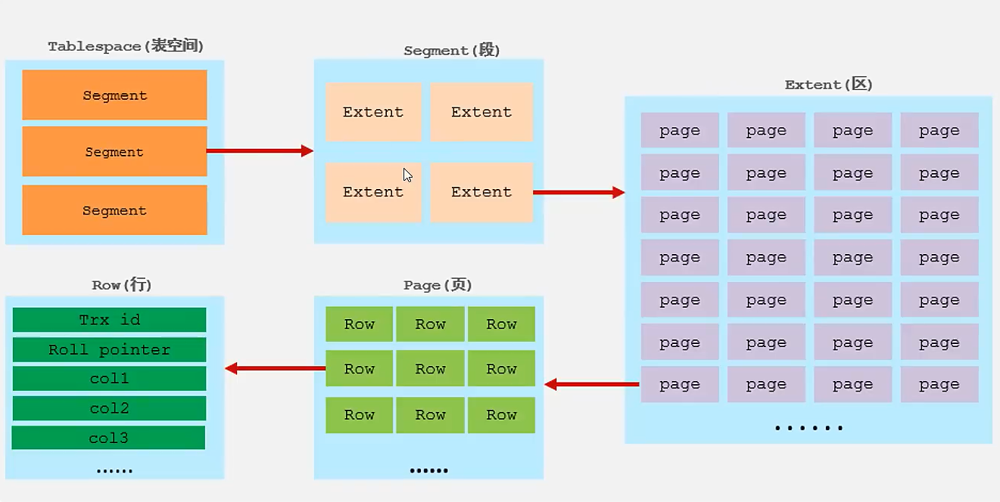

# 逻辑存储结构

## 表空间(TableSpace)

-   存储数据,索引
-   .idb文件
-   可以有多个.idb文件
-   最外层

## 段(Segment)

表空间内多个段

#### 数据段**(Leaf Node Segment)**

InnoDB是索引组织表

数据段就是B+Tree的叶子节点

#### 索引段**(Non-Leaf Node Segment)**

索引段就是B+Tree的非叶子节点

#### 回滚段**(Rollback Segment)**

## 区(Extent)

大小固定,是1MB

## 页(Page)

InnoDB存储引擎磁盘管理的最小单元

大小固定,是16KB

为了保证数据的连续性,InnoDB每次从磁盘存取**4-5个区**

-   索引有关

## 行(Row)

数据就是按行存放的

### 隐藏

-   Trx_id
    -   行id
    -   最后一次事务操作的ID
-   Roll Point
    -   回滚指针
    -   指针,找到增删改之前的数据

-   字段值

