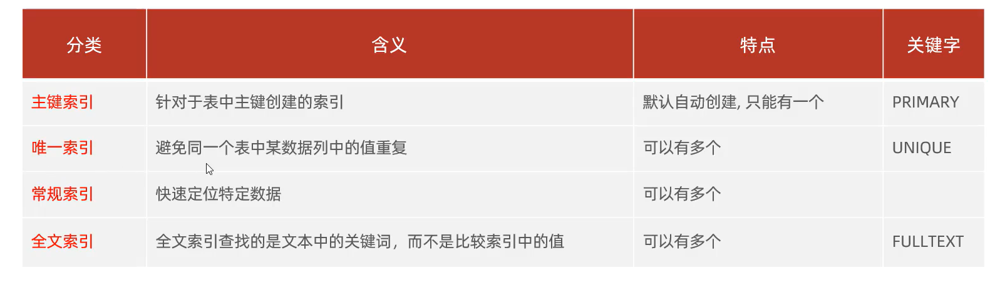
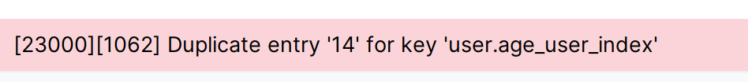

# 索引使用

## 查看已存在的索引

```mysql
show index from 表名;
show index from 表名\G;# 当返回的只有一条记录时候可以\G把行列置换
```

## 创建索引

### 选择索引

>   分析字段属性与约束,选择合适的索引



### 语法

```mysql 
create [unique|fullText] index 取一个索引名 on 表名(字段1[,字段2,....]);
create primary index 取一个索引名 on 表名(字段名);# 自动创建耶
```

-   索引名:idx▁表名▁字段名
-   这里如果使用多个字段时(以Unique为例)

    -   例如name和phone为联合索引,phone唯一,name不唯一,依旧可以选择unique

        -   给不唯一的字段创建唯一索引:

        

        -   但是,如果一个字段没有被约束成Unique,但数据实质上是Unique的,那么可以创建,不会报错

        -   但是,创建了Unique索引之后,就会检查唯一性,就会报错了

            
-   创建索引的顺序的讲究

    -   看了知乎提前接触了一点了
-   创建索引时关联多个字段就是在创建关联索引了

    -   会在`where age = 35 and gender = '女'`这种地方用到

## 删除索引

```mysql
drop index 索引名 on 表名;
```

