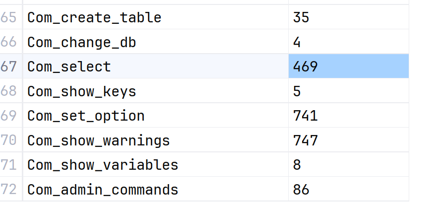
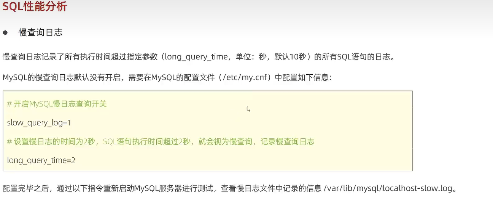
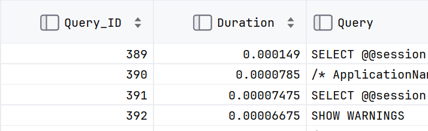
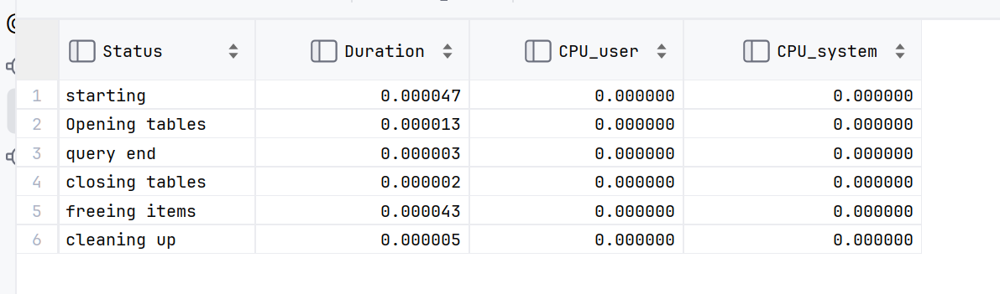
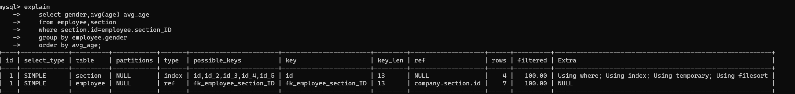
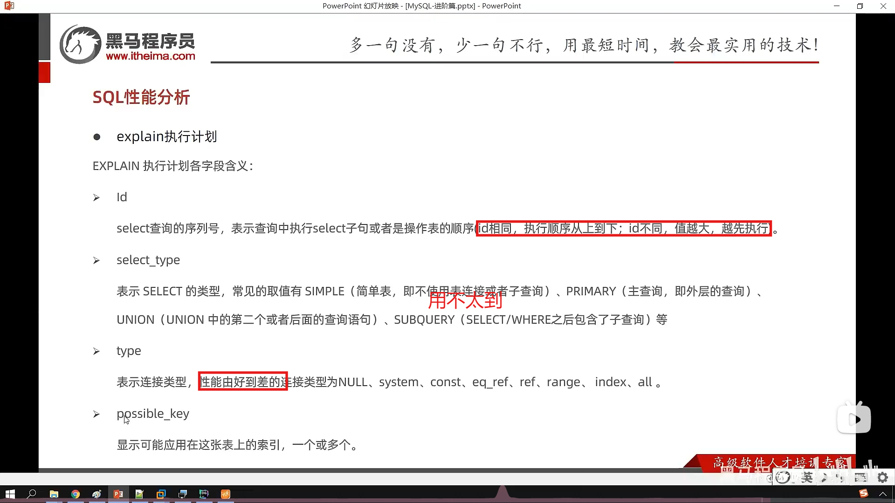
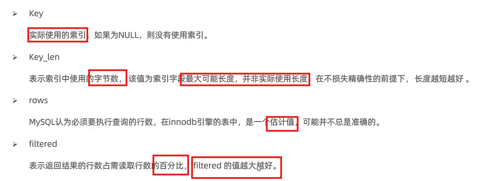
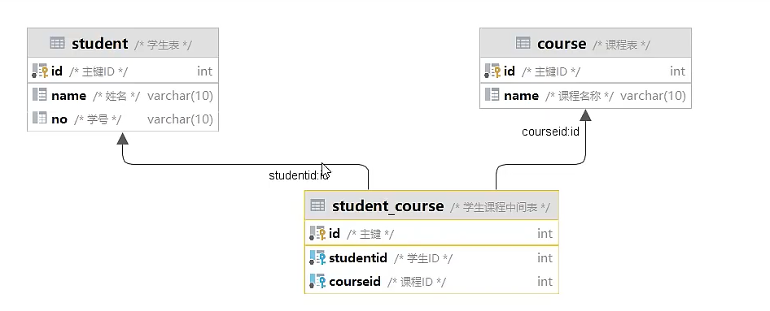
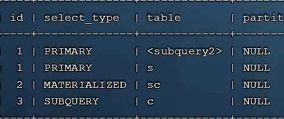

# 性能优化与分析

-   优化针对于查询,因为查询次数会很多
-   其中优化索引占据主要地位

## 查看用户数据库各项操作访问频次

```mysql
show global status like 'Com_____';
```

-   global,范围是这个数据库

-   模糊查询,一个下划线就是一个字符,**commit**

-   当然,既然是模糊匹配,那么:

	```mysql
	show global status like 'Com%';
	```
	
-   也是没问题的

    



## 慢查询日志

-   用于记录慢于设定时间的查询
-   时长默认10s
-   默认关闭

### 慢查询日志的查询

```mysql
show variables like 'slow_query_log';
```


### 设置慢日志配置

-   在文件[MySQL配置文件](D:\IT_study\MySQL\MySQL Server 8.0\my.ini)设置

-   开启慢查询日志

```mysql
slow_query_log = 开(1)/关(0);
```

-   设定限制时长

```mysql
long_query_time = 时长(s);
```

-   然后重启Mysql生效
-   在mysql5.21+后版本支持毫秒记录

slow_query_log = 开(1)/关(0);

long_query_time = 时长(s);

-   生成目录文件:

    `D:\IT_study\MySQL\MySQL Server 8.0\-slow.log`

```properties
log-output=FILE
general-log=1
general_log_file="D:\IT_study\MySQL\mysql.log"
slow-query-log=1
slow_query_log_file="D:\IT_study\MySQL\mysql_slow.log"
long_query_time=2

```

文件似乎是被我修改过了,前面的都不算,以这个为准

## Profile详情

-   显示每一条指令的时间
-   显示耗时在何处

### 查看是否支持Profiles

```mysql
select @@have_profiling;
```

-   Yes

### 查看Profiles是否开启

```mysql
select @@profiling;
```

-   0     未开启

### 开启Profile

```mysql
set profiling = 1;
```

### 使用profile详情

-   显示历史select语句的耗时

	```mysql
	select .........;
	............
	............
	............
	show profiles ;
	```
	
-   依据这条ID查询这条Select语句在各方面的耗时

	```mysql
	show profile [cpu] for query Query的ID;
	```
	
	
	
	
	
-   ​												↑它

-   cpu 多俩列字段显示CPU占用

    

## explain获取如何执行SELECT信息

-   语法:

    ```mysql
    explain|desc select语句;
    ```

    


```mysql
explain
    select gender,avg(age) avg_age
    from employee,section
    where section.id=employee.section_ID
    group by employee.gender
    order by avg_age;

desc
    select gender,avg(age) avg_age
    from employee,section
    where section.id=employee.section_ID
    group by employee.gender
    order by avg_age;
```

-   一样的




### explain各字段解释





#### ID

  


```mysql
# 选了MySQL课程的学生
explain
	select * from 
	student s 
	where s.id in (
    	select studentid 
        from student_course sc 
        where sc.courseid = (
        	select id 
            from coure c
            where c.name = 'MySQL'
        ) 
    )
;
```



c -> sc -> subquery2 -> s

#### select_type

>    不重要

#### type

-   Null

    -   形如:

        ```mysql
        select 'A';
        ```

        不查询任何表的

-   System

    -   查询系统表

-   Const

    -   形如

        ```mysql
        select name from employee where id = 1;
        ```

        查询条件是表的主键或唯一索引

-   ref

    -   形如

        ```mysql
        select id from employee where name = 'A';
        ```

        查询条件是表的非唯一主键

-   index

    -   查询索引

-   all 

    -   全表扫描 

#### 着重关注的字段

-	type
-	possible_keys
-	key
-	key_len
-	Extra

