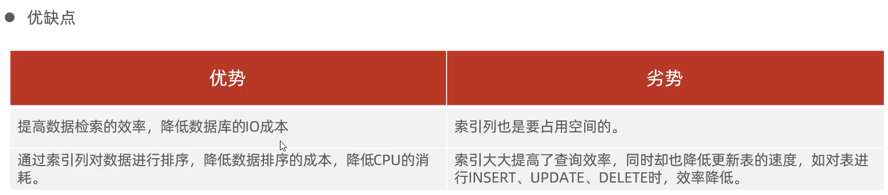
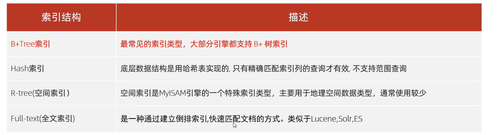
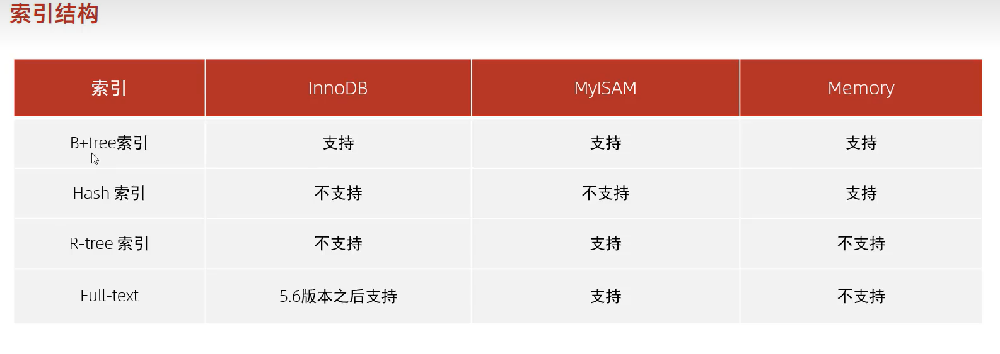
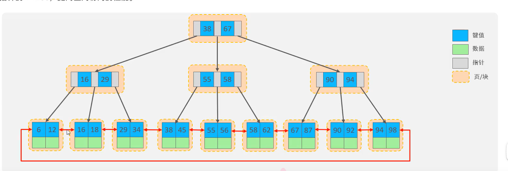
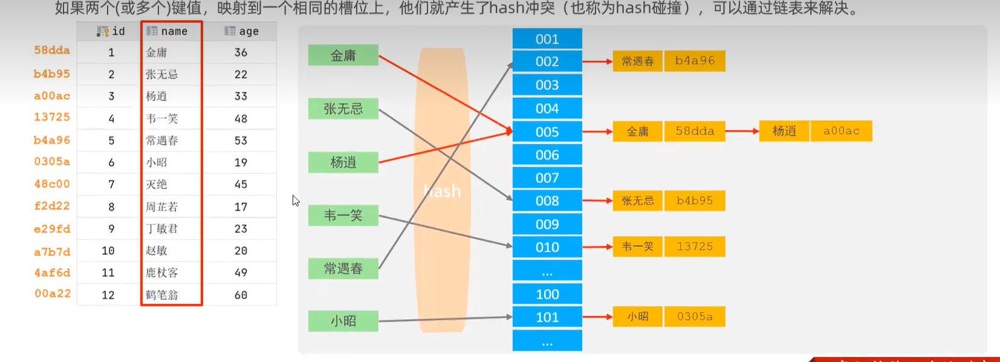
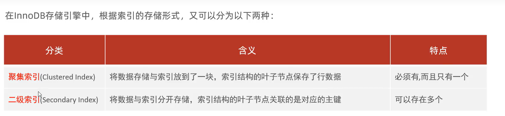
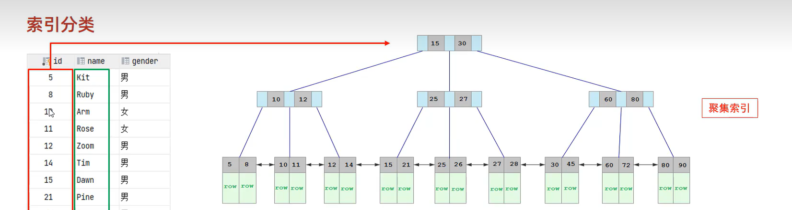
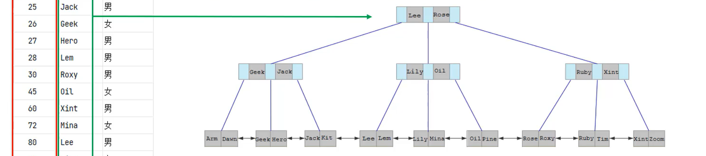
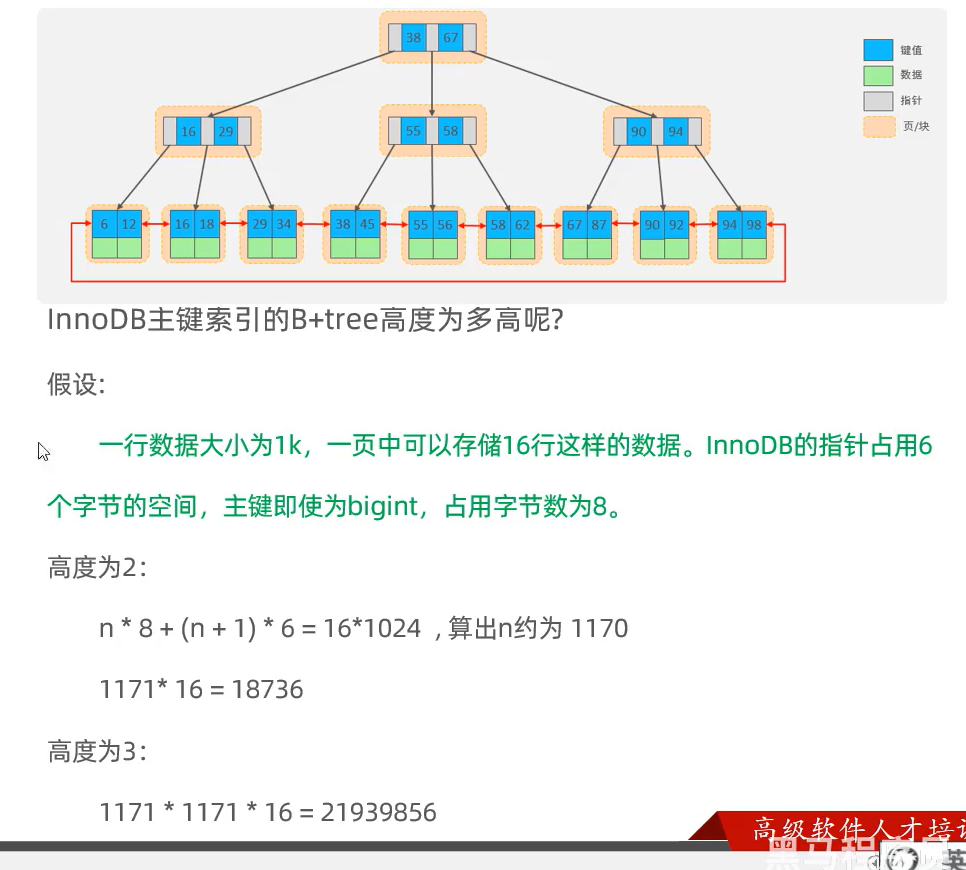

#  索引

-   有序的数据结构
-   高效获取数据

-   无索引的情况:
    -   查age=20
    -   找到后,继续向下找
    -   全表扫描,效率极低
-   有索引:
    -   把age提出来,索引指向数据,排序,然后二分查找
    -   数据结构  查找,高效

-   空间不值钱

-   默认是B+tree索引

### B-Tree

-   多路平衡查找树

### B+Tree

-   Mysql优化

### Hash索引

Hash冲突->在Hash值处增加链表->Hash树

只支持等值匹配(= , in),不支持范围查询(BETWEEN < >)

不支持排序

通常一次检索,效率极高

## 索引分类

-   InnoDB中

### 聚集索引

-   默认主键索引就是聚集索引
-   没有主键,将使用第一个唯一索引
-   如果没有唯一索引?MySQL自动生成一列作为聚集索引

-   二叉树的叶子挂(聚集索引连带着一行记录)

### 二级索引

-   针对某一列作为索引,抽取出来
-   叶子下面挂(这一列的数据,附带着聚集索引)

1.  拿到这列的记录

2.  取得对应聚集索引
3.  依据聚集索引去上面聚集索引的B+TREE查
4.  得到整行内容

-   这叫做**回表查询**

