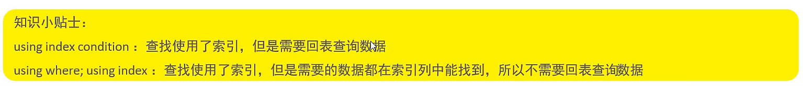

# 覆盖索引

-   查询使用了索引,并且需要返回的列,在该索引中以及全部能够找到
-   **应该尽量地使用覆盖索引来代替SELECT * **

-   使用覆盖索引时应该关注**Extea**中的信息

### 下面我们来看看Extra




```mysql
create index user_age_gender on user(age,gender);
```

```mysql
explain select id ,age where age = 30;
```

-   索引OK,不用回表查询

```mysql
explain select id ,age,gender where age = 30 and gender = '女' ;
```

-   索引OK,不用回表查询

```mysql
explain select id,NAME ,age,gender where age = 30 and gender = '女' ;
```

-   索引OK,**需要回表查询**

