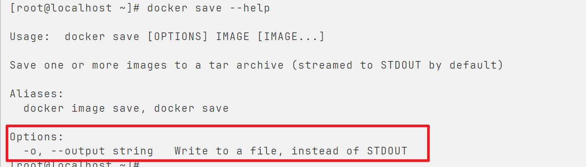
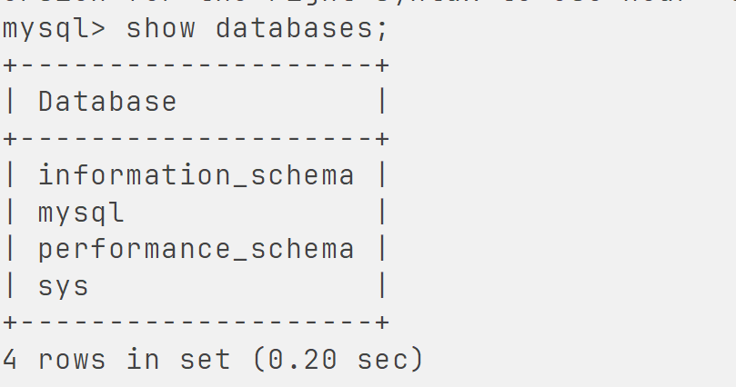
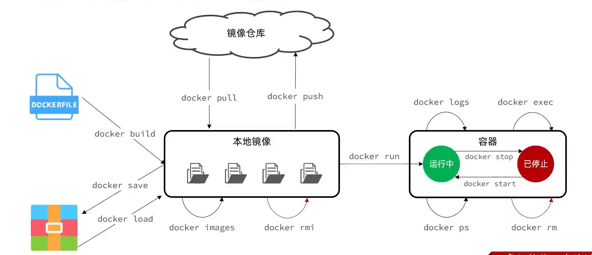

# 常见命令

>   操作镜像(image)和容器(container)

-   镜像仓库(全球/公司私服)-**pull**^下载(拉取)^->本地镜像仓库

    ```bash
    docker pull --help
    ```

-   查看镜像**images**

    ```bash
    docker images --help
    ```

-   删除**r(e)m(ove)**镜像**i(mage)**

    ```remove
    docker rmi --help
    ```

-   dockerfile-**build**^创建^->本地镜像仓库

    ```bash
    docker build --help
    ```

-   本地镜像仓库-**save**^保存^->本地压缩文件

    ```bash
    docker save --help
    ```

    

    ```bash
    docker save -o dockers/mysql.tar mysql:latest
    ```

    版本不能少,要写上

-   本地压缩文件-**load**^加载^->本地镜像仓库

    ```bash
    docker load --help
    ```

-   本地镜像仓库-**push**^上传(推送)^->镜像仓库(全球/公司私服)

    ```bash
    docker push --help
    ```

-   创建并运行**run**容器

    ```bash
    docker run --help
    ```

    对于一部分(或自定义)镜像**`-p`指定的端口映射可以有多个**

-   停止**stop**容器中的进程

    ```bash
    docker stop --help
    ```

-   启动**start**停止的容器进程

    ```bash
    docker start --help
    ```

    -   `docker run` 和`docker start`

        被`stop`的容器要用`start`去开启

        用`run`相当于又创建了一个新的容器然后去启动, 非常不合理

-   查看容器的进程**p(rocess)**状态**s(tatus)**

    ```bash
    docker ps --help
    ```

    对输出的进程状态做格式化

    ```bash
    docker ps --format 'table {{.ID}}\t{{.Image}}\t{{.Ports}}\t{{.Status}}\t{{.Names}}'
    ```

    `-a` 查看所有, 包括未启动的容器

-   查看容器日志(**logs**)

    ```bash
    docker logs --help
    ```

    清空日志内容
    
    ```shell
    docker ps -aq | xargs docker inspect --format='{{.LogPath}}' | xargs truncate -s 0
    ```
    
    
    
-   进入**exec(ute)**容器内部(容器是隔离空间),对容器进行修改和操作

    ```bash
    docker exec --help
    ```

    ```bash
    docker exec -it 容器名 bash
    ```

    -   `-it`表示添加一个可输入的控制台

    -   `bash`命令行

    -   例如,进入mysql容器

        ```bash
        docker exec -it mysql bash
        ```

        进入mysql

        ```bash
        mysql -uroot -p
        ```

        

        退出mysql

        ```bash
        exit
        ```

        退出mysql容器

        ```bash
        exit
        ```

        你看那个命令结尾的Bash,为啥要进入Bash,我就要进入mysql!

        你也可以这么骚操作:

        ```bash
        docker exec -it mysql mysql -uroot -p
        ```

        

-   删除**r(e)m(ove)**容器

    ```bash
    docker rm --help
    ```

    -   `rmi`删除镜像
    -   `rm`删除容器



剩下的看官方文档

Linux命令别名

```bash
vi ~/.bashrc
```

让文件生效

```bash
source ~/.bashrc
```


运行容器时开机自启

```bash
docker run --restart=always 容器id 或 容器名称
```

运行的容器设置开机自启

```bash
docker update --restart=always 容器id 或 容器名称
```

批量设置

```bash
docker update --restart=always $(docker ps -aq)
```

关闭开机自启

```bash
docker update --restart=no 容器id 或 容器名称
```

