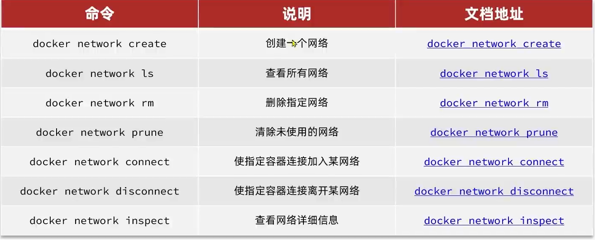

# Docker网络

## 虚拟网卡Docker0

查看镜像消息

```bash
docker inspect mysql0
```

```bash
docker inspect mysql1
```

发现他们的IP地址非常解决

**Docker创建的容器的IP地址在同一网段下**

### 原理

Docker在安装时, 自动在宿主机创建了一张**虚拟网卡Docker0**`172.17.0.1/16` ,  /16表示网段是前16位

所有容器都是以**bridge(桥接)**的方式连接到Docker的一个虚拟网卡上


-   **但是!** 

    这些IP地址都是虚拟的. ~~Docker把握不住~~, 

    IP地址可能会在机子启动时有所变化(可能因为占用IP地址的先后, 快慢而改变), 

    使用IP地址把容器连接起来, 有不确定性(一般是不一样的IP地址)

    使用IP地址作为连接容器的ID , 不合理

-   **但是!**

    **可以通过容器名互相访问, 不需要通过IP地址**

    例如:

    ```bash
    ping mysql
    ```

## 网络命令




-   在创建容器时就把容器放入网络

    ```bash
    docker run --name 容器名 -p 端口号:端口 --network 之前在create的时候自定义网络名 镜像名
    ```

    **`--network 之前在create的时候自定义网络名`**


## 注意

1.  一个项目中的几个容器(mysql,reddis,jar)放在同一个网络下

2.  由于数据库的IP地址不一定

    spring-boot在配置文件中, 应该把数据库的IP地址改为容器名

    (把对IP地址的配置,以变量表示, 然后做一个**配置配置文件的文件**, 配置这些配置)

    然后一个配置文件叫`application-dev.yml`,另一个叫`application-pro.yml`,

    通过命令来指定哪一个配置文件生效(见Spring-boot/配置/环境配置.md)


## 问题

有多台机器,都有docker了,然后都有各自的容器, 我希望这些不同机器上的不同容器都能在同一个docker网络下, 应该怎么做?
