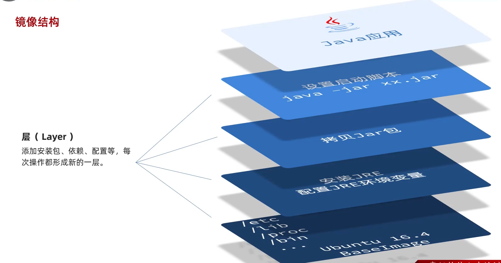
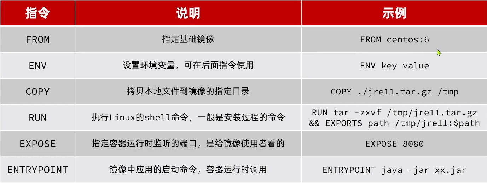

# 自定义镜像

-   部署Java应用的步骤

    1.  准备一个Linux服务器
    2.  安装JRE并配置环境变量
    3.  拷贝jar包
    4.  允许jar包

    -   但是, 不知道使用者的操作系统是啥,系统函数库不一样,不是要全炸?
    -   干脆把系统函数库全部拷进去

-   构建一个Java镜像的步骤

    1.  准备一个Linux运行环境
    2.  安装JRE并配置环境变量
    3.  拷贝Jar包
    4.  编写运行脚本


## 层Layer

Docker不是把所有文件都打包,

而是把文件打成一个一个包,这些包合在一起才是一个镜像



### 好处

-   例如把操作系统的系统函数作为一个层, 

    镜像一用完, 镜像二还能接着用!

-   把操作系统单独上传到中央

    以后的需要用到操作系统的镜像直接使用中央的镜像

    大大减少容量

-   下载两个镜像,镜像A和镜像B

    镜像A下载完了, 镜像B一看, 欸?镜像A的前俩层和我一样, 那我不下载了, 我用你的了!

    下载速度大大提升

    存储体积减少


## 镜像的要素

### 入口

>   Emntrypoint

镜像运行的入口, 一般是程序启动的脚本和参数


### 层

>   Layer

添加安装包, 依赖, 配置等, 内次操作都会形成新的一层


### 基础镜像

>   BaseImage

应用依赖的系统函数库, 环境, 配置, 文件等


## Dokerfile

-   文本文件
-   包含一个个的**指令**
-   用指令来说明要执行什么操作来构建镜像
-   将来Docker可以更具Dockerfile帮助我们构建镜像

### 指令

>   Instruction



[Dockerfile references](https://docs.docker.com/engine/reference/builder/)

-   前是FROM,后是ENTRYPOINT中间是过程

-   FROM基础镜像

    **基础镜像不存在的话是需要去下载的**

-   COPY

    jar包的步骤

-   RUN

    解压缩

### 模板

-   简单的模板

```dockerfile
# 基础镜像, jdk内含有系统函数
FROM openjdk:11.0-jre-buster

# 设定时区
ENV TZ=Asiz/Shanghai
RUN ln -snf /usr/share/zoneinfo/$TZ etc/localtime &&echo $TZ > /etc/timezone
# 时区默认是中时区, 不是东八区

# 拷贝自己的jar包
COPY docker-demo.jre /app.jar
# 入口
ENTRYPOINT ["java","-jre","/app.jar"]
```

**Dockerfile就应该叫** ***Dockerfile*** **,没有后缀名**

### 构建镜像的命令

```bash
docker build -t 镜像名字:版本 .
```

-   `-t`: 给镜像起名

    格式是`repository:tag`

    不指定tag时默认时latest

-   `.`: 指定Dokerfile所在目录

    不会去指定Dokerfile的文件名,所以Docker一定要叫Dockerfile

    即当前路径(**相对于执行命令的路径**)

    当然, Dokerfile里也涉及了相对路径(**相对于Dockerfile的路径**) , 所以jar包也要放在合适的位置

