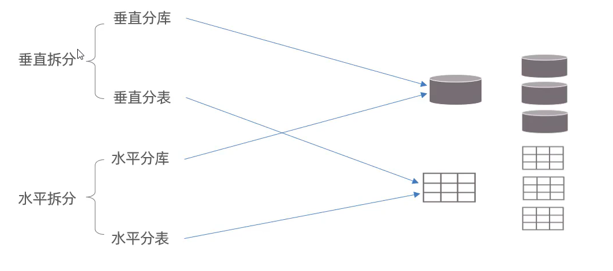
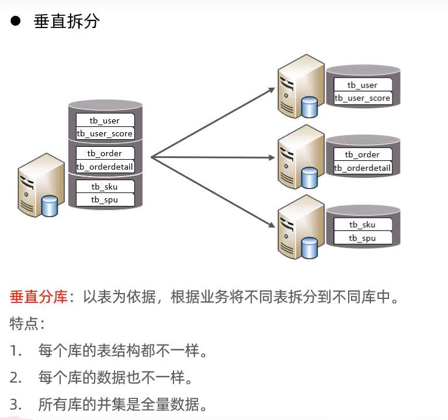
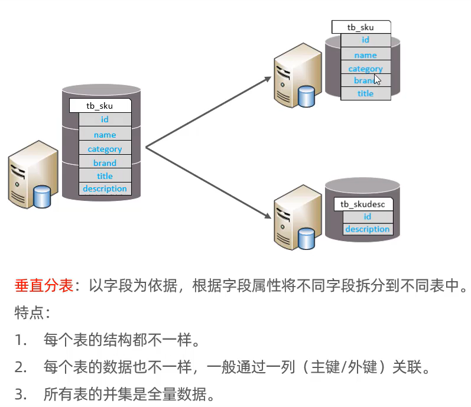
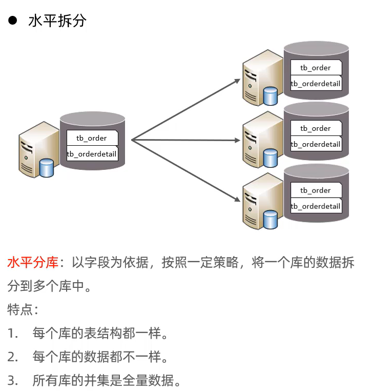
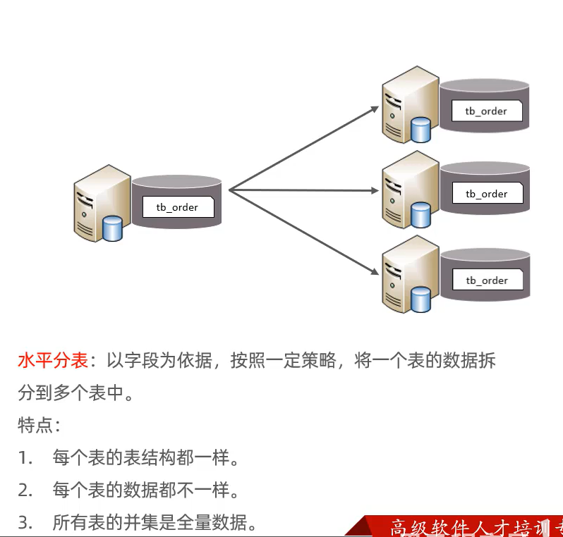

# 分库分表

-   大量数据

    ->磁盘内存不足

       ->增加磁盘和内存

    无止境的数据,

- IO瓶颈,热点数据过多,
    - 磁盘IO瓶颈: 数据库缓存不足,效率低,
    - 网络IO瓶颈: 请求数据多,宽带不够

-   CPU瓶颈,排序分组,连接查询,聚合统计消耗大量CPU资源

## 核心:

将数据分散存储,使单一的数据库/表的数据量变小来缓解单一数据库的性能问题,从而提升数据库性能目的

## 拆分策略

### 垂直拆分

-   垂直分库

    -   以表为单位拆分

        

-   垂直分表

    -   以**字段**单位拆分

        

### 水平拆分

-   水平分库

    -   都存表,但记录被分散了

        

-   水平分表

    -   都存字段,但记录被分散了

        

## 分库分表的实现技术

-   ShardingJDBC

    

-   MyCat

    

