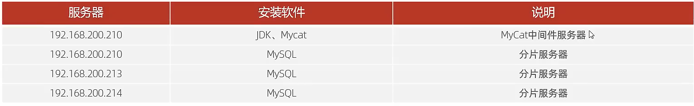
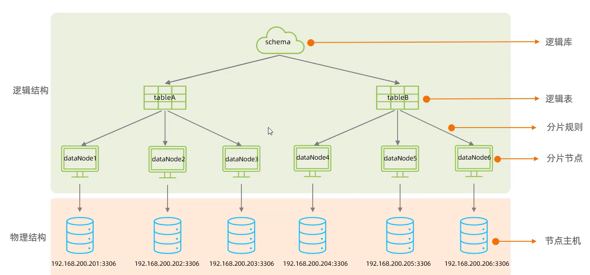
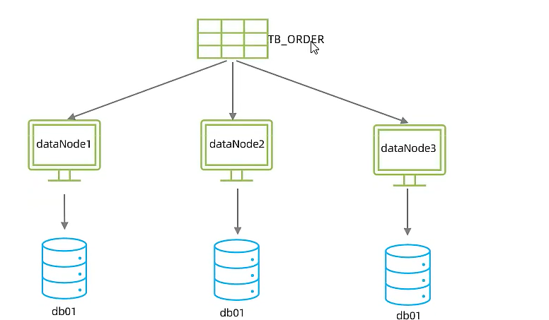
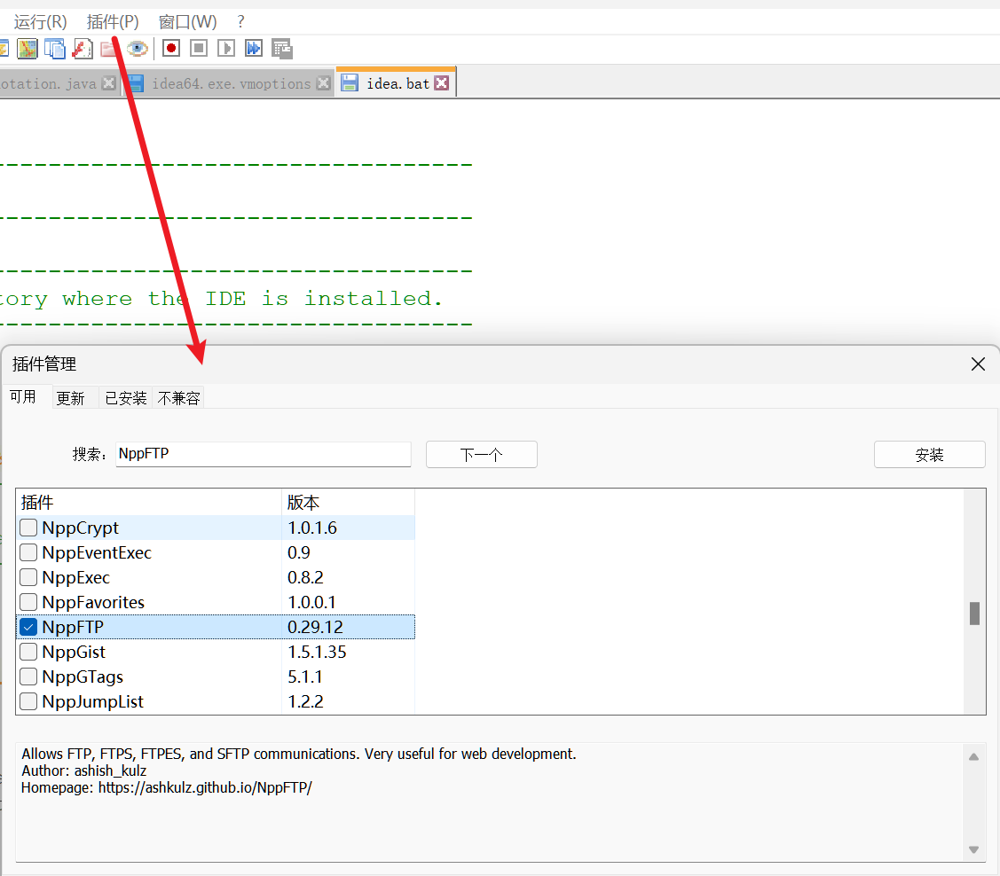
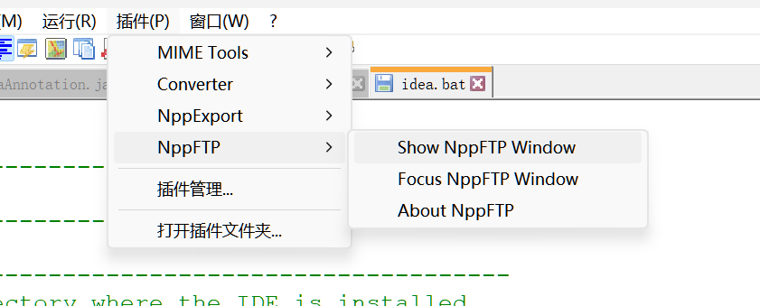
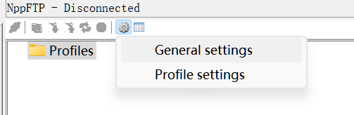

# MyCat

>   非侵入式的开源的基于Java的阿里巴巴的数据库中间件

>   注意MyCat和MySql8.0之后版本的兼容问题,以下笔记我都没有测试过

## 原理

>   我们可以连接MyCat,然后让MyCat连接数据库服务器,达到和直接连接完全一致的效果

-   伪装协议

## 优势

-    性能可靠稳定
-   强大的技术团队
-   体系完备
-   社区活跃

## 安装



先装JDK,再装MyCat

```bash
tar -zxvf 压缩包名.tar.gz -C /安装目录
```

配置环境变量

```bash
vim /etc/profile
```

加上配置

 ```properties
JAVA_HOME=/安装目录
PATH=$PATH:$JAVA_HOME/bin
 ```

重新执行环境变量文件

```bash
source /etc/profile
```

检查JDK

```bash
java -version
```


### 目录文件夹

-   bin

    可执行文件,用于启动停止mycat

-   conf:

    存放mycat的配置文件

-   lib

    存放mycat的项目依赖包

-   logs:

    存放mycat日志文件

#### 解决MyCat与MySQL的版本兼容问题

mycat解压好之后(不用配环境变量....吧?)

再MyCAT的安装目录下的lib目录中, 有许都jar包

其中`mysql-connector-java-5.1.35.jar`就是导致版本不兼容的元凶

删除该jar包

```bash
rm -rf jar包名(看情况吧)
```

重新上传一个高版本的jar包(从maven那边偷可以吗)

给新的jar包授权

```bash
chmod 777 指定文件jar包
```


## 结构

>   逻辑结构和物理结构

-   逻辑结构
    -   逻辑库
    -   逻辑表
    -   分片规则
    -   分片节点
-   物理结构
    -   节点主机




## MyCat 入门

### 需求:

对tb_order表进行分片, 分为三个数据节点,每一个节点主机位于不同的服务器上




-   水平拆分

### 环境准备

MyCat中间件服务器


 


#### 检查防火墙

```bash
Systemctl status firewalld
```

显示:

```txt
Active:inactive (dead)
```

表示关闭

-   关闭防火墙的命令:

    ```bash
    systemctl stop firewalld
    systemctl disable firewalld
    ```

    都可以试试,stop暂时关闭,disable永久关闭

-   开启防火墙命令:

    ```bash
    systemctl start firewalld.service
    ```

### 基本配置

见下方MyCat基本配置

### 启动服务

1.  运行Mycat的启动脚本bin/mycat

    参数start

    ```bash
    bin/mycat start
    ```

    停止MyCat---使用参数stop

    ```bash
    bin/mycat stop
    ```

    **Mycat占用的端口号是8066**

2.  查看是否已经启动---查看wrapper.log文件

    ```bash
    tail -f logs/wrapper.log
    ```

    文件末尾由一句`start successfully`就算成功

### 分片测试

通过`mysql`指令,连接登录MyCat

```bash
mysql -h 192.168.200.210 -P 8066 -uroot -p123456
```

(在有MySQL的那个中间件服务器上)

==**你看这个指令,和MySQL一样,就体现了伪装协议**==

#### 使用MyCat

输入和MySQL一样的指令

```mysql
show database;
```

-   将返回配置的逻辑数据库,库名为:MY_SCHEMA01,且唯一
-   然后就可以开始你的骚操作了

#### 通过MyCat创建表

创建表TB_ORDER,至于为什么叫TB_ORDER,见下面的配置文件

```mysql
CREATE TABLE TB_ORDER(
	id BIGINT(20) NOT NULL,
    title VARCHAR(100) NOT NULL,
    PRIMARY KEY(id)
)ENGINE=INNODB DEFAULT CHARSET=utf8
```

由于是**水平分表**,所以三个实际库会各自创建一张一样的表

数据怎么分布取决于数据分片规则(见配置)


## MyCat 配置

### 从NotePad++打开服务器文件

>   使用NotePad++的插件,连接服务器,直接打开文本文件,编辑之后自动同步到服务器



安装下



使用**Show NppFTP Window**

-   **Profile settings**设置要连接的服务器



填入相关信息即可


### 基本配置

#### 核心配置文件

核心配置文件/usr/local/mycact/conf/schema.xml

```xml
<?xml version="1.0"?>
<!DOCTYPE mycat:schema SYSTEM "schema.dtd">
<mycat:schema xmlns:mycat="http://io.mycat/">

    <!--<schema>标签是顶级结构逻辑库,name:逻辑库的库名,自己指定-->
    <schema name="MY_SCHEMA01" checkSQLschema="true" sqlMaxLimit="100">
        <!--逻辑库下的逻辑表,可以有很多的逻辑表-->
        <table name = "TB_ORDER" dataNode="dn1,dn2,dn3" rule="auto-sharing-long" />
        <!--name:表名自定义         数据节点,与下方dataNode联系              分片规则-->
    </schema>

    <dataNode name="dn1" dataHost="localhost1" database="db01" />
    <!--数据节点名,与上方dataBode联系,唯一-->
    <dataNode name="dn2" dataHost="localhost2" database="db01" />
                    <!--节点主机,名字自定义,有几台,写几个,与下方dataHost联系-->
    <dataNode name="dn3" dataHost="localhost3" database="db01" />
                           <!--主机下的数据库,哪个是逻辑库的分库,数据库名应该是正是存在的数据库名,三位一体方位-->

    <!--节点主机名与上方dataHost联系--><!--最大连接数,最小连接数,连接的负载均衡策略-->
    <dataHost name="localhost1" maxCon="1000" minCon="10" balance="0"
              writeType="0" dbType="mysql" dbDriver="jdbc" switchType="2"  slaveThreshold="100">
                             <!--dbDriver有两种形式:"native"和"jdbc",我们使用jdbc-->
        <heartbeat>show slave status</heartbeat><!--心跳,不用管-->
        <!--数据库的连接信息-->
        <writeHost host="master"
                   url="jdbc:mysql://192.168.200.210:3306?useSSL=false&amp;serverTimezone=Asia/Shanghai&amp;characterEncoding=utf8"
                   user="root" password="123456"/><!--&amp;即转移&-->
        <!--host的值涉及主从复制-->
    </dataHost>
    <dataHost name="localhost2" maxCon="1000" minCon="10" balance="0"
              writeType="0" dbType="mysql" dbDriver="jdbc" switchType="2"  slaveThreshold="100">
        <heartbeat>show slave status</heartbeat>
        <writeHost host="master"
                   url="jdbc:mysql://192.168.200.213:3306?useSSL=false&amp;serverTimezone=Asia/Shanghai&amp;characterEncoding=utf8"
                   user="root" password="123456"/>
    </dataHost>
    <dataHost name="localhost3" maxCon="1000" minCon="10" balance="0"
              writeType="0" dbType="mysql" dbDriver="jdbc" switchType="2"  slaveThreshold="100">
        <heartbeat>show slave status</heartbeat>]
        <writeHost host="master"
                   url="jdbc:mysql://192.168.200.214:3306?useSSL=false&amp;serverTimezone=Asia/Shanghai&amp;characterEncoding=utf8"
                   user="root" password="123456"/>
        <!--IP地址记得改-->
    </dataHost>

</mycat:schema>
```

#### 用户权限配置

server.xml配置用户的用户权限

```xml
<user name="root" defaultAccount="true">
	<property name="password">123456</property>
    <property name="schema">MY_SCHEMA01</property>
</user>
<!--用户权限配置-->
<user name="user">
	<property name="password">123456</property>
    <property name="schema">MY_SCHEMA01</property>
    <!--权限设置-->
    <property name="readOnly">true</property>
</user>
```


## MyCat分片

### 数据分片规则其一

上面使用了`rule="auto-sharing-long"`,引用了conf/rule.xml

-   rule.xml

    ```xml
    <tableRule name="auto-sharing-long">
    	<rule>
        	<columns>id</columns>
            <!--根据id分派你-->
            <algorithm>rang-long</algorithm>
            <!--使用算法rang-long,引用分派你函数function标签-->
        </rule>
    </tableRule>
    <funcion name="rang-lang" 
             class="io.mycat.route.function.AutoPartitionByLong">
        <property name="mapFile">autopartition-long.txt</property>
    </funcion>
    ```

-   conf/autopartition-long.txt

    ```txt
    # range start-end,data node index
    # K=1000,M=10000.
    0-500M=0
    500-1000M=1
    1000-1500M=2
    ```

    500M->五百万

    看data node index数据节点索引

    所以id>500万的会去第二个库(没必要有五百万个数据)

    超过一千五百万就报错:

    ```
    ERROR 1064 (HY000): can't find any valid datanode :TB_ORDER -> ID -> 15000001
    ```

    在autopartition-long.txt继续写就可以解决这个问题

