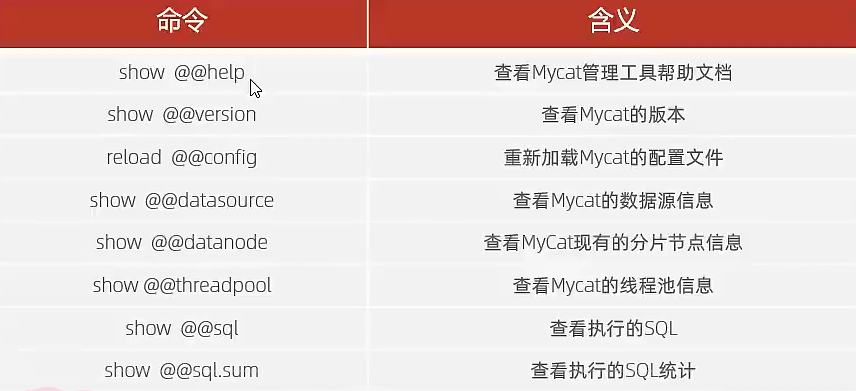

# 管理与监控

## MyCat原理及处理流程

-   传输MySQL指令
    1.  解析客户端的SQL语句
    2.  分片分析
    3.  路由分析
    4.  读写分离分析
-   返回结果数据
    1.  结果合并
    2.  聚合处理
    3.  排序处理
    4.  分页处理
-   幸苦你了MyCat

## MyCat管理系统

-   MyCat:Port=8066
    -   数据访问及接口
    -   进行DML和DDL
-   MyCatPort=9066
    -   数据库管理端口
    -   myCat服务管理控制功能
    -   管理macat的整个集群状态

### 配置系统运行的环境信息-端口

```xml
<system>
    <!--MyCat服务端端口号默认为8066-->
    <property name="serverPort">8066</property>
    <!--MyCat管理端端口号默认为9066-->
    <property name="managerPort">9066</property>
</system>
```

### 连接端管理端口

```bash
mysql -h 192.168.200.210 -p 9066 -uroot -p123456
```

### 使用管理端

-   管理端指令:

    

    ```bash
    show @@help
    ```

    查看所有MyCat管理指令

    ```bash
    show @@version
    ```

    查看当前MyCat的版本

    ```bash
    reload @@config
    ```

    ==重新加载配置文件,而不需要重启Mycat==

    ```bash
    show @@database
    ```

    查看数据库

    ```bash
    show @@threadpool
    ```

    查看线程池信息

    ```bash
    show @@sql
    ```

    最近执行的sql情况(执行耗时,执行语句,执行用户,执行时间点(时间戳)等)

    ```bash
    show @@sql.sum
    ```

## MyCat-Web/MyCat-eye

>   监控MyCat服务的图形化工具

-   MyCat-eye依赖**zoo-kepper**和**MyCat-web**

### Zoo-kepper

-   `conf/zoo_smple.cfg` 

    -   这是样例的配置文件,但"样例"不重要,直接改名`zoo.cfg`

    -   里面需要改的配置:

        ```properties
        dataDir=自己创建的文件夹路径
        ```

### MyCat-web

-   `mycat-web/WEB-INF/classes/mycat.properties`

    -   配置文件

    -   指定zookeeper的地址

        ```properties
        zookeeper=location:2081
        ```

        在同一台服务器上就不用改

#### 启动MyCat-Web

```bash
sh start.sh
```

访问

#### 进入MyCat-eye

`192.168.200.210:8082/mycat/`

-   服务器IP地址

-   Mycat配置->MyCat服务管理->新增->

    -   IP地址:`192.168.200.210`

        MyCat所在地址

    -   管理端口:9066

    -   服务端口:8066

