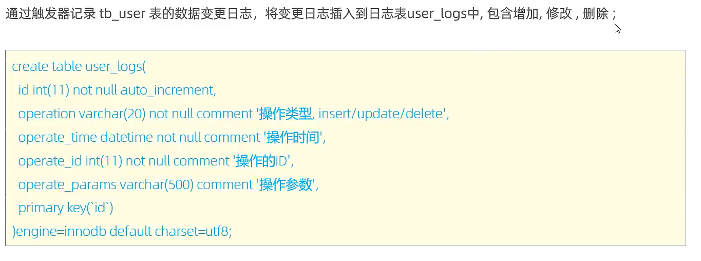
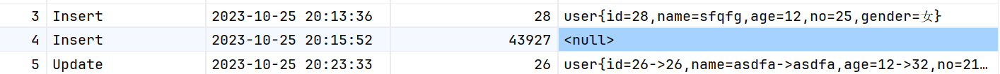

# 触发器(trigger)


## 创建

```mysql
Create trigger 触发器名
	Before|After insert|update|delete
	on 受关注的表名 for each row -- for each row 表示行级触发器
					-- 既然特意强调了行级触发器,语句级触发器是不是也不远了? 
begin

	SQL语句
	
end;
```


## 查看

```mysql
show triggers;
```


## 删除

```mysql
Drop Triggers [schema_name.]trigger_name; 
```

-   schema_name->数据库的名字

## 案例

-   触发器的作用在哪里?作用在这里,他真的,我哭死 



```mysql
create table user_logs(
    id int(11) not null auto_increment,
    operation char(6)
        check( operation in ('Update','Delete','Insert')) not null
        comment '操作类型,Update/Delete/Insert',
    	-- 做一点小变动
    operate_time datetime not null comment '操作时间',
    operate_id int(11) not null comment '操作对象的ID',
    operate_params varchar(500) comment '操作参数',
    primary key (id) -- 还有这么操作的?
)engine = innodb default charset =utf8;
```


### insert

```mysql
-- 插入数据触发器
Create trigger user_log_in_trigger
	After insert
	on user for each row
begin
     -- id              自增的,insert就行
     -- operation       不言自明
     -- time            时分秒 now()
     -- operate_id      通过new.id来获取id
     -- operate_params  仿照Java重写tpString写法拼一个字符串
    insert into user_logs(id, operation, operate_time, operate_id, operate_params)
        value(
              null,'Insert',now(),new.id,
              concat(
                      'user{id=',new.id,
                      ',name=',new.name,
                      ',age=',new.age,
                      ',no=',new.no,
                      ',gender=',new.gender,
                      '}'
              )
        )
    ;
end;
```

-   使用测试

```mysql
show triggers;
drop trigger user_log_in_trigger;
start transaction ;
insert into user( name, age, no, gender)
value ('asdfa',12,21,'男'),
    ('weqf',14,22,'女'),
    ('sfqfg',12,25,'女');
commit;
rollback;

select * from user_logs;
```

-   爽~


```mysql
insert into user(id)
value (43927);
```



-   我还以为会是name=null之类的字符串呢qwq

```mysql
insert into user(name) value ('dhgervc');
```

-   这个也是null也太过分了!不对null值做检查真是太痛苦啦


-   针对输入null值做了改进

    ```mysql
    -- 插入数据触发器
    Create trigger user_log_in_trigger
    	After insert
    	on user for each row
    begin
        declare name varchar(10) default  IFNULL(new.name,'\'\'');
        declare age varchar(3) default  IFNULL(new.age,'\'\'');
        declare no varchar(10) default  IFNULL(new.no,'\'\'');
        declare gender varchar(1) default  IFNULL(new.gender,'\'\'');
    
        -- id              自增的,insert就行
         -- operation       不言自明
         -- time            时分秒 now()
         -- operate_id      通过new.id来获取id
         -- operate_params  仿照Java重写tiString写法拼一个字符串
        insert into user_logs(id, operation, operate_time, operate_id, operate_params)
            value(
                  null,'Insert',now(),new.id,
                  concat(
                          'user{id=',new.id,
                          ',name=',name,
                          ',age=',age,
                          ',no=',no,
                          ',gender=',gender,
                          '}'
                  )
            )
        ;
    end;
    ```
    
-   测试

    ```mysql
    delete from user;
    delete from user_logs;
    
    show triggers;
    drop trigger user_log_in_trigger;
    
    start transaction ;
    insert into user( name, age, no, gender)
    value ('asdfa',12,23,'男'),
        ('weqf',14,22,'女'),
        ('sfqfg',12,25,'女');
    commit;
    rollback;
    
    insert into user(id)
        value (43923);
    
    select * from user;
    select * from user_logs;
    ```

### update

-   Update触发器

    ```mysql
    -- 插入数据触发器
    Create trigger user_log_in_trigger
    	After insert
    	on user for each row
    begin
        declare name varchar(10) default  IFNULL(new.name,'\'\'');
        declare age varchar(3) default  IFNULL(new.age,'\'\'');
        declare no varchar(10) default  IFNULL(new.no,'\'\'');
        declare gender varchar(1) default  IFNULL(new.gender,'\'\'');
    
        -- id              自增的,insert就行
         -- operation       不言自明
         -- time            时分秒 now()
         -- operate_id      通过new.id来获取id
         -- operate_params  仿照Java重写tiString写法拼一个字符串
        insert into user_logs(id, operation, operate_time, operate_id, operate_params)
            value(
                  null,'Insert',now(),new.id,
                  concat(
                          'user{id=',new.id,
                          ',name=',name,
                          ',age=',age,
                          ',no=',no,
                          ',gender=',gender,
                          '}'
                  )
            )
        ;
    end;
    ```

-   测试

    ```mysql
    show triggers;
    drop trigger if exists user_log_up_trigger;
    
    start transaction ;
    
    update user set age = 32 where id = 43923;
    commit;
    rollback;
    
    select * from user;
    select * from user_logs;
    ```


### delete

