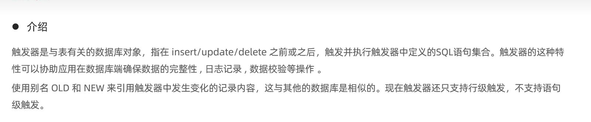
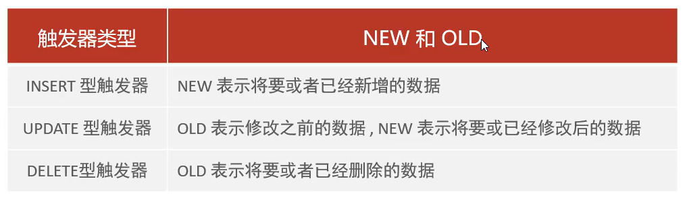

# 触发器概述

-   在数据库端来完成数据的完整性保证
-   在服务器端来完成数据校验(before)和记录日志(after)等操作

-   Old,New针对的是记录(行触发器)

## 触发器类型

-   **目前只支持行级触发器**

## 行级触发器和语句触发器

### 行级触发器

-   执行一条update语句,影响了五行,那么这个触发器被触发了五次

### 语句触发器

-   执行一条update语句,不管影响了几行,触发器都被触发一次