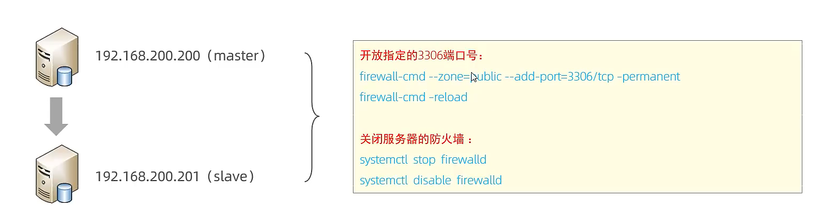
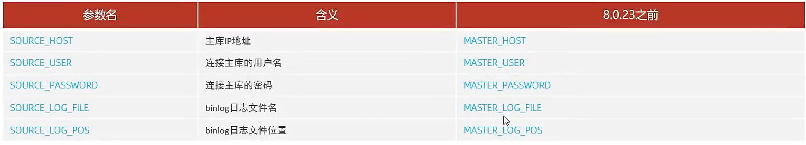
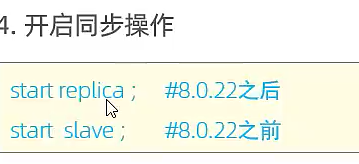

# 概述

-   主库(Master)
-   从库(Slave)
-   离谱


>    将主数据库的DDL和DML语句通过**二进制日志**传给从库服务器,然后在从库上对这些日志进行**重新执行**(也叫重做)从而**使主库和从库的数据保持时刻一致**

-   Mysql支持一台主机**同时**向多台从库进行复制
-   **从库**同时也可**作为**其他从服务器的**主库**实现**链状复制**


## 作用

1.  意外发生,马上顶替
2.  读写分离,降低主库压力
3.  在从库备份,避免备份期间影响主库服务


# 原理

-   基于二进制日志
-   从库IO Thread连接主库
    -   将主库的 binlog 写到 relay log(中继日志)
-   从库的SQL Thraed
    -   读取Relay log,把其中的内容返样(relay)到自身数据库
-   时刻保持一致


# 搭建

>   因为朕只有一台电脑...所以,bye
>
>   开启3306端口号(MySQL)



-   Linux的命令qwq

## 主库

-   主库修改`my.ini`

    ```properties
    # mysql服务id 保证集群唯一 范围[1,2^32-1],默认1
    server-id=1
    # 是否只读 ,1表只读,0表读写
    read-only=0
    # 忽略的数据,指不需要同步的数据库
    # binlog-ignore-db=mysql
    # 指定同步的数据库
    # binlog-do-db=数据库名
    ```

    -   受不鸟啦,网连不上,谁来帮帮我啊


```mysql
create user 'company'@'%'  with mysql_native_password by '123dSA@!dsa';
-- 密码八位以上,大小写符号,也可以自己改等级
-- 给创建出来的用户设置密码,该用户可在任意主机连接该MySQL服务

Grant replication slave on *.* to 'company'@'%';
-- 为'company'@'%'用户分配主从复制权限
```


```mysql
show master status;
```

-   字段:
    -   file 从哪个文件开始推送日志文件
    -   position 从哪个位置开始推送日志
    -   binlog_ignore_db 指定不需要同步的数据库

## 从库

`my.init`

```mysql
# mysql服务id 保证集群唯一 范围[1,2^32-1],默认1
server-id=2
# 是否只读 ,1表只读,0表读写
read-only=1
```

-   权限自己设置下


```mysql
change replication source to source_host='xx.xx',source_user='xxx',master_log_file='xxx',master_log_pos='xxx';
```

-   source_host='xx.xx',源主机地址
-   source_user='xxx',主库用户名
-   master_log_file='xxx',日志地址
-   master_log_pos='xxx';从这份日志的哪个位置




-   后版本支持前版本


```mysql
start replica;
```




-   兼容!


