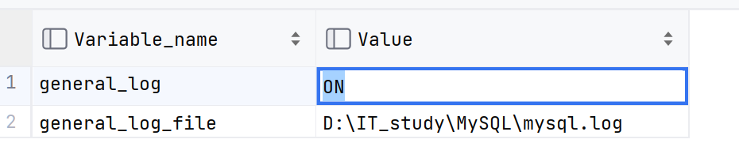

# 错误日志

>   记录MySQL启动停止时,以及服务器运行过程中发生的任何严重错误的相关信息


-   有问题先看错误日志


## 查看

 D:\it_study\Mysql\MySQL Server 8.0\data\错误日志.err

```mysql
show variables like '%log_error%';
```

-   返回文件位置

# 二进制日志(Bin Log)

>   记录了DDL和DML,不包含DQL

## 作用

-   灾难时的数据恢复
-   MySQL的主从赋值


## 查看

-   8.0版本中默认开启

```mysql
show variables '%log_bin%';
```

## 格式

-   Statement
    -   **记录DDL和DML语句**,对数据进行修改的语句会记录在日志中
-   Row(**默认**)
    -   记录每一行数据的变更前后的样子
-   Mixed
    -   混合二者,默认Statement,某些状态下会自动切换成Row记录

### 语法

-   看格式

```mysql
show variables like '%binlog_format%';
```

-   切换格式 
    -   `my.ini` 下修改/添加:

```mysql
binlog_format=STATEMENT
```


## 使用

>   二进制日志是二进制存储的,不能直接读

```DOS
mysqlbinlog [option] logfilename
```

-   `-d` 指定数据库,只列出指定数据库相关操作
-   `-o`  忽略日志前n行命令
-   `-v` 将行事件(数据变更) 重构为SQL语句
-   `-w` 将行事件(数据变更) 重构为SQL语句,并输出注释信息

### 日志删除

```mysql
reset master;
```

-   删除所有binlog,日之编号从binlog.000001重新开始


```mysql
purge master logs to 'binlog.*******';
```

-   删除编号\*\*\*\*\*前**(不包含)**的全部日志


```mysql
purge master logs before 'yyyy-mm-dd hh24:mi:ss'
```

-   删除编号日期前的全部日志

#### 自动删除

-   设置日志过期时间

    ```mysql
    show variables like '%binlog_expire_logs_seconds%';-- 默认30天
    ```
    -   `my.ini` 下修改/添加:

```properties
binlog_expire_logs_seconds=1145141414810
```


# 查询日志

>   包含客户端的所有DDL,DML,DQL语句
>
>   默认是不开启的(因为很占空间)

## 查看开启

```mysql
show variables like '%general_log%';
```



-    

### 开启


-   1和on都行

```properties
general_log=1
general_log_file="D:\IT_study\MySQL\mysql.log"
```

```mysql
SET GLOBAL general_log=1;
```

# 慢查询日志

>   所有时间长于...

[朕乏了,自己去看](..\SQL索引\Day07-性能分析.md)

-   不会记录管理语句,不会记录不使用索引进行的查找语句(你有啥鸟用啊)

-   但是可以`my.ini`

    ```properties
    # 记录执行较慢的管理语句
    long_slow_admin=1
    # 记录执行较慢的未使用索引的语句
    long_queries_not_using_indexes=1
    ```

    
