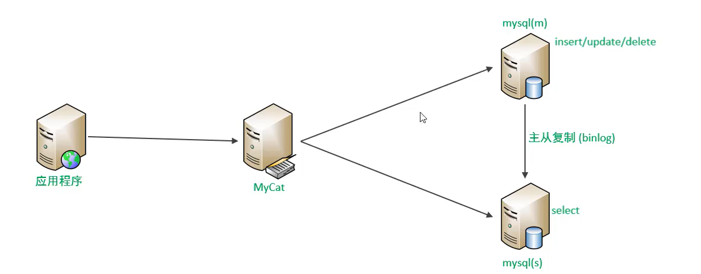
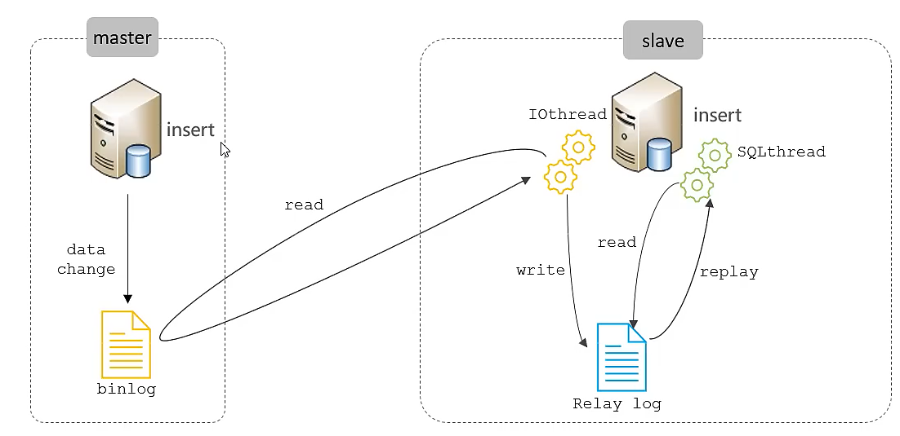
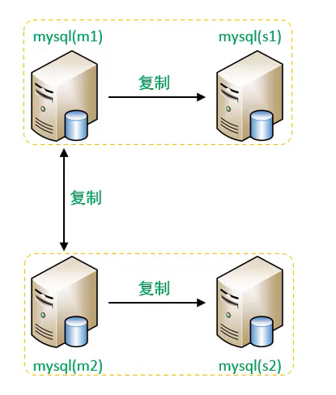
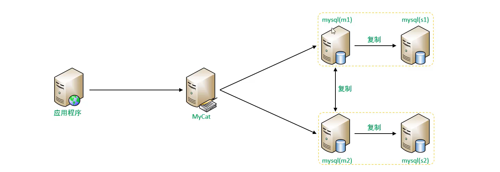
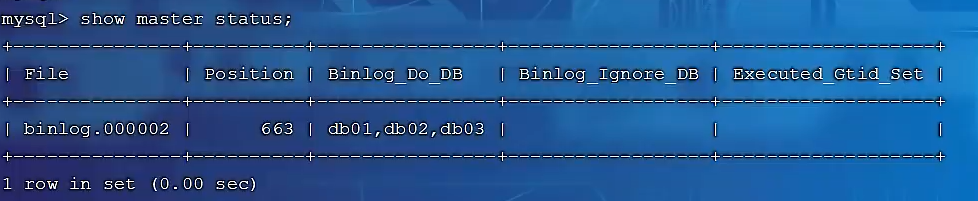
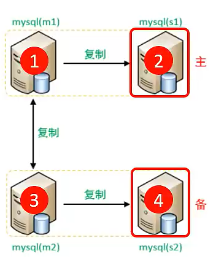

# 读写分离

>   修改数据在主库, 读取数据在从库, 减少单台服务器的访问压力

主从复制, 基于二进制日志

## 简述

### 两种方案

如果让应用程序决定主库还是从库=>耦合, 麻烦

解决: 

应用程序连接MyCat, MyCat连接主从库,

-   MyCat决定什么sql语句去什么库
-   对于增删改语句, mycat把sql语句路由给主库,并进行主从复制
-   对于查询操作, mycat把sql语句路由给从节点



### MyCat支持读写分离的组件

-   `writeHost`

-   `readHost`

## 主从准备

MySQL的主从复制是基于二进制(Binlog)实现的

其中包括了DDL语句和DML语句



[主从复制](Day12-主从复制.md)

```mysql
use harvey;

create table tb_user(
	id int(11) not null,
    name varchar(50) not null,
    sex.varchar(1),
    primary key(id)
)engine=innodb default charset=utf8;

insert into tb_user(id,name,sex) value(1,'Tom','1');
insert into tb_user(id,name,sex) value(1,'Trigger','0');
insert into tb_user(id,name,sex) value(1,'Dawn','1');
```

从库的同步请看[主从复制](Day12-主从复制.md)读写分离实现

## 一主一从读写分离

借助MyCat的两个标签和一个属性

配置`schema.xml`

```xml
<schema name="HARVEY_READ_WROITE" checkSQLschema="true" sqlMaxLimit="100" dataNode="dataNode4">
	<!--<table name="sku" dataNode="dn7" primaryKey="id">-->
    <!--这个逻辑库没有指定逻辑表-->
    	<!--在读写分离中, 可以不指定逻辑表-->
    		<!--不指定逻辑表, 就会自动加载该数据库的数据库的所有表结构,作为逻辑表-->
    	<!--当然指定了逻辑表也没问题-->
</schema>
													<!--见上建表语句-->
<dataNode name="dataNode4" dataHost="dataHost4" database="harvey"/>

<dataHost name="dataHost4" 
          maxCon="1000" minCon="10" balance="1" 
          writeType="0" dbType="mysql" dbDriver="jdbc">
    <!--默认的balance属性是0 , 需要修改成 1 或 3 -->
    <!--配置主从的读写-->
</dataHost>
```

-   `balance`, 负载均衡策略, 共有四种
    -   `"0"`
        -   不开启读写分离机制
        -   所有的读操作都发送到当前可用的weiteHost上
        -   即使配置了readHost也不生效
    -   `"1"` 
        -   **全部的readHost与备用的writeHost都参与**select语句的负载均衡
        -   针对双主双从的集群
        -   对一主一从的集群`1`和`3`效果一致
        -   **主writehost不承担读压力**
    -   `"2"` 
        -   **全部的读写操作都随机在writeHost和readHost上**
        -   这不叫读写分离, 这只是单纯的分担服务器的压力
    -   `"3"` 
        -   **所有的读写请求随机分发到writeHost对应的readHost上执行**
        -   writeHost不承担读压力

配置主从的读写

`schema.xml`

```xml
<writeHost host="master" 
           url="jdbc:mysql://192.168.171.135:3306?useSSL=false" 
           user="root" password="123456">
	<!--host="master" 这个无所谓, 但要和readHost不一样-->
    <readHost host="slave" 
              url="jdbc:mysql://192.168.171.136:3306?useSSL=false"
              user="root" password="123456"/>
</writeHost>  
```

`server.xml`

```xml
<user name="root" defaultAccount="true">
    <!--逻辑库的用户名密码-->
	<property name="password">123456</property>
    <property name="schemas">一些SCHEMA名,HARVEY_READ_WRITE</property>
</user>
```

一测试, 发现两个库都被增加了数据, 一查, 也确实查到了数据

那怎么知道读写分离了嘞?

现在, **主库的数据是可以同步到主库的, 但是, 从库的数据不会同步到主库**

那么, 你改变从库的值之后, 再去查询数据, 出现的是主库的数据还是从库更改后的数据? 

答: 从库更改后的数据

## 读写分离对异常情况的处理

当主库宕机了

可以关闭主库`systemctl stop mysql`试一试

使用写操作:

```mysql
insert into tb_user(id,name,sex) values(08,"Mike",1);
```

返回异常

```error
ERROR:
No operations allowed after connection closed
```

mycat也连接不上主库了

但是能读哦!

去试一试吧

## 双主双从读写分离

### 介绍

面对主库宕机的情况, 我们肥肠的悲伤啊, 这这这, 咱的数据库不再**高可用**

那么, 双主双从读写分离即使解决此情况的方案

  master1和master2会互相复制同步



写入任意一个master库, 其他三个库中的数据全都会发生变化

-   一个主机M1处理所有的写请求

-   M1的从机S1和另一台主机M2还有它的从机Slave2负责所有读请求

-   当M1主机宕机后, M2主机分则写请求, M,M2互为备用机



### 搭建

准备服务器环境2S+2M+1MyCat

#### 主库配置

1.  修改配置文件, /etc/my.cnf

    `server-id`要每台主机不一样啊 !

    ```properties
    # mysql服务ID. 保证整个集群环境中唯一: [1,2^32-1],默认为1
    server-id=1
    # 指定同步的数据库的库名
    # M2
    binlog-do-db=db01
    # S1
    binlog-do-db=db02
    # S2
    binlog-do-db=db03
    # 当前数据库作为从数据库的时候, 有写入操作也要更新二进制日志文件
    log-slave-updates
    ```

2.  重启MySQL数据库

    ```mysql
    systemctl restart mysqld
    ```

3.  为主库创建账号, 用于主从复制, 使他们具有主从复制的权限

    ```mysql
    -- 创建用户, 设置密码 , 该用户可以任意主机连接该MySQL服务
    CREATE USER 'username'@'%' IDENTIFIED WITH mysql_native_password BY 'Root@123456';
    -- 为'user1'@'%'用户分配主从复制权限
    GRANT REPLICATION SLACE ON *.* TO 'username'@'%';
    ```

4.  通过之类, 查看两台主库的二进制日志坐标

    ```mysql
    Show Master status
    ```

    

#### 从库配置

1.  修改配置文件 `/etc/my.cnf`

    ```properties
    # mysql服务ID. 保证整个集群环境中唯一: [1,2^32-1],默认为1
    server-id=2
    ```

2.  重启Mysql服务器

    ```bash
    systemctl restart mysqld
    ```

3.  在从库中设置对应的主库, 注意s1对应m1,s2对应m2,对应关系不能乱

    ```mysql
    Change 
    Master_HOST='xxx.xxx.xxx.xxx',-- 不要对应错了
    Master_user='username',master_password='Root@123456',
    Master_log_File='binlog.000002',Master_LOG_POSITION=663;-- 见上文master配置的查询结果
    ```

    

4.  启动主从复制

    ```mysql
    start skave;
    ```

5.  查看从库状态

    ```mysql
    show slave status\G;
    ```

    

    确保两个Slave_XX_Running为yes

#### 连接两台主库

主库之间的主从复制, 相互复制

两台主库都**互相认主**即可,交叉认主, ~~共轭主从~~

```mysql
Change 
Master_HOST='xxx.xxx.xxx.xxx',-- 不要对应错了
Master_user='username',master_password='Root@123456',
Master_log_File='binlog.000002',Master_LOG_POSITION=663;
-- 见上文master配置的查询结果,注意更改
```

重复从库的操作

**此时, 四台数据库已经同步**

可以在两台主库中任选一台, 创建`db01`或`db02`或`db03`,测试是否都有数据库存在

然后创创表啊之类的测一测

#### MyCat的连接

`schema.xml`

```xml
<schema name="HARVEY_DOUBLE_READ_WROITE" 
        checkSQLschema="true" sqlMaxLimit="100" dataNode="dataNode5">
</schema>
													<!--见上建表语句-->
<dataNode name="dataNode5" dataHost="dataHost5" database="db01"/>

<dataHost name="dataHost5" 
          maxCon="1000" minCon="10" balance="?" 
          writeType="?" switchType="?" dbType="mysql" dbDriver="jdbc">
    <!--
		默认的balance属性是0 , 需要修改成1,
			即M1承担写,M2/S1/S2承担读
		writeType:
			"0": (一般)写操作都在转发到第一台writeHost,第一台writeHost宕机, 会切换到第二台
			"1": 所有的写操作都**随机**地发送到配置到配置的writeHost上
		switchType:第一台writeHost宕机, 切换到第二台时是否自动
			"-1": 不自动切换
			"1": 自动切换
	-->
    <writeHost host="master1" 
           url="jdbc:mysql://192.168.171.137:3306?useSSL=false" 
           user="root" password="123456">
		<!--host="master" 这个无所谓, 但要和readHost不一样-->
    	<readHost host="slave1" 
              url="jdbc:mysql://192.168.171.138:3306?useSSL=false"
              user="root" password="123456"/>
	</writeHost>

    <writeHost host="master2" 
           url="jdbc:mysql://192.168.171.139:3306?useSSL=false" 
           user="root" password="123456">
		<!--host="master" 这个无所谓, 但要和readHost不一样-->
    	<readHost host="slave2" 
              url="jdbc:mysql://192.168.171.140:3306?useSSL=false"
              user="root" password="123456"/>
	</writeHost>  
</dataHost>
```

`server.xml`

```xml
<user name="root" defaultAccount="true">
    <!--逻辑库的用户名密码-->
	<property name="password">123456</property>
    <property name="schemas">
        一些其他SCHEMA名,
        HARVEY_READ_WRITE,
        HARVEY_DOUBLE_READ_WROITE
    </property>
</user>
```

### 启动测试

停止mycat

```bash
/bin/mycat stop
```

启动mycat

```bash
/bin/mycat start
```

查看日志

```mycat
tail -f logs/wrapper.log
```

看看有没有`successful`

测试就看一主一从吧的吧

再看看M1宕机之后的样子吧

