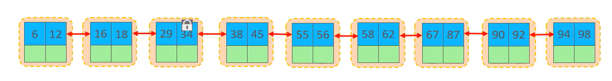
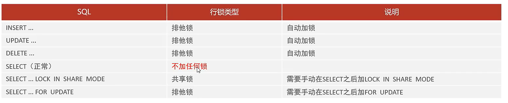
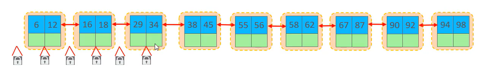
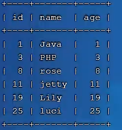
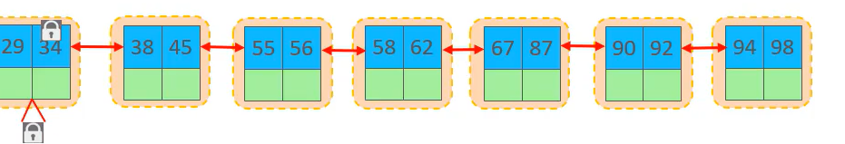

# 行级锁

-   每一次锁住行
-   锁的**力度最小**
-   发生**锁冲突的概率最低**
-   **并发度最高**

## 行级锁的原理?

>    行锁是通过对索引上的索引项加锁来实现的,而不是对记录直接加锁

## 三类行级锁

-   行锁(**Record Lock**)
-   间隙锁(**Gap Lock**)
-   临键锁(**Next-Key Lock**)

### 行锁

-   锁定单个索引项的锁防止其他事务对此行进行的**Update和delete**
-   在RC(**Read Commit**) 和RR(**Repeatable Read**)事务隔离级别下都支持



#### 共享与排他

-   共享锁(**S**)
    -   允许一个事务去读一行
    -   阻止其他事务获得相同事务数据集的排他锁
    -   ###### 只和共享锁兼容
-   排他锁(**X**)
    -   允许获取排他锁的食物更新数据
    -   组织其他事务获得相容数据集的共享锁和排他锁
    -   和所有锁冲突




#### 演示

>   默认情况下
>
>   InnoDB在RR(**Read Repeatable**)事务隔离级别运行
>
>   InnnoDB使用**next-key**锁进行搜索和扫描
>
>   以防止幻读

1.  针对唯一索引进行检索时,对已存在的记录进行等值匹配时,将**next-key**自动优化为行锁
2.  InnoDB的行锁是针对于索引加的锁,**不通过索引条件检索数据,那么InnoDB将对表中的所有记录加锁**,此时**就会升级成为表锁**

#### 查看

-   和查看意向锁一样

```mysql
select
    Object_Schema,	-- 涉及到的数据库
    Object_Name,	-- 涉及到的表
    Index_Name,		-- 涉及索引的名字
    Lock_Type,		-- 锁的对象(数据库,数据表,行)
    Lock_Mode,		-- 锁的类型(IS...)
    Lock_Data		-- 锁的......Data?
from Performance_Schema.Data_Locks;
```


### 间隙锁

-   间隙?两条记录之间
-   锁定索引记录间隙(不含索引)
-   确保索引记录间隙不变,防止其他事务在这个间隙进行**Insert**,产生幻读
-   在RR(**Repeatable Read**)事务隔离级别下支持




-   这个依旧是成立的

#### 演示

>默认情况下
>
>InnoDB在RR(**Read Repeatable**)事务隔离级别运行
>
>InnnoDB使用**next-key**锁进行搜索和扫描
>
>以防止幻读

-   索引上的**等值查询**(**唯一索引**)

    -   给不存在的记录加锁时,优化为间隙锁

    -   这个等值查询呢`update user set name = 'A' where id = 5`,这个也是有等值查询的

    -   而这个**id=5**不存在的话,就算是优化为间隙锁了

        

    -   这个不锁3和8,锁的是3,8的间隙,

    -   此时如果此时另一个用户插入`insert into user(id) values(7)`的话就会被锁住

-   索引上的**等值查询**(**普通索引**)

    -   向右遍历最后一个值不满足查询需求时,**next-key lock**退化为间隙锁
    -   锁住`update user set name = 'A' where age =3 `
        -    age不唯一
        -   临建锁锁住age = 3和他前面的间隙
        -   **间隙锁锁住age = 3和age = 8**
            -   这里已经创建了索引[如题],所以age在age的索引里是递增的,所以3和8没毛病
        -   **之间的间隙**
            -   为了防止其他事务插入造成幻读

-   索引上的**范围查询**(**唯一索引**)
  
    -   会访问到不满足条件的第一个值为止
    -   `select * from user where id>=19`
    -   对19加一个行锁
    -   对25加了一个临键锁,锁住了25和19之间的间隙
    -   对(25,无穷大[**supermum pesu**])加了一个间隙锁
    -   当然,对其他例子,只是多几个临键锁了罢 


#### 注意

-   间隙锁唯一目的时防止其他事务插入间隙.*\* **\**  ***\****
-   间隙锁可以共存,**一个事物采用的间隙锁不会组织另一个事务在同一间隙上采用的间隙锁**

### 临键锁

-   行锁和间隙锁的组合
-   同时锁住数据,并锁住数据前边的间隙**Gap**
-   RR(**Repeatable Read**)事务隔离级别下支持



#### 演示

-   和间隙锁的演示混合在一起了
