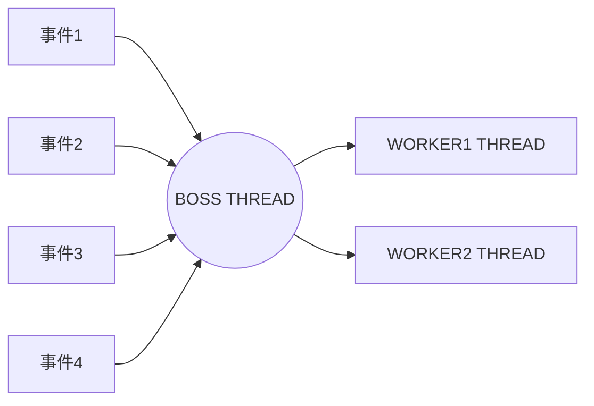

# 多线程优化



读事件交给Worker来做

每个Worker占用一条新的线程

## Worker与Boss的连接

-   在Boss线程把读写有关的channel注册在Worker的Socket上

```java
acceptHandler.accept(ssc, worker.getSelector());
```

## Worker线程阻塞问题

在主线程给Worker的selector做了注册

但是Worker知不知道它的selector变了呢?

不知道, 因为Worker的那条线程因为执行`selector#select`阻塞了

怎么办呢?

```java
if (selector.select(10)==0){
    continue;
}
```

`selector.nowSelect();`明显不合适嘛

或

-   Boss线程

```java
selector.wakeup(); // 相当于刷新selector里注册的channel
```

-   Worker线程

```java
if (selector.select()==0){
    continue;
}
```

## 多Worker

-   创建Woker数组

```java
Worker[] workers = new Worker[workerCount];
for (int i = 0; i < workerCount; i++) {
    workers[i] = Worker.register("worker-" + i);
}
```

-   负载均衡策略

```java
workers[count = (++count) % workerCount].getSelector()
```

### 合适的Worker数

-   不少于CPU数量

-   获取当前机器的CPU数量

    ```java
    int cpuCount = Runtime.getRuntime().availableProcessors();
    ```

    -   该方法的问题:

        在Docker环境下, **容器不是物理隔离的**, 会**拿到物理CPU个数**, 而不是docker容器申请的cpu个数

    -   在**JDK10**修复, 使用jvm参数 UseContainerSupport配置, 默认开启

    -   但是企业不太会用新版本的JDK\~, 怎么办呢? 手动喽

