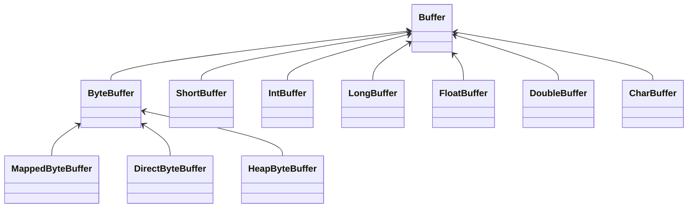
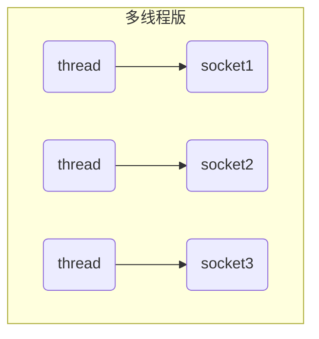
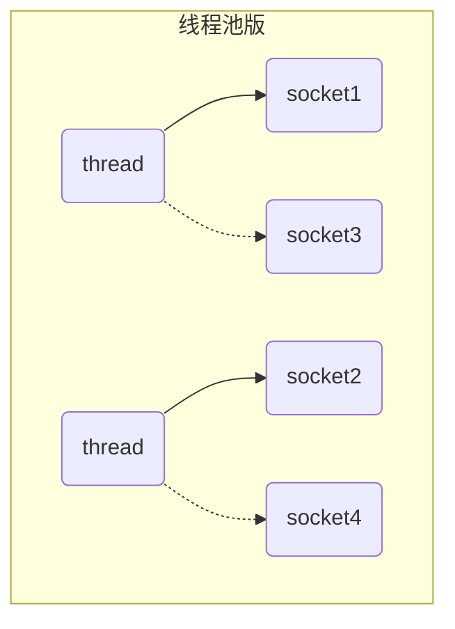
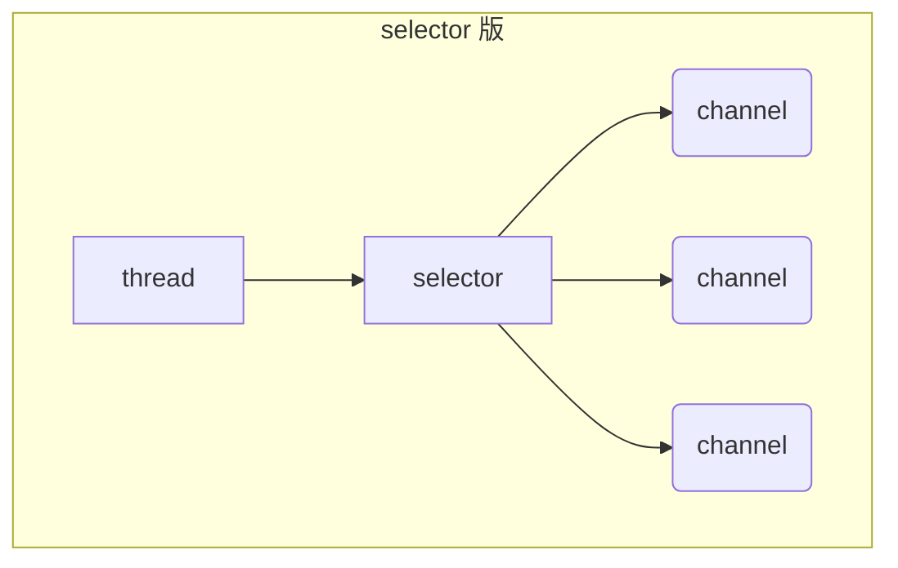

# NIO和三大组件

>   Non-Blocking IO 非阻塞IO

NIO是Netty的底层

## 三大组件

### Channel

>   通道

-   类似Stream, 是读写数据的**双向通道**(Stream是单向的)
-   可以从channel将数据读入Buffer,也可以将Buffer的数据写入channel
-   Channel比Stream更底层

#### 常见的Channel

-   FileChannel
-   DatagramChannel
-   SocketChannel
-   ServerSocketChannel

### Buffer

>   缓冲

用来缓冲读写数据

#### 常见的Buffer

* ByteBuffer
    * MappedByteBuffer
    * DirectByteBuffer
    * HeapByteBuffer
* ShortBuffer
* IntBuffer
* LongBuffer
* FloatBuffer
* DoubleBuffer
* CharBuffer

### Selector

>   选择器

####服务器设计演化

##### 多线程版设计

多线程版缺点

* 内存占用高
* 线程上下文切换成本高
* 只适合连接数少的场景(一多CPU撑不住)

##### 线程池版设计

线程池版缺点

* 阻塞模式下，线程仅能处理一个 socket 连接
* 仅适合**短连接**场景
    * 短链接: 处理完一个请求之后, 立刻将Thread的连接断开, 以便下一次能更快地连接到下一个请求

##### selector 版设计

1.  selector 配合**一个线程**来**管理多个 channel**
2.  selector 获取 **channel 上发生的事件(可连接/可读/可写)**
    -    `selector` 调用 **`select()` 会阻塞**直到 `channel` 发生了**读写就绪事件**
    -   这些事件发生，`select` 方法就会返回这些事件交给 `thread` 来处理
3.  这些 channel 之于线程是 **非阻塞模式**下的, 一个channel没有事件,线程能处理其他channal

适合连接数特别多，但流量低(同一个channal不会频繁发送大量数据)的场景（low traffic）

## NIO和BIO

>   Non-Blocking & Blocking

### Stream & Channel

-   Stream不会自动缓冲数据, channel会利用系统提供的发送缓冲区和接收缓冲区( **更为底层** )
-   Stream仅支持阻塞API , CChannel同时支持阻塞 , 非阻塞API
-   网络Channel可以配合Selector实现**多路复用**
-   Stream和Channel均为全双工, **读写可以同时进行**
    -   可以通过使用两个线程分别进行读和写操作来实现全双工通信。
    -   **"Stram是单向的,Channel是双向的"**不和这句话冲突

### IO模型

-   同步阻塞
-   同步非阻塞
-   多路复用
-   异步阻塞
    -   放屁
    -   没有意义
-   异步非阻塞

这些概念都是些啥呢?

-   等待数据阶段
-   复制数据阶段

-   对于JVM, 不能直接去操作硬件
-   操作硬件的工作是交由操作系统完成的,
-   JVM调用了操作系统提供的接口
-   例如在Java使用用户线程做了**Read操作**, 读取网卡数据
    1.  JVM使用Read调用了操作系统的接口函数
    2.  操作系统进入**等待数据阶段**, 等待网卡数据
        -   对于阻塞IO, **等待数据阶段**会**阻塞**直到有数据到来
        -   对于非阻塞IO, **如果没有数据**, 就会**立马返回给用户线程**, 并告知读取数据为0
    3.  网卡有数据之后, 操作系统在**复制数据阶段**将数据从网卡复制到内存
        -   **复制内存阶段, 用户线程总是会被阻塞**
    4.  完成数据复制之后, 会切换回JVM虚拟机, 继续接下来的操作

-   同步IO
    
    -   阻塞IO
        -   只是阻塞了**等待数据阶段**
    
    -   非阻塞IO
        -   只是不阻塞**等待数据阶段**
    -   多路复用
        -   用**Selector管理等待数据阶段**
        -   用**不同Channel从复制数据阶段读取**
        -   有需求就立刻处理
        -   **发起对操作系统API的调用**与**等待数据**的权衡
    
-   信号驱动
    
    -   不太常用呜呜呜
    
-   异步IO

    -   线程自己不去获取结果, 而是由其他线程送结果(至少有两个线程)

#### 参考

*《 UNIX 网络编程 》*

