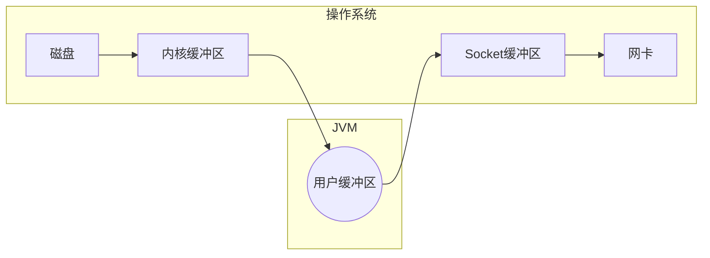

# Channel

## transferTo()

>   以FileChannel为例

```java
public void testFileChannel(){
    long start = System.currentTimeMillis();
    try (
            FileInputStream inputStream = 
        new FileInputStream(RESOURCE_PATH_PREFIX + "data.txt");
            FileOutputStream outputStream = 
        new FileOutputStream(RESOURCE_PATH_PREFIX + "target.txt");
    ) {
        FileChannel from = inputStream.getChannel();
        FileChannel to = outputStream.getChannel();
        from.transferTo(0/*position*/,from.size()/*count*/,to);
    } catch (IOException e) {
        log.error(e.getMessage());
    }
    System.out.println(System.currentTimeMillis()-start+"ms");// 1ms
}
```

JDK中凡是涉及`transferTo`的都会采用操作系统的**零拷贝**进行优化

### 大量数据传输

>   transferTo最多拷贝2G的数据 , 超过2G的数据怎么传输呢

-   解决方法: 分段传输

    ```java
    long size = from.size();
    long left = size;
    while (left > 0) {
        left -= from.transferTo(size - left, left, to);
    }
    ```

    

## 零拷贝

### HeapByteBuffer



-   四次数据拷贝
-   三次JVM和操作系统的转化
    -   从JVM调用操作系统的从磁盘读
    -   磁盘读到数据后返回JVM
    -   从JVM调用操作系统把数据写入网卡
-   来回调用与拷贝降低了效率

### DirectByteBuffer

```java
ByteBuffer buffer = ByteBuffer.allocateDirect(16);
```

-   在创建时缓冲区时需要调用操作系统的接口(相较于HeapByteBuffer慢一些)
-   不受JVM的GC垃圾回收机制影响
-   在每次读和写, 缓冲区都是在操作系统的环境下
    -   一次读写操作, 依旧是三次环境转换
    -   DirectByteBuffer创造的这块缓冲区, **JVM能访问, 操作系统能访问**.
    -   对于DirectByteBuffer来说, **用户缓存区和内核缓冲区可以认为是同一块内存**, 减少了一次数据拷贝


### 操作系统的优化

>   以下皆是零拷贝, 指不需要把数据拷贝到Java的内存中了

#### 零拷贝的特点

-   更少的**用户态**和**内核态**的切换

-   不利用cpu计算, 利用DMA(专门负责数据传输拷贝的硬件),减少cpu缓存伪共享

    -   伪共享

        -   缓存失效

            long类型占8个字节，这就意味着，当读一个long类型的变量，也会读取其相邻的7个long类型变量（不是long类型的变量按占用的字节数计算个数，如int类型的变量占4个字节，那么就64-8个字节，就可以存储14个int类型的变量），在基于mesi协议下，其它的线程此时再读取其中的一个long类型变量，那么这个long类型变量所在的缓存行就会失效，需要重新读取缓存，这就是缓存失效。

        -   1.2 伪共享

            CPU在读取数据时，是以一个缓存行为单位读取的，假设这个缓存行中有两个long类型的变量a、b，当一个线程A读取a，并修改a，线程A在未写回缓存之前，另一个线程B读取了b，读取的这个b所在的缓存是无效的（前面说的缓存失效），本来是为了提高性能是使用的缓存，现在为了提高命中率，反而被拖慢了，这就是传说中的伪共享。

        -   解决思路:

            大概是凑数据, 例如为了一个`long value`, 准备数据`long n1,n2,n3,n4,n5,n6,n7`

-   零拷贝更**适合频繁的小文件传输**
    -   零拷贝把整个文件直接拷贝到缓冲区, 然后整个拷贝到网卡, 没有好好利用缓冲区
    -   大文件还是我们控制它**分批次地传输**的好

#### 零拷贝的模型与原理

-   linux2.1后采用sendFile方法, Java中对应channel调用transferTo/transfer

    ```mermaid
    graph LR
    subgraph 操作系统
    磁盘 --> 内核缓冲区
    内核缓冲区 --> 拷贝{{transferTo}}
    拷贝{{transferTo}} --> Socket缓冲区
    Socket缓冲区 --> 网卡
    end
    ```

    -   java到操作系统的切换 1 次
    -   数据拷贝 3 次

-   Linux2.4之后, sendFile进行了改变

    ```mermaid
    graph RL
    subgraph 操作系统
    磁盘 --> 内核缓冲区
    内核缓冲区 --> 网卡
    内核缓冲区 --> 拷贝
    拷贝 --> Socket缓冲区
    拷贝{{拷贝文件offset和length等少量数据}}
    end
    ```

    -   java到操作系统的切换 1 次
    -   数据拷贝 2 次

