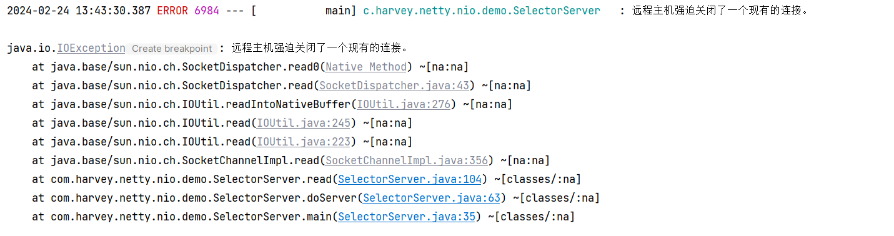
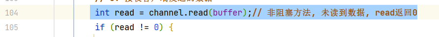

# Selector

-   多路复用
    -   单个线程
    -   管理**多个Channel**(包括服务器端的`ServerSocketChannal`和与客户端连接的`ServerChannal`)
-   有连接事件或客户端发送了数据,Selector会得知

## 事件类型

### Accept

在ServerSoft上, 有连接请求时

### Connect

在Client上, 一旦与Service端的连接建立, 就会触发

### read

可读事件

对于Service端的SocketChannel, 有请求来了, 就触发read事件

### write

可写事件


##Selector基本用法

### 创建Selector对象

```java
Selector selector = Selector.open();
```

###将Channel注册到Selector

>   建立Selector与Channel的联系

将ServerSocketChannal注册到Selector

1.  注册

    ```java
    ssc.configureBlocking(false); // 还是有必要的
    SelectionKey selectionKey = ssc.register(selector, 0, null);
    ```

    返回值SelectionKey: 据此知道事件和哪个Channel发生了事件

2.  指定关注事件(只关注连接事件)

    ```java
    sscKey.interestOps(SelectionKey.OP_ACCEPT);
    ```

3.  对于特定的事件进行阻塞

    ```java
    while (true) {
        // 对事件进行管理: 没有事件时阻塞;
        selector.select();// 这一步是阻塞的
        // 返回同时发生的事件的集合
        Iterator<SelectionKey> sKeyIt = selector.selectedKeys().iterator();
        // 考虑到为便于删除一个元素,使用迭代器
        while (sKeyIt.hasNext()){
            SelectionKey key = sKeyIt.next();
            SelectableChannel channel = key.channel(); // 获取了触发的Channel
            SocketChannel sc = ssc.accept(); // 由于只有一个事件, 就直接使用accept了 
            channels.add(sc);
            this.service(sc);
        }
    }
    ```


### Cancel

####问题的产生与需求

如果Selector接收到事件之后, 事件未处理会怎么样?

这个未处理的事件依旧会存在, Selector会再次捕获它, 直到这个事件被处理

也就是说会无限循环

#### 解决

```java
Iterator<SelectionKey> sKeyIt = selector.selectedKeys().iterator();
while (sKeyIt.hasNext()){
    SelectionKey key = sKeyIt.next();
    /*SelectableChannel channel = key.channel();
    SocketChannel sc = ssc.accept();
    channels.add(sc);
    this.service(sc);*/
    key.cancel();
}
```

一个事件, 要么处理, 要么取消, 不能置之不理

依照源码看来, cancel不会把一个key从selectorKeys中删除啊, 而是将key加入到一个`cancelKeys`, 并将其的`valid`(有效)字段改为false

### 区分事件类型

```java
// 区分事件类型
if (key.isAcceptable()) {
    
}
```

但是看源码, 一个key可以具备多个事件的性质....

-   答: 
    -   注册的时候可以有多个事件
    -   获取事件的时候取得的socketKey不具备多种事件的性质
    -   判断事件类型需要的事件类型和`interestOps()`改变的事件类型不是同一个属性

### 事件处理后删除Key

对于

```java
Iterator<SelectionKey> sKeyIt = selector.selectedKeys().iterator();
```

的`selectedKeys`, 每当有新的事件发生, selector就会主动往这个集合里添加`key`

channel处理之后accept的事件已经没了, 但是! **selector不会主动删除`selectedKeys`里处理过的key**

下一次遍历的时候, 处理过的channel依旧会被遍历到, 但是没有事件可处理

因此需要删除`selectedKeys`里处理过`selectedKey`的的记录

```java
SelectionKey key = sKeyIt.next();
sKeyIt.remove();
```

### 对事件的处理

#### 对Accept事件的处理

```java
private void accept(ServerSocketChannel ssc) throws IOException {
    SocketChannel sc = ssc.accept();
    sc.configureBlocking(false);
    SelectionKey scKey = sc.register(selector, 0, null);
    scKey.interestOps(SelectionKey.OP_READ);
    // channels.add(sc); select可以管理多个channel
}
```

#### 对Read事件的处理

-   问题

    如果服务器与客户端建立之后, 客户端强制关闭, 连接中断, 服务器将产生异常

    

    

    read出现了IO异常

    但是客户端连接断开了, 管我服务器屁事?

-   解决

    1.  抓住异常
    2.  把key取消掉

    ```java
    try {
        this.read((SocketChannel) key.channel());
    } catch (IOException e) {
        log.warn(e.getMessage());
        key.cancel();
    }
    ```
    
    但是客户端用`sc.close()`正常断开之后, 依旧会产生读事件
    
    ```java
    int read = channel.read(buffer);
    if (read == -1) {
        // 客户端正常断开
        throw new IOException("远程主机正常关闭了一个现有连接");
    }
    ```
### 其他select()

返回值代表有多少 channel 发生了事件

方法1，阻塞直到绑定事件发生

```java
int count = selector.select();
```


方法2，阻塞直到绑定事件发生，或是超时（时间单位为 ms）

```java
int count = selector.select(long timeout);
```

-   干嘛用? 或许count=0在所有count的占比可以估计网站的热门程度?


方法3，不会阻塞，也就是不管有没有事件，立刻返回，自己根据返回值检查是否有事件

```java
int count = selector.selectNow();
```

-   那不是要累死CPU?干嘛呢?


### select() 何时不阻塞

* 事件发生时
    * 客户端**发起连接请求**，会触发 accept 事件
    * 客户端发送数据过来，**客户端正常、异常关闭时，都会触发 read 事件**
    * 如果发送的**数据大于 buffer 缓冲区，会触发多次读取事件**
    * channel 可写，会触发 write 事件
        * 可写, 但没有写的需求时呢?
    * 在 linux 下 nio bug 发生时
* 调用 selector.wakeup()
* 调用 selector.close()
* selector 所在线程 interrupt


## 程序清单

```java
@Slf4j
public class SelectorServer {
    public SelectorServer() throws IOException {
    }

    private final Selector selector = Selector.open();

    /**
     * 单线程非阻塞式模拟服务器
     */
    public void doServer() throws IOException {
        try (ServerSocketChannel ssc = createServerSocketChannel()) {
            while (true) {
                // accept 建立与客户端连接， SocketChannel 用来与客户端之间通信
                selector.select();
                // 返回同时发生的事件的集合
                Iterator<SelectionKey> sKeyIt = selector.selectedKeys().iterator();
                // 考虑到为便于删除一个元素,使用迭代器
                while (sKeyIt.hasNext()) {
                    SelectionKey key = sKeyIt.next();
                    sKeyIt.remove();
                    log.debug("{}", key);
                    // SelectableChannel channel = key.channel();
                    // 区分事件类型
                    if (key.isAcceptable()) {
                        this.accept(ssc);
                    } else if (key.isReadable()) {
                        try {
                            this.read((SocketChannel) key.channel());
                        } catch (IOException e) {
                            log.warn(e.getMessage());
                            key.cancel();
                        }
                    } else {
                        key.cancel();
                    }

                }
            }
        }
    }

    private void accept(ServerSocketChannel ssc) throws IOException {
        SocketChannel sc = ssc.accept();
        sc.configureBlocking(false);
        SelectionKey scKey = sc.register(selector, 0, null);
        scKey.interestOps(SelectionKey.OP_READ);
        // channels.add(sc); select管理channel
    }

    private ServerSocketChannel createServerSocketChannel() throws IOException {
        // 1. 创建了服务器
        ServerSocketChannel ssc = ServerSocketChannel.open();
        // 2. 绑定监听端口
        ssc.bind(new InetSocketAddress(8080));
        ssc.configureBlocking(false);
        // 创建selector和Channel之间的联系
        SelectionKey sscKey = ssc.register(selector, 0, null);
        sscKey.interestOps(SelectionKey.OP_ACCEPT);
        return ssc;
    }

    // ByteBuffer
    private final ByteBuffer buffer = ByteBuffer.allocate(16);


    /**
     * 完成与客户端之间的通讯
     *
     * @param channel 与客户端之间的管道
     */
    private void read(SocketChannel channel) throws IOException {
        // 5. 接收客户端发送的数据
        int read = channel.read(buffer);// 非阻塞方法, 未读到数据, read返回0
        if (read == -1) {
            // 客户端正常断开
            throw new IOException("远程主机正常关闭了一个现有连接");
        }
        buffer.flip();
        debugRead(buffer);
        buffer.clear();
        log.debug("after read...{}", channel);
    }
}
```

