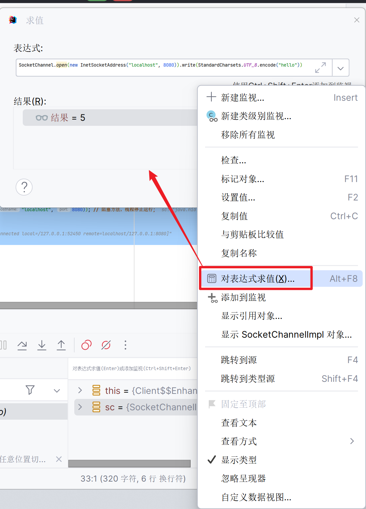
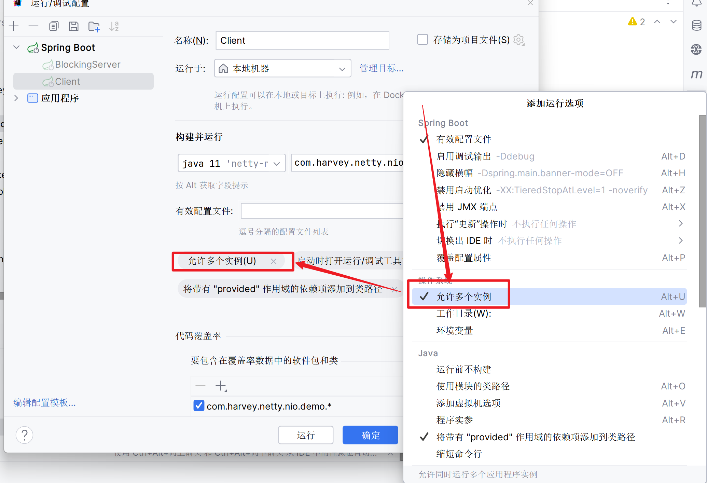

# 阻塞模式

-   `Socket`和`ServerSocket`是TCP的API

## 示例

### 阻塞式服务器

```java
// ByteBuffer, 只用一个做演示
private final ByteBuffer buffer = ByteBuffer.allocate(16);

// 连接的集合
private final List<SocketChannel> channels = new ArrayList<>();
```

使用`ServerSocketChannel`创建服务器

```java
/**
 * 单线程阻塞式模拟服务器
 */
public void doServer() throws IOException {
    // 1. 创建了服务器
    ServerSocketChannel ssc = ServerSocketChannel.open();

    // 2. 绑定监听端口
    ssc.bind(new InetSocketAddress(8080));
    while (true) {
        // 3. accept 建立与客户端连接， SocketChannel 用来与客户端之间通信
        log.debug("connecting...");
        SocketChannel sc = ssc.accept(); // 阻塞方法，没有客户端连接,线程停止运行
        this.service(sc);
    }
}
```

```java
/**
 * 完成与客户端之间的通讯
 * @param sc 与客户端之间的管道
 */
private void service(SocketChannel sc) throws IOException {
    log.debug("connected... {}", sc);
    channels.add(sc);
    for (SocketChannel channel : channels) {
        // 接收客户端发送的数据
        log.debug("before read... {}", channel);
        channel.read(buffer); // 阻塞方法，没有客户端请求,线程停止运行
        buffer.flip();
        debugRead(buffer);
        buffer.clear();
        log.debug("after read...{}", channel);
    }
}
```

### 客户端

```java
public void doClient() throws IOException, InterruptedException {
    SocketChannel sc = SocketChannel.open(new InetSocketAddress("localhost", 8080)); 
    // 阻塞方法，线程停止运行;
    log.debug("waiting");
    // sc.write(StandardCharsets.UTF_8.encode("hello world"));
    sc.close(); // 可以正常关闭客户端
}
```

### 运行测试

1.  启动服务器

2.  启动客户端

    -   \[日志\]服务器连接客户端
    -   \[日志\]客户端发送了内容"hello world"

3.  再次使用客户端发送内容

    

    表达式: 

    ```java
    sc.write(StandardCharsets.UTF_8.encode("hello"))
    ```

    然后求值

    -   服务器阻塞

        原因: 服务器在等待一个新的连接

4.  启动一个新的客户端

    

    -   \[日志\]服务器连接第二个客户端
    -   \[日志\]服务器输出第一个客户端的表达式
        -   如果没有让第一个客户端发送内容, 服务器会阻塞等待第一个客户端发送内容, 而不能即使处理第二个客户端发送的内容
    -   \[日志\]服务器连接第二个客户端的信息

5.  此时服务器阻塞, 等待第三个客户端连接数据

## 问题

阻塞模式无法自由地对应对几个客户端的连接和请求, 

