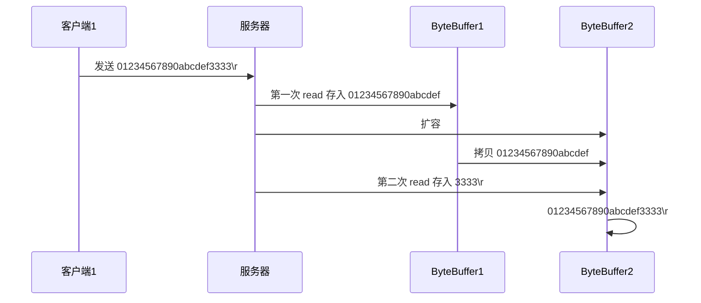
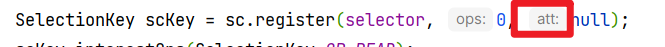

# 消息边界问题

## 消息边界

传输的是字节, 一个字符往往不是一个字节, 而由于buffer长度固定, 字符可能被切割


-   Message1->需要扩容
-   Message3,Message6->半包
-   Message4,Message5->粘包

## 处理

### 思路

* 客户端和服务器端固定消息长度，数据包大小一样，服务器按预定长度读取
    * 浪费带宽
* 按分隔符拆分
    * 查找, 对比, 分割, 整合....效率低
* TLV 格式，即 Type 类型、Length 长度、Value 数据，类型和长度已知的情况下，就可以方便获取消息大小，分配合适的 buffer，缺点是 buffer 需要提前分配，如果内容过大，则影响 server 吞吐量
    * Http 1.1 是 TLV 格式
    * Http 2.0 是 LTV 格式


### 半包粘包的分割整合

```java
private static void split(ByteBuffer source) {
    source.flip();
    int oldLimit = source.limit();
    for (int i = 0; i < oldLimit; i++) {
        if (source.get(i) == '\n') {
            System.out.println(i);
            ByteBuffer target = ByteBuffer.allocate(i + 1 - source.position());
            // 0 ~ limit
            source.limit(i + 1);
            target.put(source); // 从source 读，向 target 写
            debugAll(target);
            source.limit(oldLimit);
        }
    }
    source.compact();
}
```


### 扩容思路


对于超出一次buffer容量的消息



对于此时的Buffer

1.  对于一个长消息, 不能是不同的ByteBuffer而导致截取到的前一段消息丢失
2.  对于不同的SocketChannel, 要使用不同的ByteBuffer

-   SocketChannel和Buffer形成了映射关系\~\~

### 附件

>   attachment




每个SocketChannel都有自己的附件

注册时带上附件

```java
SelectionKey scKey = sc.register(selector, 0, ByteBuffer.allocate(16));
```

获取附件

```java
Object arr = key.attachment();
```

```java
this.read((SocketChannel) key.channel(),(ByteBuffer) key.attachment());
```

扩容->attach改为新的ByteBuffer

```java
key.attach(newBuffer);
```

扩容

```java
private static ByteBuffer expansion(ByteBuffer buffer) {
    ByteBuffer newBuffer = ByteBuffer.allocate(buffer.capacity() * 2);
    buffer.flip();
    return newBuffer.put(buffer);
}
```


## ByteBuffer的大小分配

1.  扩容
    -   会有一次拷贝
2.  用多个数组组成buffer
    -   数据存储不连续

