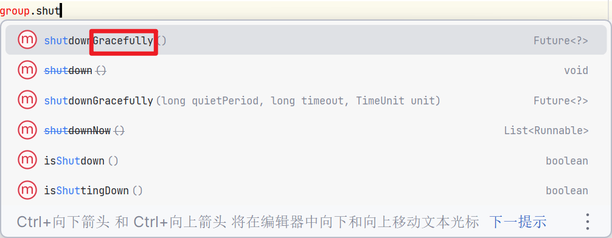

# Channel

## API

-   关闭channel

    ```java
    channel.close();
    ```

-   处理channel的关闭之后的一些业务

    ```java
    ChannelFuture channelFuture = channel.closeFuture();
    ```

    -   同步等待channel的上一步异步操作的完成

        ```java
        channelFuture.sync();
        ```

    -   异步等待channel的上一步异步操作的完成

        ```java
        channelFuture.addListener(ChannelFutureListener.CLOSE_ON_FAILURE); // 类似于这样子?
        ```

    -   暂略

-   添加处理器

    ```java
    channel.pipeLine();
    ```

-   将数据写入

    ```javascript
    channel.write(msg);
    ```

    -   由于Netty特殊的缓存机制, 数据不会立刻通过网络发出

        ```java
        channel.write("AAA");
        channel.write("111");
        channel.write("xxx");
        channel.flush();// 此刻数据才发出
        ```

    -   将数据写入并立刻刷出

        ```java
        channel.writeAndFlush();
        ```

## ChannelFuture

异步非阻塞的连接

```java
ChannelFuture future = client.connect(new InetSocketAddress("localhost", 8080));
```

```java
Channel channel = future
        // 阻塞方法, 直到连接建立
        .sync()
        // 获取channel
        .channel();
```
如果不调用`sync()`方法, 获取到的Channel是未被`connect`构建好的半成品, 是不能用的 

😓既然我们常常要在连接之后获取Channel, 又何必把client.connect做成异步的呢?

获取不到Channel, 大部分情况下, 下一步啥都没法做吧?

**使用异步的回调对象**, 异步地等待

```java
future.addListener(new ChannelFutureListener() {
    /**
     * 在nio线程的连接建立之后, 会调用该方法
     * @param future  the source {@link io.netty.util.concurrent.Future} which called this callback
     */
    @Override
    public void operationComplete(ChannelFuture future) throws Exception {
        Channel channel = future.channel();
        // 向服务器发送数据
        channel.writeAndFlush("Hello World");
        channel.writeAndFlush("Hello");
        channel.writeAndFlush("World");
    }
});
```

### 异步实践-善后操作

#### 异步关闭

```java
channel.close();// 异步操作
```

```java
if ("exit".equals(input)) {
    // 善后工作
    ChannelFuture close = channel.close();// 异步操作
    /*法一: 同步关闭
    try {
        close.sync();
        log.warn("关闭中...");
    } catch (InterruptedException e) {
        throw new RuntimeException(e);
    }*/
    // 法二: 异步执行关闭
    close.addListener((ChannelFutureListener) future -> log.warn("关闭中..."));
    break;
}
```

#### 释放资源

结束NioEventLoopGroup里的线程都关闭



## EmbeddedChannel

>   测试用的Channel ,不需要打开服务器, 客户端

```java
private static ChannelHandler[] handlers() {
    return new ChannelHandler[]{new StringEncoder()};
}
```

