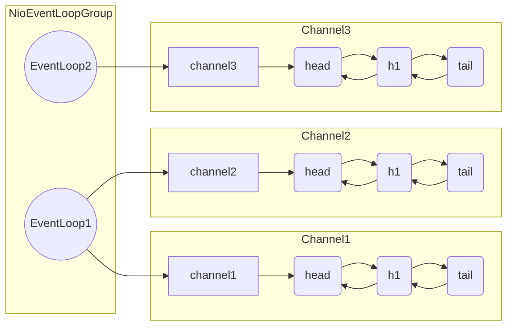
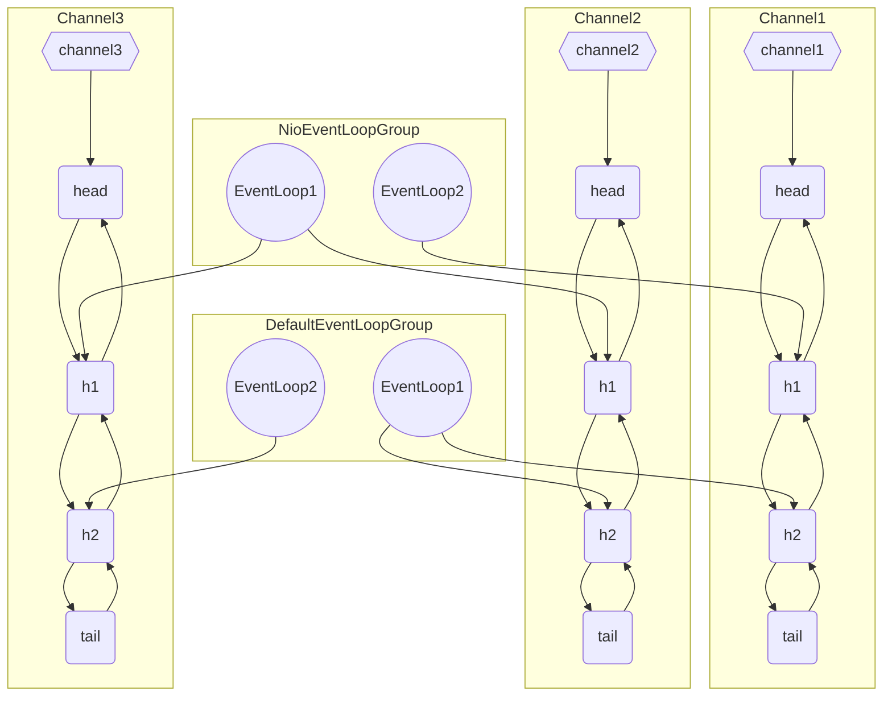

# EventLoop

>   事件循环对象

本质是一个单线程执行器+维护一个socket

含有`run`方法处理Channel上的IO事件

-   继承JDK的`j.u.c.ScheduledExecuterServer`执行定时任务
-   继承Netty的`io.netty.util.concurrent.OrderedEventExector`
    -   有序执行事件
    -   提供`isEventLoop(Thread thread)`判断是否属于此EventLoop
    -   提供`parent()`方法查看自己属于哪个EventLoogGroup

## EventLoopGroup

>   事件循环组


是一组EventLoop

`Channel`一般会调用`EventLoopGroup`的`register`方法来绑定一个`EventLoop`

此后此`Channel`的IO事件都由此EventLoop来处理(**保证了IO事件处理时的线程安全**)

### 创建EventLoopGroup

功能全面, 能提交IO事件, 普通任务, 定时任务

```java
NioEventLoopGroup group = new NioEventLoopGroup(/*int 指定线程数*/);
```

默认线程数"0"=>DEFAULT_EVENT_LOOP_THREADS

```java
private static final int DEFAULT_EVENT_LOOP_THREADS;

static {
    DEFAULT_EVENT_LOOP_THREADS = Math.max(1, SystemPropertyUtil.getInt(
            "io.netty.eventLoopThreads", NettyRuntime.availableProcessors() * 2));

    if (logger.isDebugEnabled()) {
        logger.debug("-Dio.netty.eventLoopThreads: {}", DEFAULT_EVENT_LOOP_THREADS);
    }
}
```


主要做普通任务和定时任务

```java
DefaultEventLoopGroup defaultGroup = new DefaultEventLoopGroup();
```

### 获取EventLoop

```java
EventLoop eventLoop = group.next();
```

由于设定了线程, 就会由和**线程个数相同的EventLoop**, 负载均衡采用了轮巡

```java
NioEventLoopGroup group = new NioEventLoopGroup(2);
// 轮巡的效果
for (int i = 0; i < 4; i++) {
    log.debug("hashcode:{}", group.next().hashCode());
}
```

    1498621286
    231351829
    1498621286
    231351829
## 普通任务

### 提交普通任务

```java
EventLoop eventLoop = group.next();
eventLoop.submit(()->{
    // Runnable#run()
    log.debug("hi");
});
// 效果一样, 参数不同 , submit参数可选更多
eventLoop.execute(()->{
    // Runnable#run()
    log.debug("hello");
});
log.debug("main");
```


```log
2024-02-25 18:58:42.931 DEBUG 11812 --- [           main] NettyServer   : main
2024-02-25 18:58:42.931 DEBUG 11812 --- [ntLoopGroup-2-1] NettyServer   : hi
2024-02-25 18:58:42.932 DEBUG 11812 --- [ntLoopGroup-2-1] NettyServer   : hello
```


## 定时任务

```java
log.debug("start");
eventLoop.scheduleAtFixedRate(
        ()->{log.debug("hi");},
        1/*initial delay*/,
        2/*period*/,
        TimeUnit.MINUTES
);
log.debug("main");
```


```log
2024-02-25 19:04:25.727 DEBUG 17620 --- [           main] NettyServer   : start
2024-02-25 19:04:25.728 DEBUG 17620 --- [           main] NettyServer   : main
2024-02-25 19:04:26.743 DEBUG 17620 --- [ntLoopGroup-2-1] NettyServer   : hi
2024-02-25 19:04:28.739 DEBUG 17620 --- [ntLoopGroup-2-1] NettyServer   : hi
2024-02-25 19:04:30.733 DEBUG 17620 --- [ntLoopGroup-2-1] NettyServer   : hi
2024-02-25 19:04:32.736 DEBUG 17620 --- [ntLoopGroup-2-1] NettyServer   : hi
2024-02-25 19:04:34.737 DEBUG 17620 --- [ntLoopGroup-2-1] NettyServer   : hi
```

## 处理IO事件

```java
ChannelInitializer<NioSocketChannel> childHandler = new ChannelInitializer<>() {
    @Override
    protected void initChannel(NioSocketChannel channel) throws Exception {
        channel.pipeline().addLast(customHandler); // 直接加入自定义Handler
    }
};
```


```java
// 自定义Handler
ChannelInboundHandlerAdapter customHandler = new ChannelInboundHandlerAdapter() {
    /**
     * 要出理读事件的Handler, 打印上一步转换好的字符串
     */
    @Override
    public void channelRead(ChannelHandlerContext ctx, Object msg) throws Exception {
        // if (msg==null) {}没必要, null instanceof ...总是false
        // 会进入下面分支然后抛出NullPointException异常
        if (!(msg instanceof ByteBuf)) {
            log.error("msg here is not ByteBuf, it's:{}", msg.getClass().getName());
            return;
        }
        ByteBuf buf = (ByteBuf) msg;
        log.debug(buf.toString());
        // PooledUnsafeDirectByteBuf(ridx: 0, widx: 11, cap: 2048)
        log.debug(buf.toString(Charset.defaultCharset()));// 建议不要使用默认的字符集
        // Hello World
    }
};
```


客户端传输的数据

```java
channel.writeAndFlush("Hello World");
channel.writeAndFlush("Hello");
channel.writeAndFlush("World");
```

服务器日志

```log
2024-02-25 19:29:33.264 DEBUG 4856 --- [ntLoopGroup-2-2] c.harvey.netty.demo.server.NettyServer   : Hello WorldHelloWorld
```




## 分工细化

将EventLoopGroup里的EventLoop分为Boss(处理Accept)和Worker(处理Read/Write)

```java
NioEventLoopGroup parent = new NioEventLoopGroup();
// ↑就算服务器只有一个, 也不需要指定线程个数为1,
// 虽然会给大于1的线程上限, 但根本不可能产生超过一个的EvenLoop
NioEventLoopGroup child = new NioEventLoopGroup(4);
server.group(parent,child);
```


将耗时较长的任务交给`DefaultEventLoopGroup()`的`EventLoop`处理

```java
DefaultEventLoopGroup group = new DefaultEventLoopGroup();
```

```java
// 需要消耗时间的任务的Handler
ChannelInboundHandlerAdapter longTimeHandler = new ChannelInboundHandlerAdapter() {
    @Override
    public void channelRead(ChannelHandlerContext ctx, Object msg) throws Exception {
        log.debug("length: {}",  ((String) msg).length());
    }
};
```


```java
ChannelInboundHandlerAdapter customHandler = new ChannelInboundHandlerAdapter() {
    @Override
    public void channelRead(ChannelHandlerContext ctx, Object msg) throws Exception {
        ...message = (String) msg;...
        ctx.fireChannelRead(message); // 本次Handler之后的结果交由pipeLine的下一个Handler处理
    }
};
```


```java
ChannelInitializer<NioSocketChannel> childHandler = new ChannelInitializer<>() {
    @Override
    protected void initChannel(NioSocketChannel channel) throws Exception {
        channel.pipeline()
            	.addLast("io handler"/*name*/, customHandler)
                .addLast(group, "default group",longTimeHandler);
    }
};
```


测试结果, 发现线程不一样了

```java
2024-02-25 20:11:25.161 DEBUG 2448 --- [ntLoopGroup-3-1] c.harvey.netty.demo.server.NettyServer   : Hello WorldHelloWorld
2024-02-25 20:11:25.162 DEBUG 2448 --- [ntLoopGroup-4-1] c.harvey.netty.demo.server.NettyServer   : length: 21
```



好傻逼啊, 好丑啊

执行）


#### 💡

## 不同Handler线程的切换原理

```java
ctx.fireChannelRead(message);
```

源码

`io.netty.channel.AbstractChannelHandlerContext`

```java
@Override
public ChannelHandlerContext fireChannelRead(final Object msg) {
    invokeChannelRead(findContextInbound(MASK_CHANNEL_READ), msg);
    return this;
}

static void invokeChannelRead(final AbstractChannelHandlerContext next, Object msg) {
    // touch是pipline的字段ResourceLeakDetector.isEnabled();
    final Object m = next.pipeline.touch(ObjectUtil.checkNotNull(msg, "msg"), next);
    // 获取下一个handler的eventLoop
    EventExecutor executor = next.executor();
    // 由于多态变成了EventExecutor
    
    if (executor.inEventLoop()/*下一个是否与当前的事件循环是同一线程*/) {
       	// 是
        next.invokeChannelRead(m); // 直接调用
    } else {
        // 不是
        executor.execute(new Runnable() {
            @Override
            public void run() {
                next.invokeChannelRead(m);
            }
        });
    }
}
```

 
