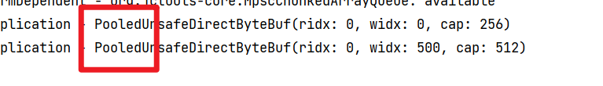

# ByteBuf

>   Netty对ByteBuffer的增强

## 创建

```java
ByteBuf buf = ByteBufAllocator.DEFAULT.buffer();
```

再Pipeline中, 推荐使用

```java
ByteBuf buf = ctx.alloc().buffer();
```

创建ByteBuf

```java
new ChannelInboundHandlerAdapter() {
    @Override
    public void channelRead(ChannelHandlerContext ctx, Object msg) throws Exception {
        ByteBuf buf = ctx.alloc().buffer();
    }
}
```

### 内存分配

>   默认直接内存


#### 直接内存

```java
ByteBuf directBuffer = ByteBufAllocator.DEFAULT.directBuffer();
```

#### 堆内存

```java
ByteBuf heapBuffer = ByteBufAllocator.DEFAULT.heapBuffer();
```


### 池化

ByteBuf采用直接内存, 直接内存的空间创建慢, 所以ByteBuf采用了池化


对于**创建慢**的资源, 用池的思想进行优化

将**创建昂贵(创建时时间, 内存空间占用大)**的对象提前创建好, 省去创建的时间, 省去创建的步骤

使用好对象之后, 将对象归还, 实现对象的重复利用


池中的 ByteBuf 采用了与jemalloc类似的 内存分配算法提高了效率

打印ByteBuf.toString()



#### 开启池化功能

```shell
-D io.netty.allocator.type={unpooled|pooled}
```

-   4.1以后, 除Android平台都启用池化功能
-   4.1以前, 池化功能不成熟, 都是非池化

## 组成


-   max capacity: 默认: 2^31^
-   capacity
-   read index : 读指针
-   write : 写指针
    -   超出容量就扩容
-   废弃字节部分会被回收

不用切换读写模式了

## 使用

### 写入

| 方法签名                                                     | 含义                   | 备注                                                         |
| ------------------------------------------------------------ | ---------------------- | ------------------------------------------------------------ |
| writeBoolean(boolean value)                                  | 写入 boolean 值        | 用一字节 0x01\|0x00 代表 true\|false                         |
| writeByte(int value)                                         | 写入 byte 值           |                                                              |
| writeShort(int value)                                        | 写入 short 值          |                                                              |
| writeInt(int value)                                          | 写入 int 值            | Big Endian，大端写入, 即 0x250，写入后 `00 00 02 50`(网络编程一般采用大端) |
| writeIntLE(int value)                                        | 写入 int 值            | Little Endian，小端写入, 即 0x250，写入后 `50 02 00 00`      |
| writeLong(long value)                                        | 写入 long 值           |                                                              |
| writeChar(int value)                                         | 写入 char 值           |                                                              |
| writeFloat(float value)                                      | 写入 float 值          |                                                              |
| writeDouble(double value)                                    | 写入 double 值         |                                                              |
| writeBytes(ByteBuf src)                                      | 写入 netty 的 ByteBuf  |                                                              |
| writeBytes(byte[] src)                                       | 写入 byte[]            |                                                              |
| writeBytes(ByteBuffer src)                                   | 写入 nio 的 ByteBuffer |                                                              |
| int writeCharSequence(CharSequence sequence, Charset charset) | 写入字符串             |                                                              |


### 动态扩容

-   初始容量256

```java
log.debug("{}",buf);
log.debug("{}",buf.writeBytes("12345".repeat(100).getBytes()));
```


#### 扩容规则

-   写入后**数据大小**未超过512字节
    -   选择下一个16的整数倍
    -   例如写入后大小为12 , 则扩容后capacity是16
-   写入后**数据大小**超过了512字节
    -   选择下一个2^n^
    -   例如写入后大小为1000 , 则扩容后capacity是1024

### 读取

-   get开头的一系列方法不会改变读指针的位置

### mark&reset

```java
buf.markReaderIndex();
buf.markWriterIndex();
buf.resetReaderIndex();
buf.resetWriterIndex();
```

### 内存回收

-   `UnpooledHeapByteBuf`使用JVM内存, 有GC回收

-   `UnpooledDirectByteBuf`使用直接内存, GC也会回收, 但是不及时, 建议手动回收内存

-   `PooledByteBuf`及其子类, 把ByteBuf的内存归还ByteBuf的内存池, 实现复用

-   ByteBuf都继承ReferenceCounted, 采用了同一套api进行回收

-   ReferenceCounted曹勇引用计数法来控制内存回收

    -   每个ByteBuf的初始计数为1
    -   当计数为 0 , ByteBuf内存被回收, 此时即使ByteBuf对象还在, 都无法正常使用
    -   调用`release()` , 计数减 1 , 表示该调用者使用完毕, 可以接收回收 ,当计数为 0 , ByteBUf内存被回收
    -   调用`retain()`, 计数加 1 , 表示调用者没用完之前, 不希望被回收, 其他的Handler即使调用了release也不会造成回收

-   大可不必使用

    ```java
    ByteBuf buf = ByteBufAllocator.DEFAULT.buffer();
    try {
        // TODO ...
    } finally {
        buf.release();
    }
    ```

    反复回收内存, 应该在连续多次的ByteBuf使用过后再回收

    -   Pipeline的headHandler和tailHandler都会**尝试释放butyBuf**
    -   但是当byteBuf(实际上是msg)发生了转变(例如变成了String), tail和head就无法释放它了
    -   因此, ByteBuf的使用者依旧有计时释放ByteBuf的责任
    -   **谁最后拿到ByteBuf, 谁来释放它的内存**


### 复制

#### Slice

>   切片


##### 原理

1.  创建新的写指针和读指针指向被切片的内存区域

2.  将新指针给新创建的ByteBuf, 

    -   实际上, 操纵的依旧是原来的那片内存

3.  **新创建的Slice是只可读不可写的**, 创建了Slice之后就会**对容量做限制**了

    -   由于操作的内存是原来的内存, 那么切片后得到的数据但凡再写入的话, 就会**造成原有数据的冲突**

    -   同理, 原始的ByteBuf释放内存的时候, 可能会影响切片下来的Slice

        ```java
        ByteBuf slice = buf.slice();
        log.debug("{}",slice); // 有数据
        buf.release();
        log.debug("{}",slice); // UnpooledSlicedByteBuf(freed)
        ```

        怎么办呢? 创建一个切片就`slice.retain()`

        源码:

        ```java
        ByteBuf retain0() {
            unwrap().retain(); // 就是调用了源的retain, 加的源的释放的计数
            return this;
        }
        ```

        

##### 测试

```java
ByteBuf slice1 = buf.slice();// 全部
ByteBuf slice2 = buf.slice(0/*index*/, 5/*length*/);
channel.writeInbound(slice1);
channel.writeInbound(slice2);
```


#### duplicate

创建读写指针, 将指针拷贝出来, 只是**没有了容量的限制**


#### copyXxx

**深拷贝**, 无论怎么写, 都和原始ByteBuf无关


#### composie

-   组合数据

```java
ByteBuf buf = ByteBufAllocator.DEFAULT.buffer();
ByteBuf buf1 = ByteBufAllocator.DEFAULT.buffer().writeBytes("abc".getBytes());
ByteBuf buf2 = ByteBufAllocator.DEFAULT.buffer().writeBytes("def".getBytes());
buf.writeBytes(buf1).writeBytes(buf2); // 也能复制, 深拷贝
```


-   浅拷贝
-   维护更复杂
-   同样有Release()的问题

```java
CompositeByteBuf buf = ByteBufAllocator.DEFAULT.compositeBuffer();
// buf.addComponents(buf1,buf2);// 不会自动改变写入指针位置, 导致显得没有完成复制
channel.writeInbound(buf);
buf.addComponents(true/*increaseWriterIndex*/,buf1,buf2);
channel.writeInbound(buf);
```

## Unpooled

工具类

提供了非池化ByteBuf的创建 , 组合, 复制等操作

`wrappedByteBuf`使用浅拷贝(底层使用CompositeByteBuf), 将ByteBuf或数组包装成新的ByteBuf
