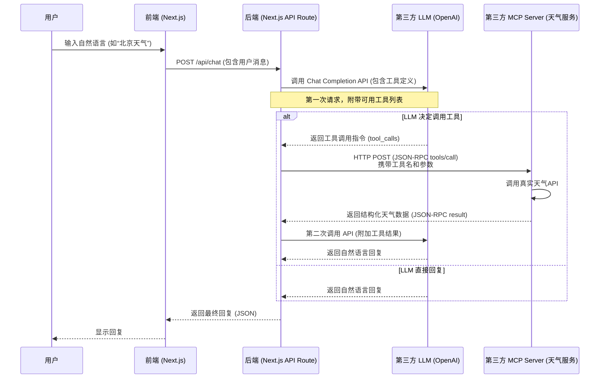

# Agent

## Memory

短期记忆直接上聊天记录的滑动窗口

长期记忆采用向量等

长期记忆还有长期记忆的文档


## Toolcall

写自己的Toollist, 然后交给LLM, LLM分析用户的自然语言, 判断是否需要使用Tool, 如果需要, 则会在请求中返回Toolcall, 然后进行

## Skill

抽象的概念, 表示模型进行操作的方式. Toolcall是Skill的一种实现


## Agnet Loop

通过循环统一调度管理LLM

- 上下文感知与状态更新
- 规划任务列表
- 执行工具调用
- 错误重试
- 反思总结, 错误学习, 计划修正
- 终止与输出, 状态持久化
- 资源与成本控制, 超出token即停止/用户手动中断/调用频次超出


## MCP

> Model Context Protocol

一种规范

一般来说, MCP over HTTP

`PUT` `/api/mcp` 

请求

```http
POST /mcp HTTP/1.1
Host: weather-mcp.example.com
Content-Type: application/json; charset=utf-8
Accept: application/json, text/event-stream
Mcp-Session-Id: sess-xyz
MCP-Protocol-Version: 2025-06-18
Origin: https://chat.openai.com

{
  "jsonrpc": "2.0",
  "id": 3,
  "method": "tools/call",
  "params": {
    "name": "get_current_weather",
    "arguments": {
      "location": "Beijing",
      "unit": "celsius"
    }
  }
}
```

响应

```json
{
  "jsonrpc": "2.0",
  "id": 2,
  "result": {
    "content": [
      {
        "type": "text",
        "text": "北京当前天气：多云，温度18°C，湿度65%。"
      }
    ]
  }
}
```


统一规范了之后, 有利于厂商封装MCP Server, 有利于客户端构建请求



不就是封装HttpAPI接口为一个通用接口+Toolcall吗? 我依旧认为MCP是造概念


### Q: 让 AI 写代码调用HttpAPI, 而不是MCP; 让 AI 写代码执行, 而不是Toolcall

MCP 和 Toolcall 作为一种规范, 降低了AI工作的复杂度, 让工作更可控. 如果彻底让AI从零开始写代码, 然后执行, AI的任务太重, 容易出错.

