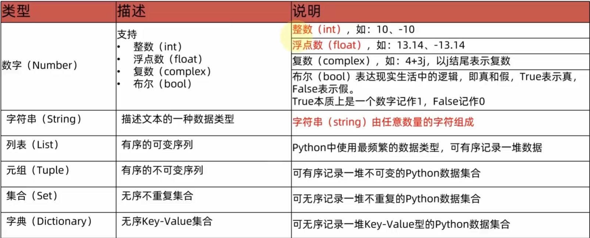

# 字面量与变量

-   字面量就是常量

## 类型




```python
type() # 查看数据类型 
```


## 变量

```python
变量名 = 变量值
```

python中变量没有类型, 变量存储的值有类型

```python
money = 10
print(type(money))  # <class 'int'>
print(type(12))     # <class 'int'>
print(type(print))  # <class 'builtin_function_or_method'>
print(type(type))   # <class 'type'>
```


## 数据类型转换

```python
money = 10

# int 转 str
money = str(money)
print(money)        # 10
print(type(money))  # <class 'str'>

# 字符串转 int
money = int(money)
print(money)        # 10
print(type(money))  # <class 'int'>

num = 1.2
print(int(num))  # 直接去除小数点后面的数
print(str(num))  # 任何类型都能转化为字符串
print(int(str(num)))  # 浮点数的字符串不能直接转化成整数


```

ASCII码和字符串的互相转化

```python
ascii_value = 65
char = chr(ascii_value)
print(f"'{char}'")  # 'A'

char = 'a'
ascii_value = ord(char)
print(ascii_value)  # 97
```


## 声明变量类型

不声明变量类型也可以, Python会帮你做好

但是如果想要显示地声明类型. 可以用`变量:类型`来做

如:

```python
def str_method(string: str):
    print(string)


if __name__ == '__main__':
    a: int = 12
    # a = "12" 可以, 但IDE会涉黄
    # str_method(a) 可以, 但IDE会涉黄
```

声明了之后, IDE就会帮你做类型检查,我看Pycharm做的检测emmmmm, Python本身也没啥强制性的, 都是些规定, 就很....

就别全信, 就当为了只是可读性

```python
def my_fun(str_var:str,int_var:int) -> (int, str):
    return int_var,str_var
```

声明了参数类型和返回值类型

