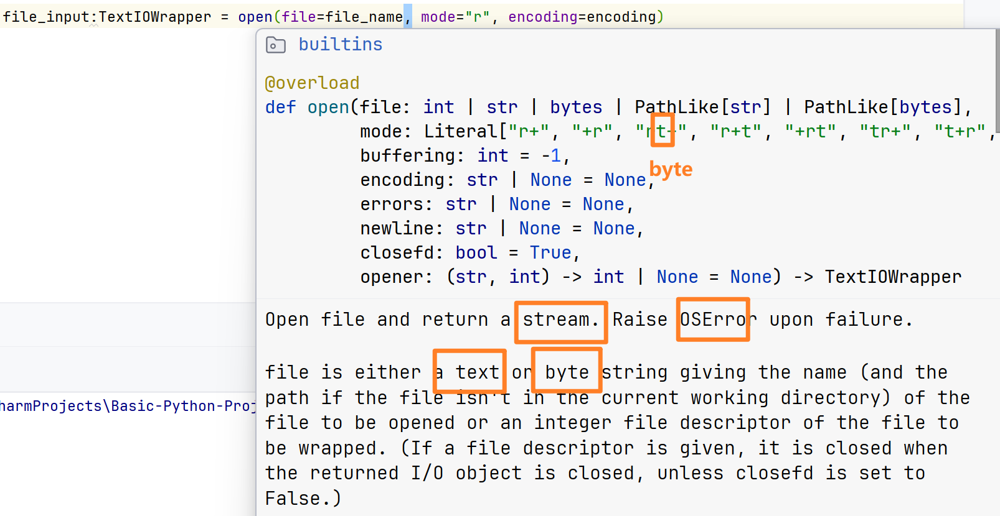

# 文件IO

## 文件编码

## IO


创建文件指针

```java
if __name__ == '__main__':
    file_name: str = "./main.py"
    encoding: str = "UTF-8"
    file_input = open(file=file_name, mode="r", encoding=encoding)
    file_output = open(file=file_name, mode="a", encoding=encoding)

```


`read-write`读写, 字符输入输出

```python
file_content: str
while True:
    file_content = file_input.read(__n = 20)
    if len(file_content) == 0:
        break
    print(file_content, end="")
    file_output.write(file_content)
file_output.close()
file_input.close()
```


`read_lines-write_lines`读写

```python
content:list[str] = file_input.readlines(__hint = 20)
for line in content:
    print(line)
    file_output.writelines(line)
file_output.close()
file_input.close()
```



```python
"""
你好
"""
from astroid.brain.brain_io import TextIOWrapper

if __name__ == '__main__':
    file_name: str = "./main.py"
    encoding: str = "UTF-8"
    file_input: TextIOWrapper
    with open(file=file_name, mode="r", encoding=encoding) as file_input:
        while file_input.readable():
            print(file_input.read(1), end="")
        pass
```

`with-as`自动关闭流

