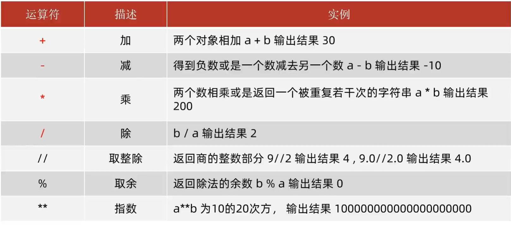
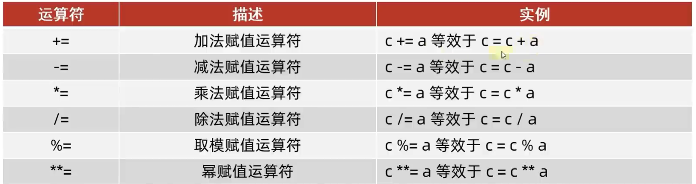
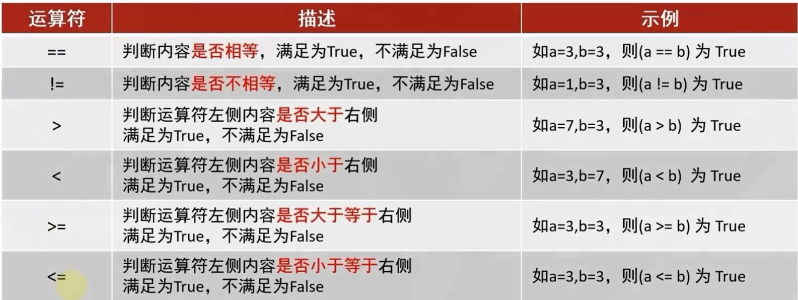

# 运算符

## 算数运算符



## 赋值运算符

-   复合赋值运算符



## 条件运算符

值为布尔`True`或`False`



"1"和1是不相等的, 但可以比而不会报错

"1" 和 0 不能大小比较, 会报错

字符串比大小是比ASCII码, 前端对齐, 一个字符一个字符地比

## 逻辑运算符

`not` `and` `or` `in`

```python
if __name__ == '__main__':
    print(1 in [1,2]) # True
```

