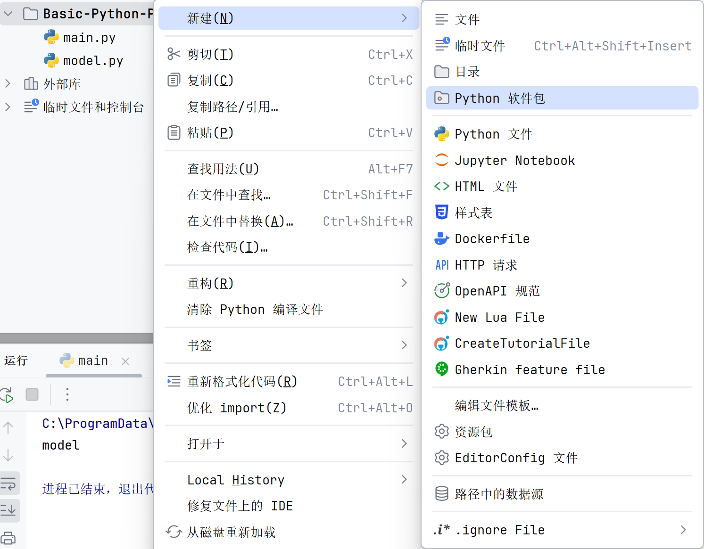
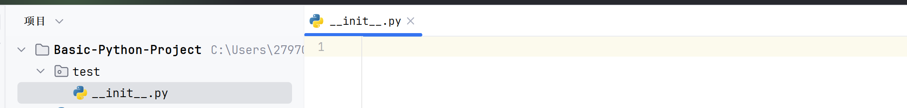
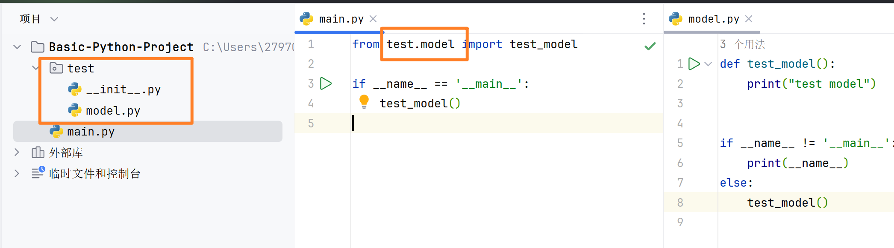
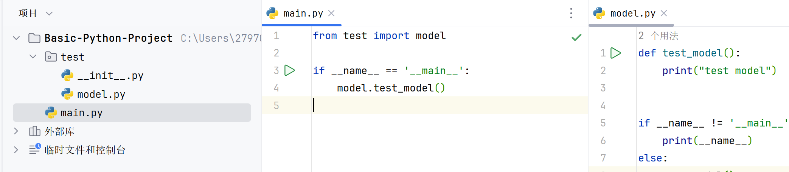
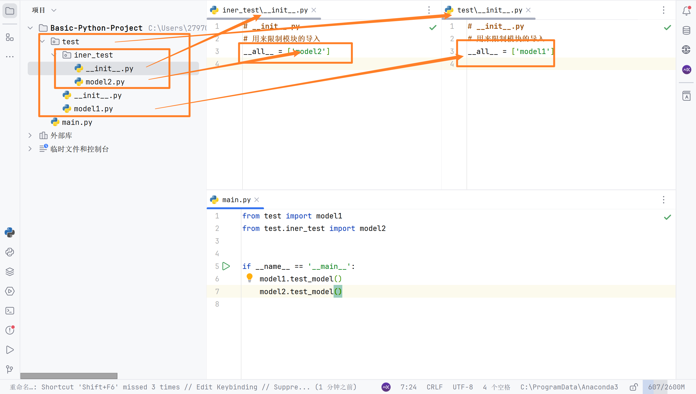

# 包

## 自定义包



`__init__.py` , 表示这是一个python包



导入包中的模块



或这样:

 

-   这样子是不可以的

```python
from test import model.test_model
```

-   限制包内模块的导入

```python
# __init__.py
# 用来限制模块的导入
__all__ = ['model']
```

包的嵌套

`__init__.py`只能管理本级的模块, 不能管理上一级或下一级的模块



## 安装第三方包

[清华镜像](pypi.tuna.tsinghua.edu.cn/simple)

```
pip install -i https://pypi.tuna.tsinghua.edu.cn/simple  --target=D:\IT_study\anaconda\Lib 包名称
```

```shell
pip install -i https://pypi.tuna.tsinghua.edu.cn/simple  --target=D:\IT_study\anaconda\Lib PyMuPDF
```

