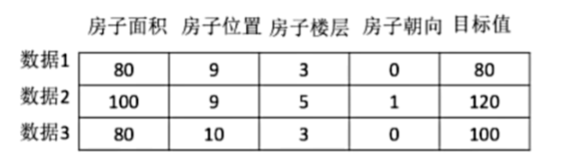

# 机器学习

从大量的数据中

机器自主创建模型

## 数据

怎样的数据?

### 数据集的构成

机器学习需要的数据

特征值+目标值

从而获取目标规律

有些数据集可以没有目标值

根据特征分类数据

## 算法

### 监督学习

#### 分类问题

目标值是一个类别的(离散的数据)

例如识别图片是猫还是狗

-   算法: k-近邻算法, 贝叶斯算法, 决策树, 随机森林, 逻辑回归

#### 回归问题

目标值是一个连续的数据

例如预测房屋价格

-   线性回归, 岭回归

### 无监督学习

数据集中没有目标值

数据集有特征无标签

-   聚类方法 k-means

## 机器学习开发流程

1.  获取数据
2.  数据处理
3.  特征工程
4.  机器学习算法训练 - 模型
5.  模型评估
6.  应用

