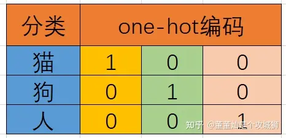

# 特征工程

数据和特征决定了机器学习的上限, 而模型和算法知识逼近这个上限而已

## 定义

处理特征数据, 使特征能在机器学习算法上发挥更好的作用的过程

## 特征工程的工具

>sklearn

pandas做数据清洗和数据处理

## 特征工程的内容

### 特征抽取

对文章的分类, 想用机器学习算法

什么是机器学习算法 - 来源于统计, 希望用机器来做统计的事情

统计方法就是数学公式

数学公式不能处理字符串

需要对字符串抽象成数值, 然后提供给数学公式处理

#### 目的

把无法直接用数学公式处理的数据转化为数值, 然后进一步处理

**特征值化**让机器学习算法更好地去理解数据

-   字典特征提取(特征离散化)
-   文本特征提取
-   图像特征提取(深度学习)

#### 对字典的特征提取

-   应用场景
    -   当数据集中存在**类别特征**, 类别特征比较多
        1.  将数据集特征抽取成字典类型
        2.  使用`DictVectorizer`向量化字典
    -   如果拿到的数据集就是字典类型

```python
from sklearn import feature_extraction

def test_dict_vectorizer():
    feature_extraction.DictVectorizer(sparse=True....) 
    # Vector 向量, 矢量 , 一维数组, Vectorizer向量化
    # 将特征值映射为一个向量
    # 矩阵 matrix 二维数组

```

-   返回值 : transfer 转换器

-   将类别转化成**one-hot编码**

    -   one-hot 编码用于将离散的分类标签转换为二进制向量

    -   猫、狗、人三分类问题，我们可以很简单的将其进行如下的编码。

        

    -   猫狗人三个类没有实质性的大小区别, 只有"是这个类"和"不是这个类"的差别

```python
def test_dict_vectorizer():
    """
    字典特征抽取
    """
    data = [{'city':'北京','temperature' : 100},
            {'city':'上海','temperature' : 60},
            {'city':'深圳','temperature' : 30}]
    # 1. 实例化一个转化器类, 默认sparse=True
    transfer = DictVectorizer(sparse=True)

    # 2. 调用fit_transform()转换, 返回sparse(稀疏)矩阵
    new_data = transfer.fit_transform(data)

    print(f"new_data:\n{new_data}")
```

`sparse=True`时输出结果

```python
new_data=
  (0, 1)	1.0
  (0, 3)	100.0
  (1, 0)	1.0
  (1, 3)	60.0
  (2, 2)	1.0
  (2, 3)	30.0
```

`sparse=False`时的输出结果

```text
new_data=
[[  0.   1.   0. 100.]
 [  1.   0.   0.  60.]
 [  0.   0.   1.  30.]]
```

-   稀疏矩阵: 将原矩阵(`sparse=False`时的原数据)的有数据的(非零的)位置+值表示出来
-   如果类别很多, 以此为例, 如果有1000个city, 就会有一个矩阵的大小就会有1000*1001
-   但是尽管数据再多, 大量都是无用的, 用来占位的零, 而我们只关注有意义的**1**
-   有了稀疏矩阵, 就能节省内存了

```python
feature_names = transfer.get_feature_names()
# 3. 获取特征名称
print(f"feature names=\n{feature_names}")
```

```text
feature names=
['city=上海', 'city=北京', 'city=深圳', 'temperature']
```

#### 对文本的特征提取

把一篇文章进行分类的话, 使用**单词作为特征**更容易分类

选项 : 句子(太千变万化), 短语, 单词, 字母

特征, 特征词

-   CountVectorizer

    -   传文本或包含文本特征值的iterable对象

        ```python
        from sklearn.feature_extraction.text import CountVectorizer
        from sklearn.feature_extraction.text import TfidfVectorizer

        def test_text_vectorizer():
            """
            文本特征抽取
            """
            data = ["When it is nine o'clock",
                    " it's earlier than eleven o'clock",
                "meanwhile, it's latter than eight o clock, isn't it?"]
            # 1. 实例化一个转化器类
            transfer = CountVectorizer(
            	stop_words=("your","me","my") # 停用词表
            )

            # 2. 调用fit_transform()转换, 参数: 文本或文本的可迭代对象, 返回sparse矩阵
            fit_data = transfer.fit_transform((data))
            print(f"fit data=\n{fit_data}")
            # 转换为原举证(不能再构造器里传参设置parse=False了)
            print(f"fit data=\n{fit_data.toarray()}")

            # 参数时array数组或sparse矩阵, 返回转换之前的数格
            inverse_data = transfer.inverse_transform(fit_data)
            print(f"inverse_data=\n{inverse_data}")

            # 3. 获取特征名称
            feature_names = transfer.get_feature_names()
            print(f"feature names=\n{feature_names}")

        ```

    -   测试结果

        ```text
        fit data=
          (0, 11)	1
          (0, 6)	1
          (0, 4)	1
          (0, 9)	1
          (0, 0)	1
          (1, 6)	1
          (1, 0)	1
          (1, 1)	1
          (1, 10)	1
          (1, 3)	1
          (2, 6)	2 # 计数了, 一个词在同一段文本里出现了两次
          (2, 0)	1
          (2, 10)	1
          (2, 8)	1
          (2, 7)	1
          (2, 2)	1
          (2, 5)	1

        fit data=
        	[[1 0 0 0 1 0 1 0 0 1 0 1]
         	[1 1 0 1 0 0 1 0 0 0 1 0]
         	[1 0 1 0 0 1 2 1 1 0 1 0]]

        inverse_data=
        	[array(['when', 'it', 'is', 'nine', 'clock'], dtype='<U9'), array(['it', 'clock', 'earlier', 'than', 'eleven'], dtype='<U9'), array(['it', 'clock', 'than', 'meanwhile', 'latter', 'eight', 'isn'],
              dtype='<U9')]

        feature names=
        	['clock', 'earlier', 'eight', 'eleven', 'is', 'isn', 'it', 'latter', 'meanwhile', 'nine', 'than', 'when']
        ```

    -   中文试验

        ```text
        fit data=
          (0, 1)	1
          (0, 0)	1

        fit data=
        	[[1 1]]

        inverse_data=
        	[array(['这是一段中文', '我想尝试一下能否被特征提取'], dtype='<U13')]

        feature names=
        	['我想尝试以下能否被特征提取', '这是一段中文']
        ```

    -   Jieba中文分词

        ```python
        import jieba

        def devid_chinese_word(text:str):
            """

            自动中文分词

            Returns
            -------
            list.

            """
            tokenizer = jieba.cut(text) # 返回词语生成器
            words_list:list = list(tokenizer)
        return " ".join(words_list) # 以空格分割, 将列表转为字符串
        ```

        ```python
        # 中文分词
        print("=================Chinese=================")
        data = ["你好世界","世界真大"]
        devided_texts = []
        for words in data:
            devided_texts.append(devid_chinese_word(words))
        print(devided_texts)
        # ['你好 世界', '世界 真 大']
        fit_data = transfer.fit_transform(devided_texts)
        print(f"fit data=\n{fit_data}")
        ```

-   `TfidfVectorizer`

    -   希望在一个类别的文章中出现很多, 在其他文档中出现不多
    -   用数学的量化方法
    -   t(erm)f(requency)=词频
    -   i(nverse)d(ocument)f(requncy)
    -   由自己的语料库做标准, 自己语料库出现频率高, 这篇文章出现频率高的文档不是高频词

    ```python
    data = ["关于这个事，我简单说两句，你明白就行，总而言之，这个事呢，现在就是这个情况",
            "具体的呢，大家也都看得到，也得出来说那么几句，可能，你听的不是很明白",
            "但是意思就是那么个意思，不知道的你也不用去猜，这种事情见得多了",
            "我只想说懂得都懂，不懂的我也不多解释，毕竟自己知道就好，细细品吧",
            "你们也别来问我怎么了，利益牵扯太大，说了对你我都没好处，当不知道就行了",
            "其余的我只能说这里面水很深，牵扯到很多东西。详细情况你们自己是很难找的",
            "网上大部分已经删除干净了，所以我只能说懂得都懂。",
            "懂的人已经基本都获利上岸什么的了，不懂的人永远不懂",
            "关键懂的人都是自己悟的，你也不知道谁是懂的人也没法请教"]
    print("=================TFIDF=================")

    transfer = TfidfVectorizer()
    fit_data = transfer.fit_transform(data)
    print(f"fit data=\n{fit_data.toarray()}")
    inverse_data = transfer.inverse_transform(fit_data)
    print(f"inverse_data=\n{inverse_data}")
    feature_names = transfer.get_feature_names()
    print(f"feature names=\n{feature_names}")
    ```

### 特征预处理

#### API

>   sklearn.preprocessing

#### 方法

通过一些转换函数, 将特征函数转化为**更加适合算法模型**的数据过程

无量纲化

因为量纲不统一导致各个数值的权重不一样

例如, 40T的磁场其实很牛逼了, 是目前人类能造成的最强磁场了. 但是和什么光速3万万米每秒, 听起来根本不算啥

问题出在哪? 出在他们有单位

-   归一化

    -   默认映射到[0,1], 总是闭区间

    1.  x2 = (x1-min)/(max-min)
    2.  x3 = x2*(high-low)+ low (配置的上下限)

    def test_scaler():
        """
        放缩器
        根据最大最小值进行放缩

    ```python
    def test_scaler():
        """
        放缩器
        根据最大最小值进行放缩

        Returns
        -------
        None.

        """

        data = np.empty(shape = (100,3),dtype = np.int32)
        for i in range(3):
            data[:,i] = np.random.randint(10**i,10**(i+1),size =(100,),dtype=np.int32)
        print(data.shape)
        scaler = MinMaxScaler(feature_range=[0,1])
        scaler.fit(data)
        result = scaler.transform(data)
        for i in result:
            for j in i:
                print("%7.3f"%j, end = ",")
            print()
        return
    ```

    -   缺点: 数据中有缺失值, 或如果有异常值(一般是最大值或最小值).

        非常容易收到最大值和最小值的影响

        鲁棒性较差(健壮性, 稳定性)

        **适合传统精确的小数据场景**

-   标准化

    -   将原始的数据变换到**平均值为0, 标准差为1**的数据(标准正态分布)
    -   方法: `x' = (x-arg)/标准差`

    ```python
    from sklearn.preprocessing import StandardScaler
        scaler = StandardScaler()
        scaler.fit(data)
        result = scaler.transform(data)
        for i in result:
            for j in i:
                print("%7.3f"%j, end = ",")
            print()
    ```

### 特征降维

#### 概念

减少**二维数组**中随机变量(**特征**)的个数, 得到**主变量**的过程

主变量之间要求**特征与特征不相关**

例如空气湿度和降水量之间的关系, 可以通过某种关系推导

如果得到了这种推导方式, 那么只需要其中一种变量, 另外一种(或几种)变量便可呼之欲出, 便不再需要另一变量, 

就可以去掉这一可得到的变量, 减少数据冗余

#### 方式

-   特征选择
-   主成分分析

##### 特征选择

只在从原有特征中找出主要特征

-   过滤式`Filter`

    -   方差选择法

        方差小, 说明每个数据没啥区别, 说明不重要

        ```Python
        sklearn.feature_selection.VarianceThreshold(threshold=0.0)
        # Variance方差
        # Threshold阈值
        # 小于等于threshold的删除, 默认0.0
        ```

        ```python
        from sklearn.feature_selection import VarianceThreshold

        def test_variance_threshold():
            data = np.empty(shape = (100,5),dtype = np.float32)
            for i in range(3):
                data[:,i] = np.random.randint(10**i,10**(i+1),size =(100,),dtype=np.float32)
            data[:,3:5] = np.random.normal(1,0.1,size =(100,2))
            print(data.shape) # (100, 5)
            selector = VarianceThreshold(threshold = 0.0101)
            result = selector.fit_transform(data)
            print(result.shape) # (100, 3)
        ```

    -   相关系数法

        特征与特征之间的相关性

        相关系数(有各种各样的)

        计算皮尔森相关系数

        $$
        r = \frac{\sum (x - m_x) (y - m_y)}
                 {\sqrt{\sum (x - m_x)^2 \sum (y - m_y)^2}}
        $$

        ```python
        def test_pearsonr():
            # 计算某两个变量之间的相关系数
            data = np.array([
                [i,2*i+np.random.normal(0,1)] for i in
                    np.random.randint(10,100,size =(100,),dtype=np.int32) 
            ])
            print(data)

            # 画散点图
            plt.figure(figsize=(20,8),dpi=100)
            plt.scatter(data[:,0], data[:,1])
            plt.show()

            # 相关系数
            r = pearsonr(x = data[0],y = data[1])
            print("相关系数:",r[0])
        ```

        对于相关性强的特征, 可以

        1.  选取其中之一
        2.  加权求和
        3.  主成分分析, 自动将相关性强的处理掉

-   嵌入式`Embeded`

    -   决策化
    -   正则化
    -   深度学习

##### 主成分分析

>   Principal component analysis 主 成分 分析

舍弃部分原有数据, 创造新的变量

数据维数的压缩, 尽可能地降低原数据的维数(复杂度), 损失少量信息

例如: 三视图要三张图, 每张图独立都不能描述事物; 平面直方图只有一张图就能很好地描绘事物

怎么降维呢?

PCA认为数据中的方差最大的方向是数据的主要方向

```python
sklearn.decomposision.PCA(n_components = None)
```

-   n_components
    -   小数表示保留百分之对少的信息
    -   整数表示要多少特征

使用水仙花

```python
def test_pca(data):
    # PCA降维
    for i in range(50):
        analysiser = PCA(n_components = (99-i)/100)
        result = analysiser.fit_transform(data)
        print(i,":",result.size)
```

结果

```text
0 : 450
1 : 450
2 : 300
3 : 300
4 : 300
5 : 300
6 : 300
7 : 150
8 : 150
保留93%的信息, 降到一维
```

