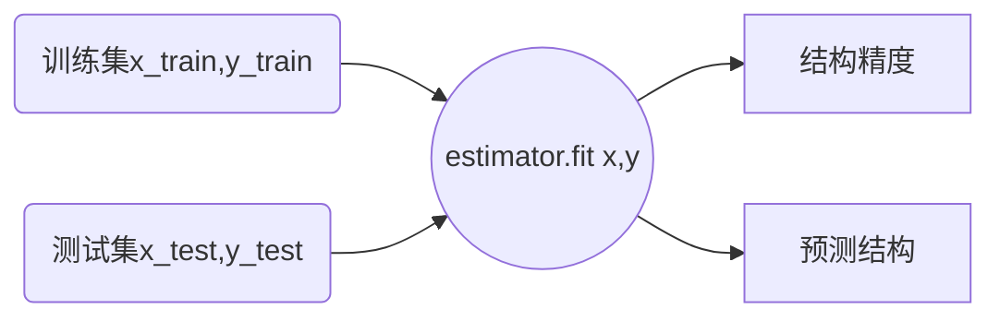

# 转换器和预估器

## 转换器

>   Transformer

之前特征工程的时候使用的都是转换器(继承`transformer`)

`fit_transform`都是由`fit`和`transform`方法封装而成

`fit`方法做计算并存储计算结果

`transform`方法改变原有数据形式, 得到转换后的数据

## 预估器

>   estimator

-   用于分类的估计器
-   用于回归的估计器
-   用于无监督学习的估计器

-   结构精度: `estimator.score(x_test,y_test)`x
-   预测结果: `estimator.predict(x_test)`