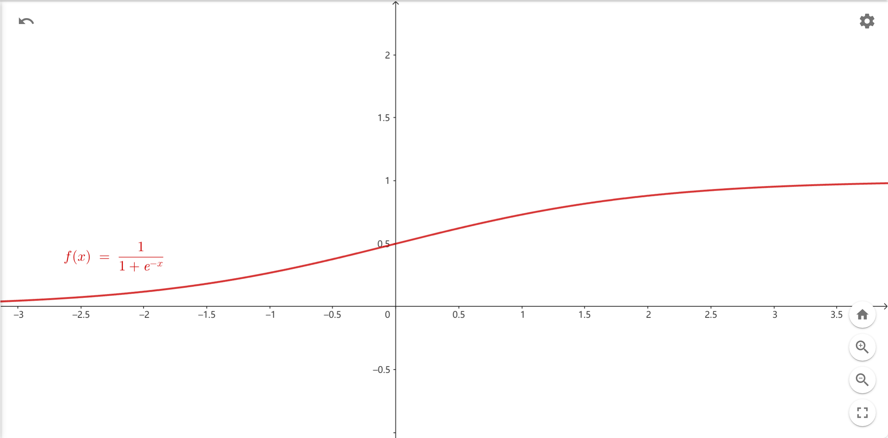
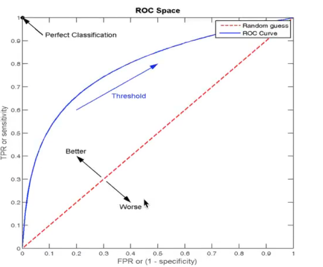

# 逻辑回归

>   Logistic Regression

是一个**分类模型**

## 应用场景

-   广告点击率
-   是否为垃圾邮件
-   是否患病
-   金融诈骗
-   虚假账号
-   皆是二分类问题

## 原理

**逻辑回归的输入就是线性回归的输出线性回归方程**

将**线性回归方程**带入`sigmoid`函数中(激活函数)

$$
g(\theta^T x) = \frac{1}{1+e^{-\theta^T x}}\\

sigmoid \space function
$$



-   `\theta^T^x` = **线性回归方程**或预测值

-   `sigmoid`函数的值域落在(0,1)之间, 可以看作一个是与否(函数值与0.5或预测值与0比较之类)的概率

-   由于逻辑回归的分类正确与否是二分类的, 需要引入新的损失函数: **对数似然损失**

    $$
    cost(h_\theta(x),y)
    \begin{cases} 
    	-log_b(h_\theta(x)), y = 1\\  
    	-log_b(1-h_\theta(x)), y = 0
    \end{cases}\\
    $$

    - `	h_\theta(x)`就是预测值带入后的`sigmoid`函数
    -  `cost`值越大, 损失就越大
    - `y`是真实值

## API

导入

```python
from sklearn.linear_model import LogisticRegression ,SGDClassifier
```

-   `LogisticRegression`

    -   `penalty{'l1', 'l2', 'elasticnet', 'none'}, default='l2'`

    -   `C:float, default=1.0` 正则化力度

    -   `fit_intercept:bool, default=True`

    -   `solver : {'newton-cg', 'lbfgs', 'liblinear', 'sag', 'saga'}, default='lbfgs'`

        优化秋决方法

        `sag` : 根据数据集自动选择, **随机平均梯度下降**

        `saga`:GPT说是sag的改进版本

-   `SGDClassifier`

    -   ` average:bool or int, default=False`

        `SGDClassifier`默认SGD, 设置为True可开启SAG

        `LogisticRegression`默认使用SAG

-   通用方法

    -   `coef:_ndarray`
    -   ` intercept:ndarray`

```python
def pre():
    # 导入
    from sklearn.datasets import load_boston
    boston = load_boston()

    # 划分
    from sklearn.model_selection import train_test_split
    data_train,data_test,target_train, target_test = \
        train_test_split(
            boston.data,boston.target,
            test_size = 0.2 # 可选, 默认0.25
        )

    # 标准化
    from sklearn.preprocessing import StandardScaler
    scaler = StandardScaler()
    scaler.fit(data_train)
    data_train = scaler.transform(data_train)
    data_test = scaler.transform(data_test)
    import numpy as np

    target_train = np.where(target_train < np.quantile(a=target_train,q=0.1),1,0)
    target_test = np.where(target_test < np.quantile(a=target_test,q=0.1),1,0)
    # 预估器
    return data_train,data_test,target_train, target_test

def post(regresssor,data_test,target_test):
    y_pred = regresssor.predict(data_test)
    score = regresssor.score(data_test, target_test)
    print(y_pred)
    print(score)

if __name__ == "__main__":
    data_train,data_test,target_train, target_test = pre()

    from sklearn.linear_model import LogisticRegression ,SGDClassifier

    print("---------------------------LogisticRegression---------------------------")
    regresssor = LogisticRegression(C=0.5)
    regresssor.fit(data_train,target_train) # 要求target必须只能有两个值
    print(regresssor.coef_)
    print(regresssor.intercept_)
    # 模型评估
    post(regresssor,data_test,target_test) # 8.666
    print("---------------------------SGDClassifier---------------------------")
    classifier = SGDClassifier(average=True)
    classifier.fit(data_train,target_train) # 要求target必须只能有两个值
    print(classifier.coef_)
    print(classifier.intercept_)
    post(classifier,data_test,target_test) # # 8.333

```

## 模型评估

### 二分类问题评估的特殊性与需求的产生

对于二分法问题, 我们对于预测结果的正确率又是不这么关心

因为有时候, 我们更希望**宁可错杀一千, 不可放过一个**

例如: 对于癌症数据, 机器学习之后, 得到的正确率, 即使是96%, 也是很危险的, 因为是医学

我们希望的是: "真的患癌症的, 检查出患癌症的正确率是多少", 而不太关心"没有患癌症的, 检查出患癌症的概率" ,因为可以复查嘛, 但是如果第一遍检查出没换癌症, 就不太会去复查了, 这就要危险得多了

### 精确率和召回率

#### 混淆矩阵

|                | 预测结果为正例 | 预测结果为假例 |
| -------------- | -------------- | -------------- |
| 真实结果为正例 | 真正例TP       | 伪反例FN       |
| 真实结果为假例 | 伪正例FP       | 真反例TN       |

-   True-False
-   Positive-Negative

#### 精确率

预测结果为正例样本中真正例的比例

$$
\eta(Presision) = P(T|P)
$$

#### 召回率

预料正例正确的, 占所有真实结果为正例的概率
$$
\eta(Recall) = \frac{N(TP)}{N(TP)+N(FN)}
$$

**更关心召回率**, 更能代表预测正例的正确率

#### F1-score

精确率和召回率的调和平均数

$$
F_1 = \frac{2N(TP)}{2N(TP)+N(FN)+N(FP)} =\frac{2 \cdot Presision \cdot Recall}{Presision+Recall}
$$

F~1~大, 代表*Presision*和*Recall*值都很高, 代表了模型的稳健性

#### 选择正例

在上例中, 我们更关注癌症的比例与数量与评价预估 , 所以让得癌症的作为正例

一般我们更关注特殊情况, 所以一般会默认让数量少的成为正例

#### API

```python
from sklearn.metrics import classification_report
```

-   `y_true:1d array-like` 真实值

-   `y_pred:1d array-like` 预测值

-   `labels:list` 指定类别对应的数字

-   `target_names:list` 目标类别的名称

-   返回每个类别的精确值和召回率

```python
def post(regresssor,data_test,target_test):
    from sklearn.metrics import classification_report
    y_pred = regresssor.predict(data_test)
    mse = classification_report(target_test,y_pred,
                                labels=[1,0],target_names=["买得起","买不起"])
    print(mse)
```

```
              precision    recall  f1-score   support

         买得起       0.89      0.80      0.84        10
         买不起       0.98      0.99      0.98        92

    accuracy                           0.97       102
   macro avg       0.93      0.89      0.91       102
weighted avg       0.97      0.97      0.97       102
```

#### 存在问题

 一百个例子里, 99个正例, 1个反例

我们的模型, 不管三七二十一, 都把数据判定为'正例'------这是一个不负责任的模型

准确率: 99%

召回率: 100%

精确率: 99%

F1-score 99.497%

很危险啊

产生原因: 正例太多,样本不均衡

## ROC曲线和AUC指标

### TPR

$$
\eta(TPRate) = \frac{N(TP)}{N(TP)+N(FN)}
$$

### FPR

$$
\eta(FPRate) = \frac{N(FP)}{N(FP)+N(TN)}
$$

### ROC

一条以FPR为x轴, TPR为y轴形成的曲线



### AUC

就是ROC曲线与`TPR=0`,`FPR=1`围成的图形面积

-   AUC指标接近1, 分类器越好
-   AUC指标越接近0.5, 说明不论样品何种情况, TPR和FPR总是相等,说明是在瞎猜, 分类器越不好
-   如果小于0.5呢?
    -   就不能把AOC指标定义为ROC曲线和直线TPR-FPR=1围成图像的面积吗?????
    -   说明对反例的预测很好很合适

### API

```python
print("----------------ROC-AUC------------------")
from sklearn.metrics import roc_auc_score
print(roc_auc_score(target_test, # 要求真实值必须用1表示正例, 用0表示反例
                    y_pred))
# 0.8836956521739131 有点呆, 但其实数据都是自己编的, 其实还好啦?
```

