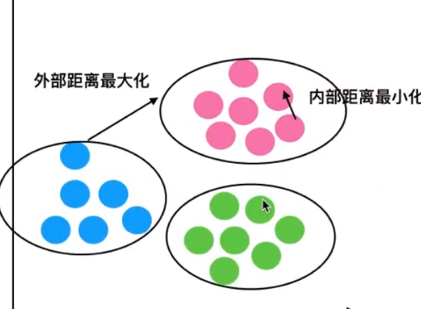

# 无监督学习

## 定义

没有目标值

## 算法

-   聚类
    -   K-means
-   降维
    -   PCA

## K-means

-   K可以作为超参数

### 原理

1.  随机设置k个特征空间的点作为聚类中心
2.  对于其他每个点计算到k个中心点的距离, 位置的点选择最近的一个聚类中心点作为标记类别
3.  依据同一类别的几个点, 重新计算出每个聚类的新中心点(平均值)
4.  如果计算得出的新中心点与原中心点一致(或较相近), 那么结束, 否则重新进行第二步过程

### API

```python
data_train = standard_scaler(data_train)
data_test = standard_scaler(data_test)
from sklearn.cluster import KMeans
classifier  = KMeans()
classifier.fit(data_train)
result = classifier.predict(data_train)
print(result- classifier.labels_) # 全0
```

- n_clusters:int, default=8 开始时聚类的中心的数量
- init{'k-means++', 'random'},default='k-means++
- labels_:默认标记的类型, 可以和真实值比较(不是值比较)

### 评估聚类

#### 轮廓系数

$$
SC_i = \frac{b_i-a_i}{max(b_i,a_i)}
$$

-   b~i~ 某一样本到其他族群所有样本的最小值
-   a~i~ 某一样本到族群的所有样本的平均
-   SC~i~ 属于 (-1,1) , 越接近1, 模型越好; 越接近-1, 模型越差



#### API

```python
# 模型评估
from sklearn.metrics  import silhouette_score
print(silhouette_score(
    data_train # 特征数据
    ,classifier.labels_ # 类
)
print(silhouette_score(data_test,classifier.predict(data_test))) # 测试数据, 应该也合理
# 0.3745812689267153
```
### 特点

简单移动

若三个随机点可能挤在一起, 容易收敛到局部最优解

