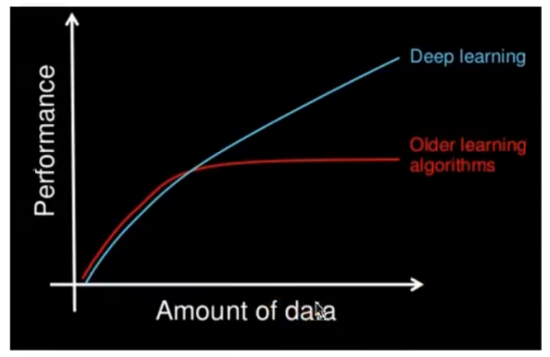
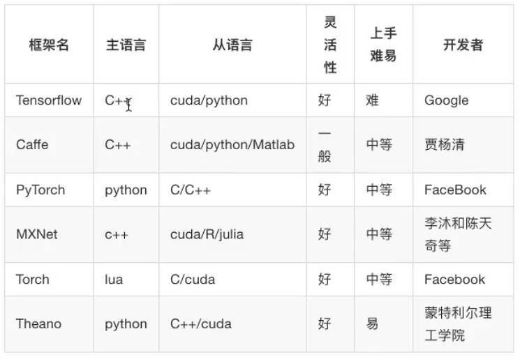

# 深度学习

## 与机器学习的区别

-   在特征提取的方面

    -    机器学习需要人工做特征工程

        需要人工判断特征之间是否有价值, 然后一步步对数据进行加工

    -   深度学习, 让神经网络做特征提取与分类

        将简单的模型组合在一起, 将数据从一层传递到另一层来构建更复杂的模型

        通过**大量训练和大量数据**自动得出模型. 不需要仍特征提取环节

    -   深度学习适合用于人工不好进行特征提取的领域, 例如图像, 语音, 自然语言



-   对计算机和计算性能的要求

    -   CPU也能洒洒水

    -   深度学习需要大量训练数据

        训练深度神经网络需要大量的算力(GPU)

        需要大量时间训练(数天, 数周)才能使用数百万张图像的数据集训练出一个深度网络

-   算法代表

    -   朴素贝叶斯, 决策树
    -   神经网络

## 应用场景

图像识别

人脸识别跟踪

## 深度学习框架



-   PyTorch 适用于动态图像
-   TensenFlow在动态图像和静态图像下都实用
-   TensenFlow和Caffe适用于移动端

### TensorFlow的特点

机器学习和深度学习都行

CPP实现, 性能保证

支持GPU和CPU, 在树莓派上也OK

Tensonboard, 时TensonFlow的一组Web应用, 用来监控TensonFlow运行过程, 或可视化 Computatuin Graph

支持标量`scalars` 图片`graph`

### TensorFlow安装

CPU有计算, 有控制(资源调度)

GPU全方面计算,`Graph Processing Unit`图像处理单元, 核心数量多

GPU的核心数量可以达到好几千, 可以处理多个不同的任务, 适合并行任务

CPU, 核心少 , 但是每个核心的处理速度块, 适合做连续的任务

```
pip3 install -i https://pypi.tuna.tsinghua.edu.cn/simple keras_applications==1.0.6 tensorflow

```

