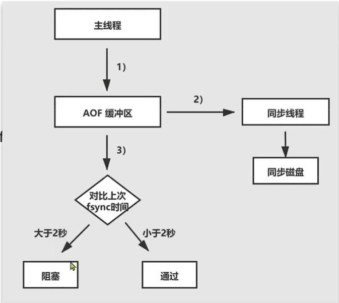
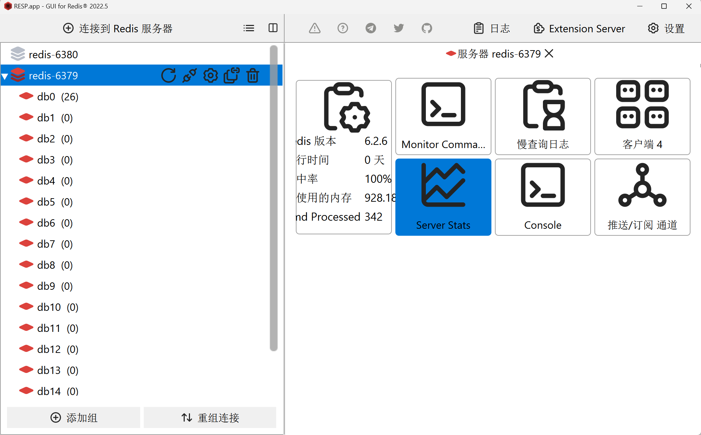

# 服务端优化

## 持久化配置

>   持久化可以保证数据安全, 但也会带来额外的开销

1.  选择性地持久化

    -   用来缓存的Redis实例不要开启持久化

        可以将缓存的数据全部由一台Redis进行管理

    -   分布式锁, 库存和订单流水等对安全性要求高的,需要进行持久化

2.  建议关闭RDB, 使用AOF持久化

    -   对于AOF, 设置合理的`rewrite`阈值,避免频繁的`bgrewrite`(消耗CPU)

    -   配置`no-appendfsync-on-rewrite = yes`, 禁止在`rewrite`或`fork`期间aof, 避免AOF引起的阻塞

        在Redis底层, 会判断AOF的过程是否出现问题, 如果fsync超过2s,认为是出问题了, **阻塞主线程**

        

        阻塞主线程将影响性能

        `no-appendfsync-on-rewrite = yes`**可以避免阻塞, 但不能保证安全性**, 反之, 若为no,则...

3.  利用脚本定期在Slave节点做RDB实现数据备份


## 部署

1.  Redis实例的物理机要预留足够的内存, 应对fork和rewrite
2.  单个Redis实例的内存上限不要太大, 例如4G/32G或8G/64G.可以加快fork的速度, 减少主从同步, 数据迁移压力
3.  可以在一台物理机上部署多台Redis(单机多实例)
4.  不要与CPU密集型应用部署在一起, 例如Elastic Search(搜索, 运算, 数据聚合)
5.  不要与高硬盘负载应用一起部署, 例如数据库, 消息队列


## 慢查询

>   Redis执行时的耗时超过某个阈值的**命令(含读含写)**

阈值配置, 单位**微秒**, 默认10ms,建议1000

```shell
127.0.0.1:6379> config get slowlog-log-*
1) "slowlog-log-slower-than"
2) "10000"
```

会将慢查询的命令记录到日志里

日志长度受限,默认128,建议1000

```shell
127.0.0.1:6379> config get slowlog-max-len
1) "slowlog-max-len"
2) "128"
```

-   查询慢查询日志的长度

    ```bash
    slowlog len
    ```

-   读取n条慢查询日志

    ```shell
    127.0.0.1:6379> slowlog get 1 # 1 可不加
    1) 1) (integer) 3 # 慢查询的编号
       2) (integer) 1708431834 # 时间错, 慢查询运行时的时间点
       3) (integer) 120 # 慢查询消耗的时间, 单位百微秒, 例如10000为1s
       4) 1) "slowlog" # 慢查询命令的几个组成部分
          2) "get"
          3) "0"
       5) "127.0.0.1:56474" # 发起慢查询的IP:端口
       6) "" # 发起这条慢查询的名称, 自己配置, 不配为空
    ```

-   清空慢查询列表

    ```shell
    slowlog reset
    ```

RESP-GUI也好用,多探索探索




## 敏感的命令及安全配置

>   Redis会绑定在0.0.0.0:6379,这样会将Redis服务暴露到公网上, 而Redis如果没有做身份认证, 会出现严重的安全漏  洞

[漏洞重现方式](https://cloud.tencent.com/developer/article/1039000)

### 漏洞出现的核心原因

-   Redis暴露在公网上
-   Redis未设置密码
-   利用Redis的config set命令动态修改了Redis配置
-   使用Root账号权限启动Redis

### 避免漏洞

-   Redis设置**复杂的密码**

-   禁止线上使用以下命令

    ```shell
    keys
    flushall
    flushdb
    config set
    ```

    修改配置文件

    ```properties
    # Command renaming (DEPRECATED).
    #
    # ------------------------------------------------------------------------
    # WARNING: avoid using this option if possible. Instead use ACLs to remove
    # commands from the default user, and put them only in some admin user you
    # create for administrative purposes.
    # ------------------------------------------------------------------------
    #
    # It is possible to change the name of dangerous commands in a shared
    # environment. For instance the CONFIG command may be renamed into something
    # hard to guess so that it will still be available for internal-use tools
    # but not available for general clients.
    #
    # Example:
    #
    # rename-command CONFIG b840fc02d524045429941cc15f59e41cb7be6c52
    #
    # It is also possible to completely kill a command by renaming it into
    # an empty string:
    #
    # rename-command CONFIG ""
    #
    # Please note that changing the name of commands that are logged into the
    # AOF file or transmitted to replicas may cause problems.
    
    
    # 运维人员才知道的命令,运维人员可以用用
    rename-command CONFIG b840fc02d524045429941cc15f59e41cb7be6c52
    
    # 无效这条命令
    rename-command CONFIG "" 
    
    ```

    

-   bind: 限制网卡, 禁止外网网卡访问

    ```properties
    bind 127.0.0.1
    
    # 127.0.0.1 默认,只有本机可以访问
    # 0.0.0.0   所有机器都可以访问
    # 局域网的网卡,内网可以互相访问, 外网就无法访问
    ```

    

-   开启防火墙

-   不要使用Root账户启用Redis

-   尽量不要用默认的端口


## 内存配置

>   这内存十分的珍贵

当Redis内存不足时, 可能导致(不常访问的)key频繁被删除, 响应时间变长, QPS不稳定等问题. 

当内存使用列表达到阈值的时候, 就需要我们警惕, 并快速定位问题所在


### Redis的内存划分

#### 数据内存

-   Redis最主要的部分

-   存储键值信息

-   主要问题

    -   BigKey

    -   内存碎片

        Redis重启时会回收碎片

        可以利用主从集群有序地重启Redis


#### 进程内存

-   Redis主进程运行(代码, 常量池)需要占用内存
-   大约几兆
-   与Redis数据占用的内存相比可忽略


#### 缓冲区内存

-   一般包括

    -   客户端缓冲区

        -   输入缓冲区(最大1G不能配置)

            若超出, Redis将认为是"忙不过来了", 强制断开一切与客户端的连接, 停止处理客户端的新命令

        -   输出缓冲区

            超出阈值, 断开与客户端的连接

            返回值很多?Bigkey or 开启`monitor`命令

            ```properties
            client-output-buffer-limit <class> <hard limit> <soft limit> <soft seconds>
            # `class`: 客户端缓存区的类型:`normal`,`replica`(主从复制),`pubsub(发布订阅)
            # `hard limit`: 缓冲区上限, 超出就断开与客户端连接
            # 	`monitor`命令监控Redis进出的所有数据
            # `soft limit``soft seconds`: 超出`soft limit`之后又过了`soft seconds`之后判断是否依旧超过
            # `soft limit`
            # <hard limit> <soft limit> <soft seconds>为0表示没有上限
            # 默认情况:
            # client-output-buffer-limit normal 0 0 0 <- 非常危险
            # client-output-buffer-limit replica 256mb 64mb 60 
            # client-output-buffer-limit pubsub 32mb 8mb 60 
            ```

        -   查询哪个客户端导致的超出阈值

            ```shell
            127.0.0.1:6379> info clients
            # Clients
            connected_clients:2
            cluster_connections:0
            maxclients:10000
            client_recent_max_input_buffer:24
            client_recent_max_output_buffer:0
            blocked_clients:0
            tracking_clients:0
            clients_in_timeout_table:0
            ```

            查询客户端信息

            ```shell
            client list [TYPE normal|master|replica|pubsub] [ID client-id [client-id ...]]
            ```

            

    -   AOF缓冲区

        -   AOF刷盘之前的缓区域,AOF执行Rewrite的缓冲区
        -   无法设置容量上限

    -   复制缓冲区

        -   主从复制的`repl_backlog_buf`
        -   如果分配内存太小可能导致频繁的全量复制, 影响性能
        -   通过`repl_backlog_size`类配置, 默认1MB

-   内存波动大

-   不当使用BigKey可能导致内存溢出

### 查看内存信息

```shell
127.0.0.1:6379> info memory
# Memory
used_memory:907712
used_memory_human:886.44K
used_memory_rss:12148736
used_memory_rss_human:11.59M
used_memory_peak:1996224
used_memory_peak_human:1.90M
used_memory_peak_perc:45.47%
used_memory_overhead:852424
used_memory_startup:810088
used_memory_dataset:55288
used_memory_dataset_perc:56.63%
allocator_allocated:943272
allocator_active:1335296
allocator_resident:3702784
total_system_memory:3954188288
total_system_memory_human:3.68G
used_memory_lua:37888
used_memory_lua_human:37.00K
used_memory_scripts:0
used_memory_scripts_human:0B
number_of_cached_scripts:0
maxmemory:0
maxmemory_human:0B
maxmemory_policy:noeviction
allocator_frag_ratio:1.42
allocator_frag_bytes:392024
allocator_rss_ratio:2.77
allocator_rss_bytes:2367488
rss_overhead_ratio:3.28
rss_overhead_bytes:8445952
mem_fragmentation_ratio:14.02
mem_fragmentation_bytes:11282032
mem_not_counted_for_evict:0
mem_replication_backlog:0
mem_clients_slaves:0
mem_clients_normal:41008
mem_aof_buffer:0
mem_allocator:jemalloc-5.1.0
active_defrag_running:0
lazyfree_pending_objects:0
lazyfreed_objects:0
```


```shell
127.0.0.1:6379> memory help
 1) MEMORY <subcommand> [<arg> [value] [opt] ...]. Subcommands are:
 2) DOCTOR
 3)     Return memory problems reports.
 4) MALLOC-STATS    Return internal statistics report from the memory allocator.
 5) PURGE 
 6)     Attempt to purge dirty pages for reclamation by the allocator.
 7) STATS # 统计
 8)     Return information about the memory usage of the server.
 9) USAGE <key> [SAMPLES <count>] 
10)     Return memory in bytes used by <key> and its value. Nested values are
11)     sampled up to <count> times (default: 5).
12) HELP
13)     Prints this help.

```

