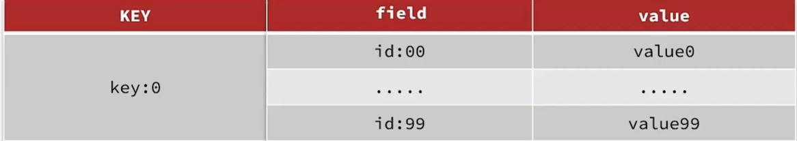

# 键值设计

## Key结构

### 时间约定

-   遵循基本的格式

    ```shell
    [业务名称]:[数据名]:[id]
    ```

    -   可读性强
    -   避免key冲突
    -   方便管理

-   长度不超过44字节(4.0版本一下是39个字节)

    -   节省空间

        key是string类型, 底层编码包括int, embstr, raw三种(不是)

        embstr在小于44字节的使用, 采用连续内存空间, 内存占用更小

        ```bash
        type <key>
        object encoding <help>
        ```

        都是关于**`value`**d的信息, 不是键的

    -   查看键的长度

        ```shell
        127.0.0.1:6379> strlen name
        (integer) 4
        ```

-   不包含特殊字符

## BigKey

### 出现场景

1.  一个key本身就有5MB(虽然上限是512MB)

    ```shell
    127.0.0.1:6379> memory usage name
    (integer) 54
    127.0.0.1:6379> memory usage age
    (nil)
    127.0.0.1:6379> memory usage num
    (integer) 55
    ```

    推荐小于10KB

2.  Key中成员众多(如ZSET中有一万个成员)

    ```shell
    lLen listKey
    ```

    推荐数量小于1000

3.  key中曾元的数据量过大(一个Hash, 成员数量1000个, 成员Value总大小100MB)

### 危害

-   网络阻塞
    -   对BigKey执行读请求时, 少量QPS就可能导致带宽使用率被占满, 导致Redis实例, 乃至所在物理机变慢
-   数据倾斜
    -   BigKey所在的Redis实例内存使用率远超其他实例, 无法数据分片的内存资源达到均衡
-   Redis阻塞
    -   对元素较多的Hash, List, zSet等做运算会耗时较久, 使主线程被阻塞
-   CPU压力
    -   对BigKey的数据序列化和反序列化会导致CPU的使用率飙升, 影响Redis实例和本机其他应用

### 如何发现BigKey

-   ```shell
     redis-cli -a 123456 --bigkeys
    ```

    遍历分析所有key, 并返回Key的整体统计信息与每个数据的Top1的Big key

    ```text
    # Scanning the entire keyspace to find biggest keys as well as
    # average sizes per key type.  You can use -i 0.1 to sleep 0.1 sec
    # per 100 SCAN commands (not usually needed).

    [00.00%] Biggest string found so far '"num"' with 5 bytes
    [00.00%] Biggest string found so far '"item:id:50002"' with 161 bytes
    [00.00%] Biggest string found so far '"item:id:10003"' with 459 bytes
    [00.00%] Biggest hash   found so far '"hot:shop:8"' with 2 fields
    [35.71%] Biggest string found so far '"item:id:10004"' with 467 bytes
    [35.71%] Biggest zset   found so far '"shop:geo:1"' with 9 members

    -------- summary -------

    Sampled 28 keys in the keyspace!
    Total key length in bytes is 343 (avg len 12.25)

    Biggest   hash found '"hot:shop:8"' has 2 fields
    Biggest string found '"item:id:10004"' has 467 bytes
    Biggest   zset found '"shop:geo:1"' has 9 members

    0 lists with 0 items (00.00% of keys, avg size 0.00)
    9 hashs with 18 fields (32.14% of keys, avg size 2.00)
    17 strings with 3082 bytes (60.71% of keys, avg size 181.29)
    0 streams with 0 entries (00.00% of keys, avg size 0.00)
    0 sets with 0 members (00.00% of keys, avg size 0.00)
    2 zsets with 14 members (07.14% of keys, avg size 7.00)

    ```

-   scan扫描

    -   自己编程, 利用`scan`扫描Redis中的所有key(别用`keys *`, 会阻塞主进程)

        ```shell
        127.0.0.1:6379> scan 0 COUNT 5
        1) "20" # 光标位置, 第一次用0, 以后用这个位置做光标
        2) 1) "num"
           2) "item:id:50002"
           3) "item:id:10003"
           4) "cache:shopType:4"
           5) "hot:shop:8"
        127.0.0.1:6379> scan 20 COUNT 5
        1) "0" # 又是0了表示扫描完了
        2) 1) "hot:shop:9"
           2) "shop:geo:1"
           3) "hot:shop:5"
           4) "cache:shopType:3"
           5) "shop:geo:2"
        ```

        不会占用主进程

        COUNT默认10个

        -   还有扫描`Hash`的`hScan`, 扫描`Set`的`sScan`, 扫描`Sorted Set`的`zScan`

    -   利用strlen, hlen等命令判断key的长度

    -   此处不建议使用`Memory Usage`,会对CPU有较大的消耗

    ```java
    public static final int STR_MAX_LEN = 10*1024;
    public static final int HASH_MAX_LEN = 500;

    private Jedis jedis;

    @BeforeEach
    void setUp() {
        // 1.建立连接
        jedis = new Jedis("redis", 6379);
        // 2.设置密码
        jedis.auth("123321");
        // 3.选择库
        jedis.select(0);
    }

    @Test
    void testScan() {
        int maxLen = 0;
        long len = 0;

        String cursor = "0";
        do {
            // 扫描并获取一部分key
            ScanResult<String> result = jedis.scan(cursor);
            // 记录cursor
            cursor = result.getCursor();
            List<String> list = result.getResult();
            if (list == null || list.isEmpty()) {
                break;
            }
            // 遍历
            for (String key : list) {
                // 判断key的类型
                String type = jedis.type(key);
                switch (type) {
                    case "string":
                        len = jedis.strlen(key);
                        maxLen = STR_MAX_LEN;
                        break;
                    case "hash":
                        len = jedis.hlen(key);
                        maxLen = HASH_MAX_LEN;
                        break;
                    case "list":
                        len = jedis.llen(key);
                        maxLen = HASH_MAX_LEN;
                        break;
                    case "set":
                        len = jedis.scard(key);
                        maxLen = HASH_MAX_LEN;
                        break;
                    case "zset":
                        len = jedis.zcard(key);
                        maxLen = HASH_MAX_LEN;
                        break;
                    default:
                        break;
                }
                if (len >= maxLen) {
                    System.out.printf(
                        "Found big key : %s, type: %s, length or size: %d %n",
                        key, type, len
                    );
                }
            }
        } while (!cursor.equals("0"));
    }

    @AfterEach
    void tearDown() {
        if (jedis != null) {
            jedis.close();
        }
    }
    ```

-   第三方工具

    [Redis-Rdb-Tools](https://github.com/sripathikrishnan/redis-rdb-tools)分析RDB快照文件,全面分析内存使用情况(运行环境是python)

-   网络监控

    自定义工具, 监控进出Redis的网络数据, 超出预警值时主动告警

### 处理BigKey

#### 删除

对于大型的BigKey, 使用`del`删除也非常耗时

-   redis3.0及以下版本

    逐个删除子元素, 最后删除BigKey

-   Redis4.0以后

    异步删除命令`unlink`

    ```bash
    127.0.0.1:6379> unlink num name
    (integer) 2
    ```

#### 拆解Bigkey

## 适当的Value数值类型

### Json字符串

-   实现简单

-   数据耦合, 不够灵活, 不易更改

-   string类型的Key, Redis没有做内存的简化, 反而会用很多的冗余包装, 不建议使用string类型的

    如果String类型真的非常合适, 就可以用Hash将同类型的string组合以下

    宁可用Hash代替sring类型都要比String占用的少:

    

### Hash类型

-   底层使用ziplist, 空间占用小, 可以灵活访问对象的任意字段

-   存的时候麻烦

    ```java
    public static final String PREFIX = "get";
    public static  Map<String, Object> object2Map(Object o) {
        if (o==null){
            return Collections.emptyMap();
        }
        Method[] methods = o.getClass().getMethods();
        Map<String, Object> resultMap = new HashMap<>();
        for (Method method : methods) {
            String methodName = method.getName();
            if (methodName.startsWith(PREFIX)){
                try {
                    resultMap.put(
                            methodName2FieldName(methodName),
                            method.invoke(o)
                    );
                } catch (IllegalAccessException | InvocationTargetException e) {
                    throw new RuntimeException(e);
                }
            }
        }
        resultMap.remove("class");
        return resultMap;
    }
    private static String methodName2FieldName(String methodName){
        char[] cs=methodName.substring(PREFIX.length()).toCharArray();
        cs[0]+=32; // 驼峰, 首字符小写
        return String.valueOf(cs);
    }
    ```

    可以把Object和String做切换调整

    限制是只允许较基本的类型的字段, 如果是Date等需要另外考虑拓展, 但暂时没有这个需求

    Hash的Entry(键值对)个数超过512时, 会使用Hash表而不是ZipList, 依旧可能占用大量内存

    配置Entry的上限

    ```properties
    hash-max-ziplist-entries 512
    ```

    ```shell
    127.0.0.1:6379> config get hash-max-ziplist-entries
    1) "hash-max-ziplist-entries"
    2) "512"
    127.0.0.1:6379> config set hash-max-ziplist-entries 512 # 暂时性命令, 重启失效
    OK
    127.0.0.1:6379> config get hash-* # 这个命令好用捏
    1) "hash-max-ziplist-entries"
    2) "512"
    3) "hash-max-ziplist-value"
    4) "64"
    ```

    但改了治标不治本, 怎么办呢? 打散啊

    像`UserInfo`和`User`这样

### 字段打散

```shell
user:1:name  "Jack"
user:1:age   "12"
```

-   灵活访问任意字段
-   占用空间大(Redis需要对一个Key做包装, 这个包装可能造成冗余)
-   无法统一管理

