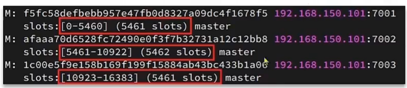
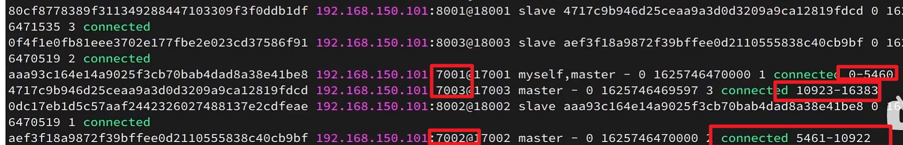
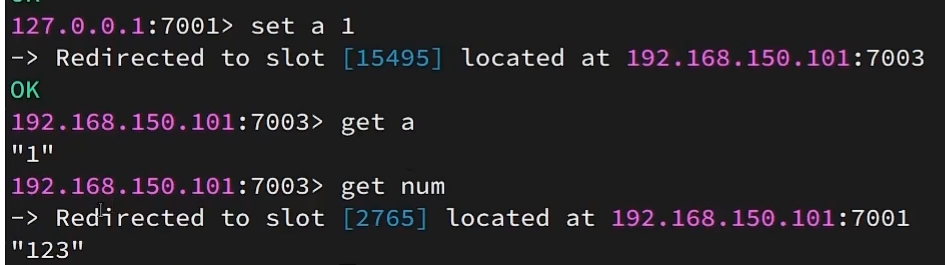
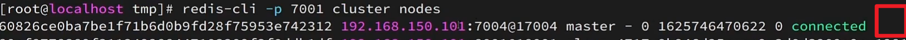
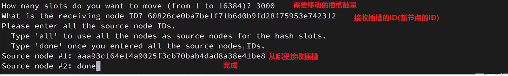

# 分片集群

>   未测试

## 问题

-   为了增强主从同步的性能, 单节点的Redis内存不应该太高, 

    否则, RBD的持久化, 或全量同步的时候, 就会导致大量IO, 影响性能

-   如果内存受限, 那么如果有存储大量数据的需求, 怎么办呢? 

-   读写分离应对了高并发读, 如果写的并发也很高怎么办呢?

## 搭建分片集群

### 分片集群结构

-   集群中有多个Master, 每个Master保存不同的数据
    -   解决海量数据存储
-   每个master都可以有多个Slave节点,各自做主从同步
    -   解决高并发读(在Slave上)写(在Master上)
-   Master之间**互相**使用心跳ping来检测集群内的健康状态

### 配置节点

`redis.conf`

```ini
# 开启集群功能
cluster-enabled yes
# 集群的配置文件名称, 不需要我们创建, 由Redis自己维护
cluster-config-file /var/lib/redis/nodes.conf
# 节点心跳失败的超时时间
cluster-node-timeout 5000
# 让Redis后台运行
daemonize yes
# 保护模式,不做用户名密码的校验了,大家都能访问
protected-mode no
# 数据库数量,本来是16个,不用这么多,1个就够了
databases 1
# 日志
logfile /logs/run.log
```

```ini
# 解除本地限制
bind 0.0.0.0

# 端口
port 6379

# 配置密码
requirepass 123456

# 是否压缩RDB文件
# 不建议开启,压缩会消耗CPU,磁盘容量不值钱
rdbcompression no

# RDB文件名
dbfilename dump.rdb

# 文件保存的路径目录
dir /var/lib/redis

# 声明redis实例的 IP地址
replica-announce-ip redis-6381
```

```ini
# 声明永久的主从关系
slaveOf redis 6379
# 主机密码
masterAuth 123456
```

### 创建集群

```bash
redis-cli --cluster help
```

```bash
Cluster Manager Commands:
  create         host1:port1 ... hostN:portN
                 --cluster-replicas <arg>
  check          host:port
                 --cluster-search-multiple-owners
  info           host:port
  fix            host:port
                 --cluster-search-multiple-owners
                 --cluster-fix-with-unreachable-masters
  reshard        host:port
                 --cluster-from <arg>
                 --cluster-to <arg>
                 --cluster-slots <arg>
                 --cluster-yes
                 --cluster-timeout <arg>
                 --cluster-pipeline <arg>
                 --cluster-replace
  rebalance      host:port
                 --cluster-weight <node1=w1...nodeN=wN>
                 --cluster-use-empty-masters
                 --cluster-timeout <arg>
                 --cluster-simulate
                 --cluster-pipeline <arg>
                 --cluster-threshold <arg>
                 --cluster-replace
  add-node       new_host:new_port existing_host:existing_port
                 --cluster-slave
                 --cluster-master-id <arg>
  del-node       host:port node_id
  call           host:port command arg arg .. arg
                 --cluster-only-masters
                 --cluster-only-replicas
  set-timeout    host:port milliseconds
  import         host:port
                 --cluster-from <arg>
                 --cluster-from-user <arg>
                 --cluster-from-pass <arg>
                 --cluster-from-askpass
                 --cluster-copy
                 --cluster-replace
  backup         host:port backup_directory
  help           

For check, fix, reshard, del-node, set-timeout you can specify the host and port of any working node in the cluster.

Cluster Manager Options:
  --cluster-yes  Automatic yes to cluster commands prompts

```

#### 创建集群

```bash
redis-cli --cluster create --cluster-replicas 从节点数量 HOST1:PORT1 HOST2:PORT2 HOST3:PORT3 HOST4:PORT4 HOST5:PORT5 HOST6:PORT6...
```

-   `从节点数量`, 例如一主一从就是1, 一主二从就是2

-   如果`从节点数量`为**1**, 就表示一主一从,  一组由**2个节点**;后面的`HOST:PORT`有**6个节点**, 则表示**有3组**

    那么**前3个**` HOST1:PORT1 HOST2:PORT2 HOST3:PORT3 `为主节点, `HOST4:PORT4 HOST5:PORT5 HOST6:PORT6`为从节点

-   如果`从节点数量`为**2**, 就表示一主二从,  一组由**3个节点**;后面的`HOST:PORT`有**6个节点**, 则表示**有2组**

    那么**前2个**` HOST1:PORT1 HOST2:PORT2 `为主节点, `HOST3:PORT3 HOST4:PORT4 HOST5:PORT5 HOST6:PORT6`为从节点

至于这个Slave是哪个Master的Slave, 我是无从得知的

#### 进入集群中的某个节点

```bash
redis-cli -c -p PORT
```

-   `-c `表示使用集群的形式访问该节点
-   `-p` 指定端口

## 散列插槽

>   插槽Slot

Redis会把每一个Master节点映射到[0,16383]共16384( 2^14^ )个插槽(Hash Slot)上

每个Master节点持有一部分的Slot插槽

查看集群信息时就能看到:



在写数据时, 数据落在哪个节点上? 这有插槽决定

查看插槽的分配

```bash
redis-cli -p 集群中已存在的节点端口 cluster nodes
```



也可以从上图看出集群中的主从关系:

`8003->7002`

`8002->7001`

`8001->7003`

### 插槽与Key的绑定

数据Key不是与节点绑定, 而是绑定. 

Redis会根据key的**有效部分**计算插槽值

-   key中包含`{}`且`{}`内至少包含一个字符, `{}`内的部分是有效部分
-   key中不包含`{}`,整个key都是有效部分
-   计算方法是**CRC16算法**得到的一个Hash值, 然后对16384取余,得到结果就是slot值

### 插槽的作用

在集群增加或减少节点时, 使用**插槽转移**,将Key与插槽绑定而不是节点绑定, 可以防止数据的丢失, 也增加了集群的可拓展性

### 插槽的使用



-   `Set `  `a`时,计算出`a`应该落在插槽`15495`, 对应端口7003

    然后重定向到插槽`15495`, 增加键`a`

-   `Get` `num` 时, 就计算`num`应该在插槽`2765`, 对应端口7001

    然后定向到插槽`2765`, 获取`num`的值

## 集群伸缩

```bash
redis-cli --cluster help
```

```bash
add-node       new_host:new_port existing_host:existing_port
               --cluster-slave
               --cluster-master-id <arg>
del-node       host:port node_id
reshard        host:port
               --cluster-from <arg>
               --cluster-to <arg>
               --cluster-slots <arg>
               --cluster-yes
               --cluster-timeout <arg>
               --cluster-pipeline <arg>
               --cluster-replace
```

### 增加节点

```bash
redis-cli --cluster add-node new_host:new_port existing_host:existing_port
```

-   `existing_host:existing_port`随便选一个集群中的节点

-   默认新增节点为master节点

    新增Slave节点:

    ```bash
    redis-cli --cluster  --slave --cluster-master-id XXXX add-node HOST:PORT HOST:PORT
    ```

    -   `master-id`, 集群在创建的时候就会给你MasterID

        

### 插槽的再分配

```bash
redis-cli -p 集群中已存在的节点端口 cluster nodes
```

发现新增加的节点没有被分配插槽



再分配插槽

```bash
redis-cli --cluseter --help
```

```bash
reshard        host:port
               --cluster-from <arg>
               --cluster-to <arg>
               --cluster-slots <arg>
               --cluster-yes
               --cluster-timeout <arg>
               --cluster-pipeline <arg>
               --cluster-replace
```

```bash
redis-cli --cluseter reshard 集群中已存在的节点HOST:其PORT 
```



### 删除节点

1.  要先把插槽转移吧? 它会自动帮我们转移吗?

2.  删除节点

    ```bash
    redis-cli --cluster del-node host:port node_id
    ```

    -   `host`是集群中的任意节点的`Host`吗?还是需要删除的节点的`Host`?

    -   `node_id`是集群中的任意节点的`node_id`吗?还是需要删除的节点的`node_id`?

    -   我懂了, 通过`host:port`找到集群, 再通过`node_id`找到集群中的节点, 再删除该节点

        毕竟不同的集群可能有一样的`node_id`嘛

        而且也不能用`node_id`找到该集群

    -   但是如果参数直接是`要删除的Host:Port`的话, 不就可以直接一举两得吗? 又何必多出这个参数呢?

## 故障转移

```bash
# 关闭节点
redis-cli -p 端口 shutdown
# 开启节点
reids-server /etc/redis/redis.config
```

不需要哨兵, 分片集群自带检测和自动故障转移, 让Master自己的Slave做Master

### 数据迁移流程

1.  Slave节点执行failover命令,向其Master发送通知
2.  Master接收到Slave的通知, 拒绝客户端的一切请求, 一切请求都会被阻塞
3.  Master将当前数据的`Offset`给Slave
    -   Slave和Master的`Offset`如果不一致, 就会执行同步
4.  Slave和Master开始故障转移
    1.  向选举出的Slave发送命令`SlaveOf no one`, Slave执行该命令, 不再为Slave,成为Master
    2.  向其他Slave节点发送广播, 告诉他们新的Master是谁, 要执行`SlaveOf HOST PORT`命令

    3.  更改原来Master的配置文件, 让他成为新的Master的Slave
5.  Slave标记自己为Master, 广播**其他Master**和**即将退休的Master**故障转移的结果
    -   其他Master转变心跳检测的对象
6.  即将退休的Master开始处理客户端读请求

### 数据迁移命令

当想淘汰某个节点(如机器太老旧了)

让集群中的某个master转为Slave, 将Master的身份切换到执行`cluster failover`命令的这个slave节点, 实现无感知的数据迁移

**这是在redis-cli里的控制台用的命令**

```bash
Cluster Failover
```

-   缺省: 使用默认流程

-   `force`: 省略对`Offset`一致性的校验

-   `takeover`: 直接标记自己为Master, 广播故障转移的结果, 忽略Master状态和其他Master意见

    -   其他Master意见? 哪里来的其他Master意见?

    -   不告诉其他Slave要易主了吗? 还是说通知Slave这一步不是在"故障转移"做的?

        如果故障转移不做通知Slave易主,那这一步还有什么用?

        ==意义不明==

    -   别用

## RedisTemplate访问分片集群

### 配置分片集群地址

```yaml
spring:
  redis:
    cluster:
      nodes:
        - redis:6379
        - redis:6380
        - redis:6381
```

### 配置读写分离

```java
@Bean
public LettuceClientConfigurationBuilderCustomizer clientConfigurationBuilderCustomizer() {
    return configBuilder->configBuilder.readFrom(ReadFrom.REPLICA_PREFERRED);
}
```

