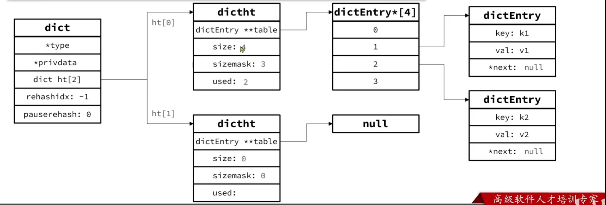
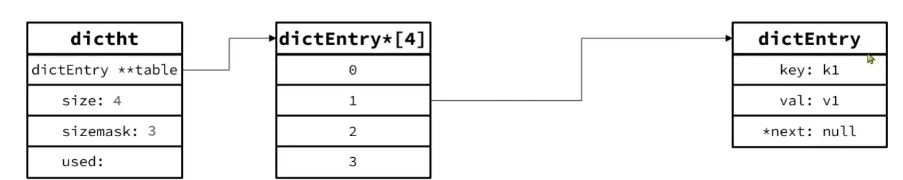
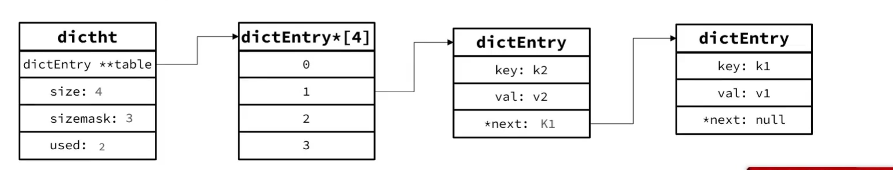

# Dict

## 组成

-   哈希表(DictHashTable)
-   哈希节点(DictEntry)
-   字典(Dict)


```c
typedef struct dictEntry {
    void *key; // 键
    union {
        // 联合体, 只能取其一
        void *val;
        uint64_t u64;
        int64_t s64;
        double d;
    } v; // 值
    // 下一个Entry的指针
    struct dictEntry *next;
} dictEntry;

typedef struct dictht {
	// entry数组, 存储entry指针
    dictEntry **table;
    // 哈希表大小, 即有多少个不同的Hash值, 总是2^n
    unsigned long size;
    // 哈希表大小的掩码, 总等于size-1
    unsigned long sizemask;
    // entry个数, 对于不同Entry有相同Hash值的情况, used会增加, size不会增加
    unsigned long used;
} dictht;

typedef struct dict {
    dictType *type; // 类型, 内置不同的Hash函数
    void *privdata; // 私有数据, 在特殊Hash运算时使用
    dictht ht[2]; // 一个Dict包含两个Hash表, 一个是当前数据, 另一个一般是空, rehash时使用
    long rehashidx; /* rehash的进度, -1表示未进行*/
    int16_t pauserehash; /*rehash是否停止, 1表示停止, 0表示继续 */
} dict;
```





## 添加

1.  根据Key计算呢Hash值=> h

2.  利用 `h&sizemask` 来计算元素应该存储到数组中的哪个索引位置

    -   保证了数据落在Hash表内
    -   对于一个`2^n^-1` 的数, 这就是取余

3.     存储`key=value`, 假设`key`的Hash值是`2`,size是4,则`2&3`=2, 存在2的位置, 

    

4.  当Hash值相同时, 我们将新元素插入链首, 插入链尾会遍历链表

    

    Hash表+单项链表


## 渐进性rehash

当集合中的元素越来越多, Hash冲突也就越多, 为了防止积累下来的Hash冲突,  时不时的重置一下Hash表

效率会大大降低

当然, 扩容之后, 利用率却很低, 就会进行收缩

###触发条件

-   扩容
    -   Dict在每次新增键值对时会检查负载因子(LoadFactor = used/size)
    -   LoadFactor>=1 且 服务器没有指向 `BGSAVE` 或者 `BGREWRITEAOF` 等后台进程
    -   LoadFactor>5
-   收缩
    -   在每次删除键值时对负载因子进行检查
    -   LoadFactor< 0.1 且 size >4 时进行收缩


### dictExpand

无论扩容还是收缩,都使用`dictExpand(dict,used)`

会将大小重置为第一个大于等于used的2^n^

```c
int _dictExpand(dict *d, unsigned long size, int* malloc_failed) { // malloc_failed=NULL
	// size,目标大小
    if (malloc_failed) *malloc_failed = 0;

	/* 如果used>size,输入不正确, 就返回错误信息 */
	if (dictIsRehashing(d) || d->ht[0].used > size)
		return DICT_ERR;
	// 声明新的Hash表
	dictht n; /* the new hash table */
    // 找到第一个大于等于size的2^n
	unsigned long realsize = _dictNextPower(size);

	/* 要拓展的内容可能导致内存溢出, 返回 */
	if (realsize < size || realsize * sizeof(dictEntry*) < realsize)
		return DICT_ERR;

	/* 新的size和旧的size一致, 报错 */
	if (realsize == d->ht[0].size) return DICT_ERR;

	/* 重置新的Hash table 大小和掩码 */
	n.size = realsize;
	n.sizemask = realsize - 1;
	if (malloc_failed) {
		n.table = ztrycalloc(realsize * sizeof(dictEntry*));
		*malloc_failed = n.table == NULL;
		if (*malloc_failed)
			return DICT_ERR;
	} else // 分配内存
		n.table = zcalloc(realsize * sizeof(dictEntry*));
	// 这个新Hash表已使用?,没使用过, 初始化为0
	n.used = 0;

	if (d->ht[0].table == NULL) {
        // 说明是来做初始化的
		d->ht[0] = n;
		return DICT_OK;
	}

	// 将心的Hash表赋值给ht[1]
	d->ht[1] = n;
	d->rehashidx = 0; // 当前rehash开始进行, 进度0, 刚开始
	return DICT_OK;
}
```

### rehash

不管是扩容还是收缩, 必定会创建新的Hash表, 导致Hash表的Size和sizemask变化

而**key的查询与sizemask有关**, 因此必须对Hash表中的没有过key**重新计算索引**, 插入新的Hash表

此乃**rehash**

1.  计算Hash表的realeSize
    -   如果是扩容, 则新size为第一个大于等于dict.ht[0].used + 1 的 2^n^
    -   如果是收缩, 则新size为第一个大于等于dict,ht[0].used 的 2^n, 不会小于4
2.  按照新的realeSize申请内存空间, 创建dictht, 并赋值给dict.ht[1]
3.  设置dict.rehashidx = 0, 标示开始rehash到dict.ht[1]
4.  **渐进式rehash** , 将所有dictEntry都rehash到dict.ht[1]
5.  将dict.ht[1]赋值给dict.ht[0], 给dict.ht[1]初始化为空Hash表, 释放原来dict.ht[0]的内存

### 渐进式

rehash的迁移对于数据量大的情形需要很多时间

渐进式使得rehash不是一步到位的

就像上面`dictExpand`, 数据没有迁移, 索引没有被重新计算, 只是开始了rehash而已- 

-   每一次做**增删改查**的时候, 都检查一下dict.rehashidx是否大于-1

    -   如果大于-1, 则将dict.ht[0].table[rehashindex]的extry链表rehash到dict.ht[1]

        并且将rehashidx++. 直至dict.ht[0]的所有数据都被rehash到ht[1]

    -   在ht[1]里新增一条数据, 在ht[1]里删除这条数据

    -   查询时, 在两个表中都查询一下(? 他这么讲, 我不这么认为: 先用原表获取hash值, hash值小于hashidx, 就到新表查询; 大于hashidx , 就到旧表查询), 直到查到了为止

    -   对于增删改这种会对数据造成影响的操作

        删, 改, 都需要先查询, 在两张表中都查询一下, 直到查找到原数据位置

        删, 直接删; 改, 将数据查出, 更改, 放入新表, 原表删除

        增, 直接在新表中增

