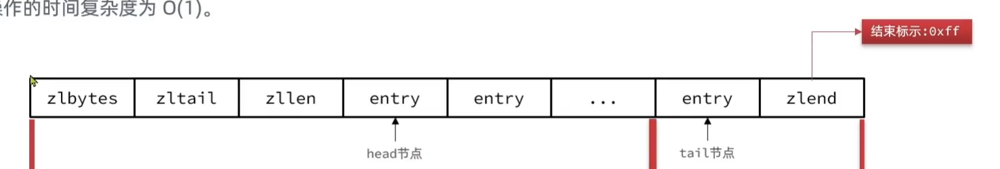
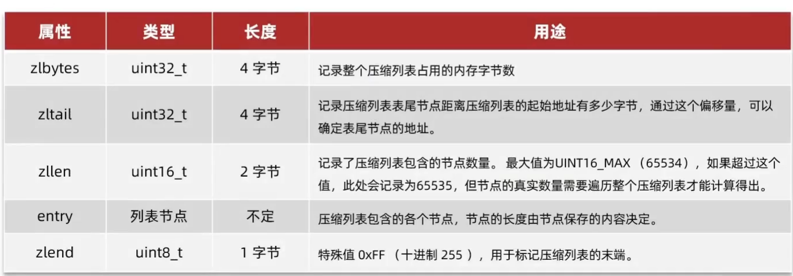
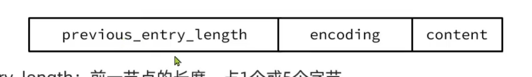

# ZipList

>   可以看作是一种特殊的"双端链表", 由一系列特殊编码的**连续编码**的内存块组成. 可以在任意一端进行压入, 弹出的操作, 并且改操作的时间复杂度为O(1) 

由于一个指针需要小高16个字节, 太浪费了

## 组成

emmm, 这里会采用小端, 可以明确, `zlbytes`,`zltail`, `zllen`会采用小端, `content`会采用大端, `zlend`无关大小端, 其余不知道



1.  `zlbyte`

    -   整个ZipList(包括`zlbyte`等头信息)的字节数

2.  `zltail`

    -   尾节点到ZipList的开头的字节数

    -   假设有指针`p`指向ziplist

        ```C
        ZipList * p = 已有的ZipList;
        ```

        那么`(*p+zltail)`指向尾节点

3.  `zllen`

    -   节点数
    -   超过了65534, 记录为65535 , 不再存储真实数量

4.  `entry`

    -   节点
    -   **一个`entry`的大小也不固定**, 为了不让7和200000存在一起, 7也和200000占用一样的内存

5.  `zlend`

    -   `0xff`, 标记ZipList的结束



##ZipListEntry




1.  `previous_entry_length`
    -   前一节点的长度
    -   当其**小于254**时, 采用一个字节存储该值
    -   其长度大于等于254字节时, 采用5个字节来保存这个长度值, 第一个字节为`0xfe`, 后四个字节才是真实值
    -   用于逆序遍历
2.  `encoding`
    -   编码格式, 记录content的数据类型(Either String or Integer)以及长度
    -   占1个, 2个或5个字节
    -   用于正序遍历
3.  `contnts`
    -   保存节点的数据, Either String or Integer

### Encoding

#### 字符串

encoding以`00`,`01`, `10`开头, 表示content是字符串, 除去开头两位的比特位才是计数的比特位

-   `00`开头, 表示`encoding`占用1个字节, content长度小于等于63bytes
-   `01`开头, 表示`encoding`占用2个字节, content长度小于等于16383bytes
-   `10`开头, 表示`encoding`占用5个字节, 第一个字节直接`1000 0000`, content长度小于等于4294967295bytes

#### 整数

encoding以`11`开头, 表示content是字符串, 剩余6个比特位用来表示是哪种整数类型

-   `1100 0000` `int16_t`
-   `1101 0000` `int32_t`
-   `1110 0000` `int64_t`


-   `1111 0000` 24位有符号整数
-   `1111 1110` 8位有符号整数
-   `1111 xxxx` 从[ `0001` , `1101 `] ->[1,13]选择, 减一之后[0,12]获得二进制整数, **直接在enconding里存储content**
    -   `0000`被占用
    -   `1110`被占用
    -   `1111`是结束符, 被占用

## 缺陷

1.  不得不遍历才能查找
2.  `previious_emtry_length`导致的连锁更新问题

### 连锁更新

`previous_entry_length`

-   前一节点的长度
-   当其**小于254**时, 采用一个字节存储该值
-   其长度大于等于254字节时, 采用5个字节来保存这个长度值, 第一个字节为`0xfe`, 后四个字节才是真实值
-   用于逆序遍历

现在假设我们有连续n个连续的长度为250~253字节之间的entry, 因此entry 的previus_length属性都用一个字节即可表示

[ZipList连锁更新原理](D:\IT_study\blog\Redis&Cache\blog\原理\ZipList连续更新问题.mp4)

ZipList这种特殊情况下产生的连续多次空间拓展操作称之为**连锁更新(Cascade Update)**. 新增, 删除都可能导致连锁更新的发生

