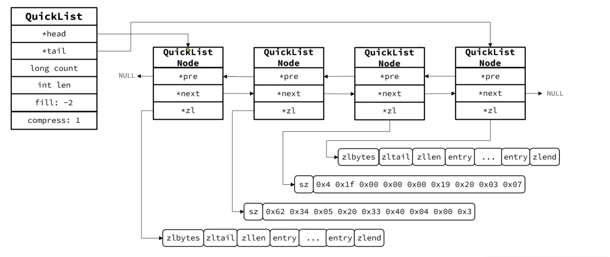

## QuickList

## ZipLis的缺陷

ZipList申请的内存空间是连续的

可是内存空间是碎片化的, 很难申请到一片很大的内存空间

如果ZipList里需要存储大量的数据, 那就很完蛋

咋办? 多申请几个ZipList(数据分片)

那么, 查找就会肥肠的麻烦

## 原理

### 结构

是一个双端链表, 链表中的每一个节点都是一个ZipList

### 控制大小

QuickList能限制每个节点ZipList的大小

#### 配置节点大小

```config
list-max-ziplist-size 值
```

-   如果值为正, 表示ZipList的允许entry个数的最大值
-   如果值为负, 表示限制内存大小(推荐)
    -   `-1` 每个ZipList的内存占用不超过4KB
    -   `-2` 每个ZipList的内存占用不超过8KB (默认)
    -   `-3` 每个ZipList的内存占用不超过16KB
    -   `-4` 每个ZipList的内存占用不超过32KB
    -   `-5` 每个ZipList的内存占用不超过64KB

### 压缩

QuikList可以对节点的ZipList做压缩. 

因为链表一般都是首尾访问较多, 所以首尾是不压缩的

#### 配置不压缩个数

使用`list-compress-depth`来控制首尾不压缩的节点个数

```powershell
set config list-compress-depth 0
```

-   `0`, 特殊值, 代表不压缩, 默认值
-   `1`, 首尾各有一个节点不压缩, 其余压缩
-   `2`, 首尾各有两个节点不压缩, 其余压缩
-   以此类推

## 结构

```C
typedef struct quicklistNode {
    // 前一节点指针
    struct quicklistNode *prev;
    // 后一节点指针
    struct quicklistNode *next;
    // 当前节点的ZipList指针
    unsigned char *zl;
    // 当前ZipList的字节大小
    unsigned int sz;             /* ziplist size in bytes */
    // 当前节点的ZipList的Entry个数
    unsigned int count : 16;     /* count of items in ziplist */
    // 编码方式: 1,ZipList, 2: lzf压缩模式
    unsigned int encoding : 2;   /* RAW==1 or LZF==2 */
    // 数据容器类型, 预留: 1, 其他; 2, ZipList
    unsigned int container : 2;  /* NONE==1 or ZIPLIST==2 */
    // 是否被解压缩. 1: 被解压缩, 将来需要被重新压缩
    unsigned int recompress : 1; /* was this node previous compressed? */
    // 测试用
    unsigned int attempted_compress : 1; /* node can't compress; too small */
    /*预留字段*/
    unsigned int extra : 10; /* more bits to steal for future usage */
} quicklistNode;
```

```C
typedef struct quicklist {
    /*头节点指针*/
    quicklistNode *head;
    /*尾结点指针*/
    quicklistNode *tail;
    /*所有ziplist的entry数量*/
    unsigned long count;        /* total count of all entries in all ziplists */
    /*ZipList的总数量*/
    unsigned long len;          /* number of quicklistNodes */
    /*ZipList的Entry上限, 默认是-2*/
    int fill : QL_FILL_BITS;              /* fill factor for individual nodes */
    /*首尾不压缩的节点数量*/
    unsigned int compress : QL_COMP_BITS; /* depth of end nodes not to compress;0=off */
    /*内存重分配时的书签数量及数组, 一般用不到*/
    unsigned int bookmark_count: QL_BM_BITS;
    quicklistBookmark bookmarks[];
} quicklist;
```

### 内存结构图



