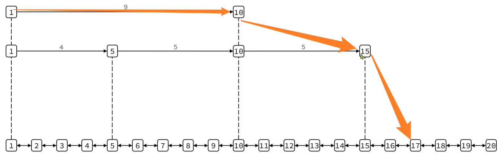
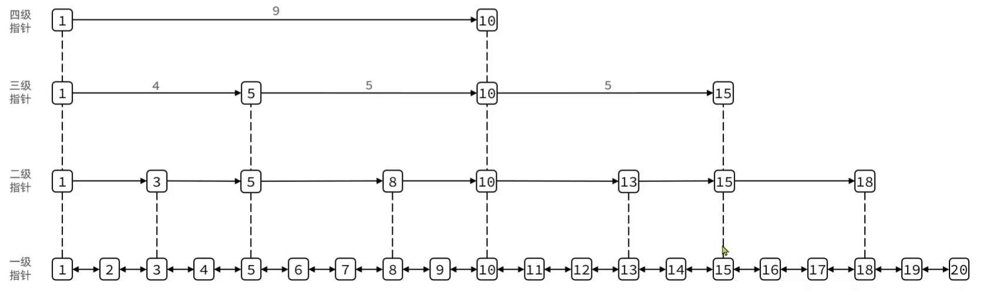
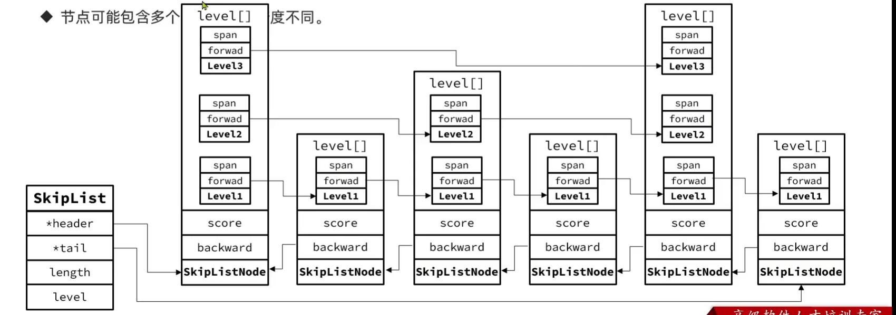

# SkipList

遍历, 要么从头到尾, 要么从尾到头

如果要随机遍历?

## 结构

1.  双向链表
2.  元素升序排序





跳表最多支持32个指针

```c
typedef struct zskiplistNode{
	sds ele; // 节点存储的值
    double score; // 节点分数, 用于排序, 查找
    struct zskplistNode *backworld; // 前一个节点的指针
    struct zskplistLevel{
        struct zskplistNode * forward;
        unsigned long span; // 索引跨度
    }level[];
} zskiplistNode;
typedef struct zskiplist{
    // 头尾节点指针
    struct zskiplistNode *header,*tail;
    // 节点数量
    unsigned long length;
    // 最大的索引层级
    int level
} zskiplist;
```



1.  跨度最大的, 尝试查一下
    -   比目标大, 重复1
    -   比目标小, 选择小一级跨度的, 尝试一下
